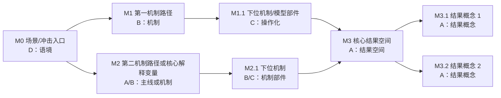

# 概念术语表

## 作用

概念术语表防止概念漂移、术语混用和标题概念过密。它尤其适用于中文经济学论文中容易反复变换表述的核心概念。

## 建议结构

概念术语表建议采用三层结构：

1. 概念谱系总表：记录概念编号、写作权重、上位概念、机制路径和相关概念。
2. 正式术语表：记录正文最终应使用的主术语、替代表述、慎用/禁用表述、定义和来源性质。
3. 术语漏斗：记录候选术语来自哪些文献、文献中承担什么角色、本文是否采用。

如果论文概念之间只有少量关系，可以简化为正式术语表 + 概念关系图。若论文存在多条机制路径、模型模块、变量/指标层级或大量细机制术语，应优先使用“概念权重 + 机制编号”的双坐标。

## 双坐标规则

概念术语表中应区分两套坐标：

- 概念权重：A/B/C/D 表示概念在论文中的写作权重。
- 机制编号：M0/M1/M2/M3 表示概念在机制路径中的位置。

二者不能混用。A/B/C/D 回答“这个概念在标题、摘要、引言、结论中有多重要”；M 编号回答“这个概念挂在哪条机制路径上，上位概念是谁，下位概念是谁”。

常用权重：

- A 级：核心主线概念，控制题名、摘要、引言、结论。
- B 级：机制支撑概念，控制理论机制、文献综述和第二章论证。
- C 级：方法、指标与操作化概念，控制模型设定、变量口径和结果解释。
- D 级：背景、政策与语境概念，控制引言背景、政策启示和结论外延。

常用机制编号：

- M0：场景、冲击入口、制度背景或系统分区。
- M1：第一条主要机制路径。
- M2：第二条主要机制路径。
- M3：机制耦合、结果识别或核心结果路径。
- M4：政策外推或语境外延。若不需要政策路径，可省略。

编号规则：

- 每个正式术语原则上只有一个主编号。
- 若一个术语跨路径出现，在“相关概念”中记录交叉关系，不重复编号。
- 正文中不必机械写出 M 编号；M 编号主要用于辅助线、提纲、审读和全文检查。
- A/B/C/D 和 M 编号应作为两列并列出现：前者管权重，后者管位置。

例子：

| 编号 | 权重 | 主术语 | 上位概念 | 机制路径 |
|---|---|---|---|---|
| M2 | A | 资本约束 | 一句话核心发现 X | M2 |
| M2.1 | B | 金融信贷传染 | 资本约束 | M2 > M2.1 |
| M2.2 | B | 去杠杆机制 | 金融信贷传染 | M2 > M2.1 > M2.2 |
| M2.2.1 | B | 信贷收缩 | 去杠杆机制 | M2 > M2.1 > M2.2 > M2.2.1 |
| M2.2.1.1 | C | 数量型信贷配给 | 信贷收缩 | M2 > M2.1 > M2.2 > M2.2.1 > M2.2.1.1 |

## 建议模板

````markdown
# 概念术语表

## 当前判断

本表采用“概念谱系总表 + 正式术语表 + 术语漏斗”的三层结构。

- 概念谱系总表：用 M 编号记录概念在机制路径中的位置、上位概念和相关概念。
- 正式术语表：记录正文最终应使用的主术语、替代表述、慎用/禁用表述和定义。
- 术语漏斗：记录候选术语来自哪些文献、文献中承担什么角色、本文是否采用。

## 概念编号规则

本文同时使用两套概念坐标，二者不能混用。

- 概念权重：A/B/C/D 表示概念在论文中的写作权重。
- 机制编号：M0/M1/M2/M3/M4 表示概念在机制路径中的位置。

## 概念谱系总表

| 编号 | 权重 | 主术语 | 上位概念 | 机制路径 | 相关概念 | 使用位置 |
|---|---|---|---|---|---|
| M0 | D | 场景/冲击入口 | 实验场景 | M0 | 第一机制路径；第二机制路径 | 引言、机制背景 |
| M1 | B | 第一机制路径 | 场景/冲击入口 | M0 > M1 | 下位机制；结果路径 | 文献综述、机制、模型 |
| M1.1 | C | 第一机制路径的模型部件 | 第一机制路径 | M1 > M1.1 | 变量/参数/指标 | 模型设定、结果解释 |
| M2 | A/B | 第二机制路径或核心解释变量 | 一句话核心发现 | M2 | 结果路径 | 全文主线或机制段 |
| M3 | A | 核心结果空间 | 一句话核心发现 | M3 | 结果概念 1；结果概念 2 | 摘要、引言、结果、结论 |

## 正式术语表

| 编号 | 权重 | 主术语 | 可接受替代表述 | 禁用/慎用表述 | 定义 | 来源性质 |
|---|---|---|---|---|---|---|
| M2 | A | 资本约束 | 银行资本约束 | 融资约束、资金约束 |  | 文献稳定术语 |
| M3 | A | 尾部风险的跨行业传染 | 尾部风险跨行业传染 | 系统性风险、风险扩散 |  | 文献稳定术语，经本文整合 |
| M3.2 | A | 分布错配 | 风险分布错配、行业分布错配 | 结构错配、资源错配 |  | 本文结果概念 |

## 术语漏斗

| 候选术语 | 来源文献 | 文献中角色 | 是否采用 | 本文定名 | 处理理由 |
|---|---|---|---|---|---|
|  |  |  |  |  |  |

## 概念关系总图

用 Mermaid 记录概念之间的关系。概念术语表不应只是词汇清单，还应说明 A/B/C/D 权重与 M 编号路径如何形成“主干树 + 机制图”。



## 术语使用规则

1. 后文统一使用“主术语”。
2. 替代表述只在解释、承接或避免重复时出现。
3. 禁用表述除非重新定义，否则不使用。
4. 标题中尽量只放一个核心概念，避免概念堆叠。
5. 如果术语来自参考文献，在“术语漏斗”中记录来源文献和文献中角色。
6. 如果术语是本文原创或半原创结果标签，必须标明为“本文结果概念”，并在正文首次出现时定义。
7. A/B/C/D 都可以进入概念术语表，但不能同等权重使用：A 级控制主线，B 级解释机制，C 级承接测度，D 级限定语境。
8. A/B/C/D 只说明写作权重，不说明从属关系；从属关系以 M 编号和“上位概念”列为准。
````

## 使用规则

- 所有改写任务都应检查是否需要读取。
- 全文检查时必须用它搜索术语漂移。
- 如果引入新概念，必须先更新此表。
- 若一个术语只出现一次，判断它是否应删除、合并或改成普通表达。
- 概念术语表应区分“外部术语证据”和“本文正式定名”：前者进入术语漏斗，后者进入正式术语表。
- 当用户已用概念治理工具整理参考文献术语时，优先读取已有概念治理输出，把文献术语、本文候选术语和最终主术语对齐。
- 如果概念之间存在机制关系，优先用 Mermaid 画“概念关系总图”；不要只用纯文本缩进表达复杂关系。
- 如果论文有多条机制路径、模型部件或细机制术语，优先建立“概念谱系总表”，并用 M 编号记录概念从属关系。
- 若后续建立变量概念映射表，应继承概念术语表中的 M 编号。

## 检查问题

- 同一个概念是否被多个术语表达？
- 不同概念是否被同一个术语模糊覆盖？
- 核心概念是否在首次出现时被定义？
- 标题和小标题是否堆叠过多高概念？
- 术语是否有文献来源，还是本文自己的结果标签？
- 本文原创/半原创术语是否已经给出必要定义，避免被误解为通用文献术语？
- 概念表是否说明了术语之间的主从关系和机制关系？
- B/C/D 级概念是否被误写成和 A 级同等重要的主线概念？
- A/B/C/D 是否被误用为从属编号？M 编号是否被误用为写作权重？
- 细机制术语是否有明确上位概念，而不是漂浮在正式术语表中？
