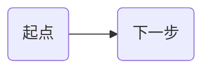
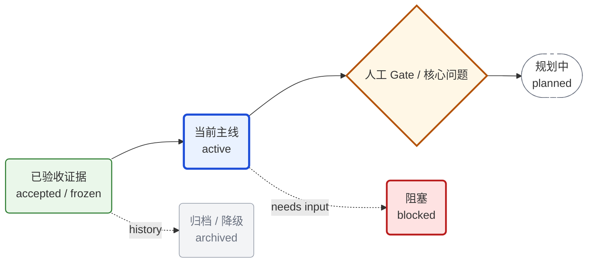
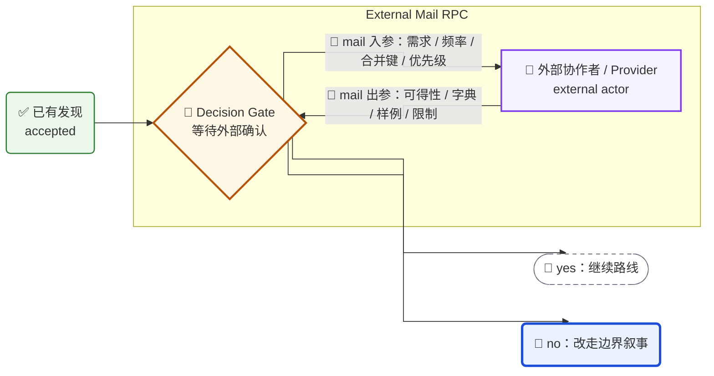
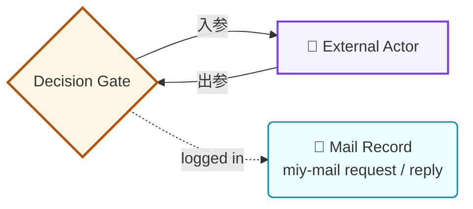
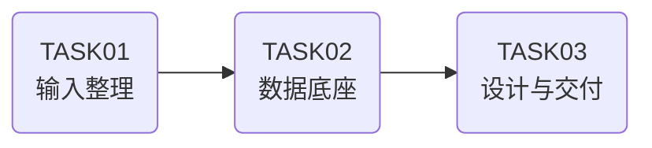
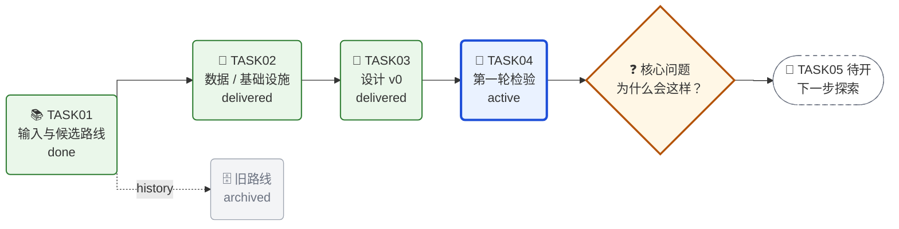
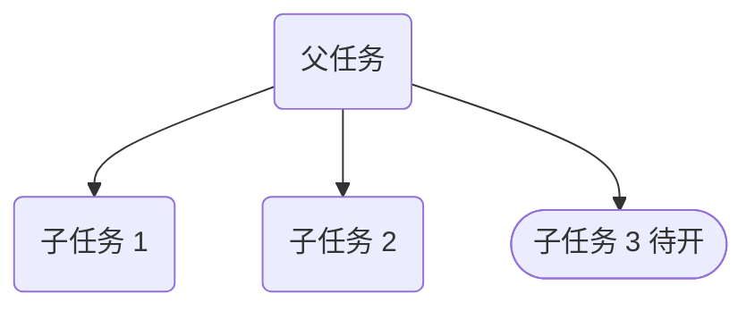
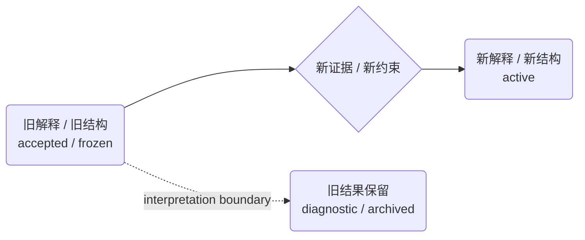

# Roadmap

状态：`seed / extracted-from-research-roadmap`

## 定位

本 Skill 是通用的路线图与导航图能力，不绑定研究、软件、数据或写作领域。

它回答：

```text
一个复杂项目 / workflow / TASK 如何用一张可点击、可维护、带状态语义的图表达主线、分支、状态、证据入口和下一步？
```

核心原则：

```text
Roadmap 讲“为什么这样推进”；
Lineage Map 讲“任务 / 对象如何组织”；
Change Map 讲“结构或解释如何变化”；
Technical Route 讲“执行步骤如何落地”。
```

不要用文件目录替代路线图。路线图的中心应是问题、目标、发现、分支、状态和导航入口，而不是文件夹层级本身。

## 适用层级 / Scope Levels

`roadmap` 是跨层级 artifact。同一套视觉语法可用于 project、workflow、route、task、subtask 和 communication，但每一层的中心问题不同。

| 层级 | Roadmap 中心 | 典型用途 | 推荐落点 |
|---|---|---|---|
| Workflow 级 | 能力工程如何从问题域、子能力、证据、模板到 Green 标准 | workflow 父入口、能力抽父、subworkflow 路由 | `workflow-*/SKILL.md` 或 `references/` |
| Project 级 | 项目如何从 idea / 输入 / 数据 / 执行推进到核心交付 | 项目 README 第一屏导航 | 项目根 `README.md` |
| Route / Node 级 | 一条路线、候选 claim、产品方向或技术方案如何竞争和收敛 | route card、node card、设计文档 | `nodes/*` 或 route 文档 |
| Task 级 | 一个任务如何从输入、动作、产物到下一步 | TASK README、任务工作台 | `tasks/TASKxx-*/README.md` |
| Subtask 级 | 一个实验、子问题或 subagent workstream 如何闭环 | subtask README、acceptance map | `subtasks/*/README.md` |
| Communication 级 | 如何向协作者解释复杂进展 | 邮件、汇报、周报、会议纪要 | `emails/`、`final_outputs/` |

跨层级规则：

```text
上层 roadmap 只放主线和关键分叉，不塞执行细节；
下层 roadmap 解释具体怎么做、用了什么数据 / 工具 / 证据；
同一节点跨层级出现时，上层节点 click 到下层稳定入口，不复制下层细节。
```

## 构造流程

1. 找到图的中心问题：
   - 项目 / workflow 的起点是什么？
   - 已经出现的关键事实、转折或交付是什么？
   - 当前最需要解释、决策或推进的点是什么？

2. 按“功能”分支，而不是按文件名或时间流水账分支：
   - 主线推进；
   - 样本 / 范围 / 口径诊断；
   - 机制 / 原因解释；
   - 稳健性 / 替代解释；
   - 数据 / 工具 / 权限 gate；
   - 归档 / 降级 / superseded；
   - 下一步规划。

3. 给每个节点标注角色和状态：
   - 节点角色：输入、发现、谜题、分支、交付、gate、结论、归档；
   - 状态：`proposed`、`active`、`delivered`、`accepted / frozen`、`diagnostic`、`superseded`、`blocked`。

4. 图里只放一眼理解路线所需的信息。细节放到被 `click` 链接的 Markdown 文档。

5. 添加 Markdown fallback link table，因为不同渲染器对 Mermaid `click` 支持不同。

## Mermaid 基础规范

默认使用左到右布局和折线箭头：



线型选项：

```text
curve: stepBefore = 默认推荐；折线清楚，适合 LR roadmap。
curve: step = 备选；图很复杂时可试。
curve: linear = 直线但可能斜穿，适合简单图。
```

不要承诺像手工绘图工具一样精确控制每个拐点。Mermaid 的 `curve` 是渲染偏好，不是逐线布线系统。

节点命名规则：

- 用短 id：`Q`、`F`、`P`、`A`、`B`、`C`、`T061`。
- 节点标签用双引号或圆括号包住。
- 中文、标点、括号、斜线较多时必须用引号。
- 节点内换行用 `<br/>`。
- 每个节点最多表达一个功能。
- 长解释放到正文或链接文档。

节点形状约定：

```text
A("...")   = 默认节点；圆角矩形，适合 task / route / evidence / artifact。
A{"..."}   = 谜题 / 选择 / gate；用于需要解释或决策的节点。
A(["..."]) = 规划中 / 待开节点；更圆的 pill / stadium 形。
A["..."]   = 方角矩形；适合外部 actor、制度性节点、非内部任务对象。
```

优先使用 Mermaid 内置形状表达圆角。不要依赖 CSS hack 精确调整 `rx/ry` 圆角半径，因为不同 Markdown 渲染器和 Mermaid 版本下不稳定。

## Visual Grammar / 视觉语法

路线图可以吸收 Kanban 的状态表达，但视觉语法只帮助读者扫读，不替代文字标签。

默认状态样式：



状态含义：

| Class | 含义 | 视觉编码 |
|---|---|---|
| `done` | 已交付 / 已验收 / 可作为历史证据 | 绿色浅底、绿色边框 |
| `active` | 当前主线 / 正在推进 / 需要关注 | 蓝色浅底、粗蓝边 |
| `planned` | 规划中 / 待开 / 尚未执行 | 白底、灰色虚线边框 |
| `puzzle` | 核心问题 / 人工 gate / 分叉点 | 黄色浅底、棕黄色边 |
| `archived` | 已归档 / 降级 / superseded | 灰底、灰边、灰字 |
| `blocked` | 阻塞 / 等待外部输入 / 不能继续推进 | 红底、红边 |
| `external` | 外部 actor / provider / reviewer，不属于内部任务树 | 紫色浅底、紫色边框，常配方角节点 |
| `mail` | 邮件、工单、IM、issue 等请求/回复载体 | 青色浅底、青色边框 |

边样式含义：

```text
A --> B          = 主推进路径。
A -. note .-> B  = 历史关系、诊断关系、弱依赖或旁支。
A ==> B          = 强收敛 / 关键交付路径；慎用，避免图过重。
G -- "📤 mail 入参：需求 / 约束" --> P = 向外部 actor 发起请求。
P -- "📥 mail 出参：结果 / 限制" --> G = 外部 actor 返回材料。
```

Emoji 约定：

| Emoji | 含义 | 典型节点 |
|---|---|---|
| 📚 | 文献 / 理论 / 参考输入 | literature、docs、references |
| 🧱 | 数据底座 / 基础设施 / panel | dataset、pipeline、foundation |
| 🧭 | 设计 / 路线选择 / roadmap | design、strategy、route |
| 🔎 | 盘点 / 审计 / QC | inventory、scope scan、audit |
| ✅ | 已验收证据 | accepted result、frozen finding |
| 🧪 | 实验 / prototype / 检验 | regression、test、prototype |
| 🧩 | 诊断 / 拆解 / 匹配 | universe split、selection audit |
| ❓ | 核心问题 / 待解释现象 | puzzle、why question |
| 🌱 | 待开探索 / 新分支 | proposed route、next task |
| 🗄️ | 归档 / 降级 | archived route、superseded design |
| 🚧 | 阻塞 / 等待外部输入 | data gate、manual gate |
| 📮 | 邮件 / 外部请求 / 回复线程 | mail thread、request、reply |
| 👤 | 外部协作者 / reviewer / provider | external actor、data colleague、domain expert |

Emoji 使用规则：

- Emoji 是第二信号，不是唯一信号；节点中仍必须写出状态词或角色。
- 同一项目中同一个 emoji 只能表达同一类含义。
- 不要在一个节点里堆多个 emoji。
- 不要用 emoji 替代 `classDef`、状态词或 `click` 链接。
- 面向正式论文正文、审稿回复或纯学术文档时，可以移除 emoji，保留同一套状态词和视觉 class。

## External Actor / Mail RPC Pattern

当路线推进依赖外部协作者、服务、权限、数据提供方或 reviewer 时，不要把外部 actor 画成内部 task，也不要把等待回复的过程压缩成一个含糊的 `Data Gate`。推荐拆成：

```text
内部 decision gate
  <-> 外部 actor / provider
  <-> mail / issue / ticket / reply artifact
```

核心语义：

- `Gate` 是内部决策点：我们要判断下一步能不能继续、走哪条路线；
- `External actor` 是外部服务节点：负责查询、审核、提供材料或返回限制；
- `Mail / issue` 是通信载体：保存入参、出参、状态和可追溯证据；
- 入参和出参优先写在双向箭头标签上，长字段表放到被 `click` 的邮件或 ticket 文档。
- 如果项目使用 `$miy-mail` 管理 correspondence，roadmap 的 `mail` 节点应 click 到 `$miy-mail` 生成的稳定 Markdown 记录，而不是聊天记录或临时草稿。

紧凑画法：



如果通信线程本身很重要，例如需要 click 到 `$miy-mail` 的 `EMAIL-*` / `REPLY-*` 记录、`emails/README.md` thread index、issue、ticket 或回复台账，可增加 `mail` artifact：



使用边界：

- 只有当外部 actor 的返回会改变路线、状态或下一步决策时，才放进上层 roadmap；
- 普通通知、寒暄或不改变路线的邮件不进入 roadmap，只保留在 correspondence 台账；
- 外部 actor 节点用 `external`，不要用 `done` 或 `active` 暗示它是内部可控任务；
- `mail` 节点链接粒度要和节点含义一致：请求邮件节点 link 到 `EMAIL-*.md`；回复节点 link 到 `REPLY-*.md`；整组通信节点 link 到 `emails/README.md` 或稳定 thread index；
- 如果正在等待回复，Gate 可标为 `blocked` 或 `puzzle`，并在节点文字写 `waiting`；
- 如果已收到回复，mail artifact 可标为 `done`，Gate 再进入路线判断；
- 上层图只画入参/出参摘要，字段清单、完整邮件和回复放在链接文档中。

## Click 链接规范

Mermaid 支持 `click`：



链接规则：

- 链接到稳定入口文件，优先 `README.md`、`results-narrative.md`、`identification-boundary-memo.md`、`table-shells.md`、`change-map.md`。
- 相对路径应以包含 Mermaid 图的 Markdown 文件为基准。
- 不要链接到临时草稿、缓存文件、未验收数据文件或会频繁改名的中间产物。
- 未创建的未来任务可以标为 `待开`，但不要添加 `click`；等目录和 README 存在后再补链接。
- 如果一个节点代表多个文档，在节点下方另放“入口表”，不要给同一节点塞多个 click。

## 推荐骨架

项目级 roadmap：



任务谱系图：



变更路径图：



## 状态词

```text
proposed = 已提出但未开工；
active = 正在推进；
delivered = 已有可读交付；
accepted / frozen = 已验收并冻结为历史证据；
diagnostic = 用于解释 / 诊断，不直接取代主结论；
superseded = 被新口径替代，但保留为项目历史；
blocked = 因数据、权限、人工确认或外部输入不足暂时不能推进。
```

避免使用含糊词：

```text
差不多 / 完事了 / 好像 / 应该可以
```

## 质量检查

交付前检查：

- 图的第一眼是否能看出“起点、主线、分支、当前状态和下一步”；
- 编号、目录或文件名是否服务故事，而不是支配故事；
- 每条分支是否有明确功能；
- 是否使用稳定视觉语法：颜色、线型、形状、emoji 和状态词含义一致；
- emoji 是否只是第二信号，节点文字是否离开 emoji 仍可理解；
- 折线设置是否存在，复杂路线图是否优先使用 `curve: stepBefore`；
- `click` 链接是否存在且指向稳定 Markdown；
- 未来任务是否标为待开且不添加失效链接；
- 是否提供 Markdown fallback link table；
- 是否区分 Roadmap、Lineage Map、Change Map 和 Technical Route。
