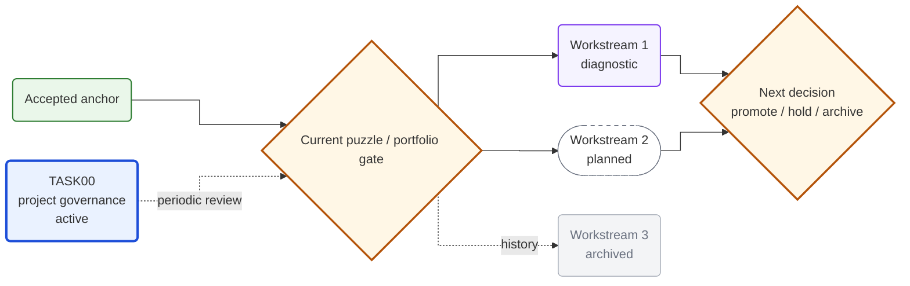
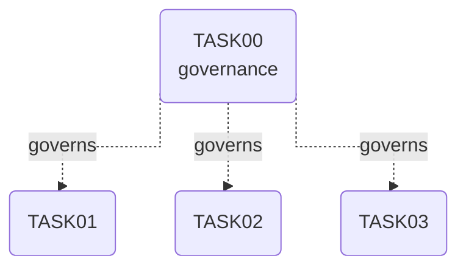

# Standing TASK00 Governance Template

Use this asset only after `references/standing-project-governance.md` trigger conditions are met. Replace placeholders; do not copy example statuses as facts.

## Folder Scaffold

```text
tasks/TASK00-project-governance/
├── README.md
├── TASK00-说明.md
├── task-registry.md
├── workstream-portfolio.md
├── decision-log.md
├── reviews/
│   └── YYYY-MM-DD-portfolio-review.md
└── logs/
    └── log.md
```

## `README.md`

````markdown
# TASK00 Project Governance

> Status: active / standing governance task
> Created: YYYY-MM-DD
> Project entry: [Project README](../../README.md)

## One-Line Goal

Maintain cross-TASK navigation, workstream comparison, decision history, and the gate for the next substantive TASK without rewriting evidence owned by existing TASKs.

## Boundary

TASK00 governs priority and navigation. TASK01+ remain the source of truth for their own evidence, models, outputs, acceptance, and logs.

## Portfolio Roadmap



## Task Lineage / Navigation Map



## Stable Entries

| Artifact | Entry |
|---|---|
| Registry | [task-registry](task-registry.md) |
| Portfolio | [workstream-portfolio](workstream-portfolio.md) |
| Current review | [dated review](reviews/YYYY-MM-DD-portfolio-review.md) |
| Decisions | [decision-log](decision-log.md) |
| ReAct log | [log](logs/log.md) |

## Sync Rules

1. Update the evidence-owning TASK first.
2. Update registry/portfolio only when governance status changes.
3. Append dated reviews; do not overwrite history.
4. Keep the project-root README compact.
````

## `TASK00-说明.md`

```markdown
# TASK00 Project Governance

## Goal

## Trigger

## Inputs

## Deliverables

## Non-Goals

- Do not move or rewrite evidence owned by TASK01+.
- Do not treat governance scores as empirical evidence.

## Initial Acceptance

- [ ] Registry covers every top-level TASK.
- [ ] Portfolio lists every active competing workstream.
- [ ] Portfolio Roadmap and Lineage Map are separate.
- [ ] Links and backlinks resolve.
- [ ] First dated review and decision log exist.

## Update Triggers

- new TASK opened/accepted/held/archived;
- new evidence changes interpretation or priority;
- a gate promotes or archives a workstream;
- a collaborator changes the project objective or boundary.
```

## `task-registry.md`

```markdown
# Task Registry

> Review snapshot: YYYY-MM-DD

| Task | Role | Governance Status | Stable Entry | Last Reviewed |
|---|---|---|---|---|
| TASK00 | governance | active / standing | [README](README.md) | YYYY-MM-DD |
| TASK01 | ... | accepted | [README](../TASK01-name/README.md) | YYYY-MM-DD |
| TASK02 | ... | active | [README](../TASK02-name/README.md) | YYYY-MM-DD |
```

## `workstream-portfolio.md`

```markdown
# Workstream Portfolio

> Review date: YYYY-MM-DD

## Status Grammar

`anchor / continue / diagnostic / monitor / hold / archive`

## Workstreams

| ID | Workstream | Existing Evidence | Missing Evidence | Status | Next Action |
|---|---|---|---|---|---|
| F0 | Common anchor | ... | ... | anchor | Keep fixed |
| W1 | Candidate route | ... | ... | continue | Run named gate |
| W2 | Alternative | ... | ... | diagnostic | Preserve boundary |

## Current Order

1. ...
2. ...

## Update Questions

1. Which workstream changed?
2. Did confidence increase or decrease?
3. Did governance status change?
4. Does the next-task order change?
```

## `decision-log.md`

```markdown
# Decision Log

## DEC-YYYYMMDD-01: Decision title

- Decision:
- Reason:
- Evidence:
- Boundary:
- Impact:
- Re-review trigger:
```

## `reviews/YYYY-MM-DD-portfolio-review.md`

```markdown
# YYYY-MM-DD Portfolio Review

## Review Question

## Frozen Candidate Set

## Comparison Dimensions

| Dimension | Meaning |
|---|---|
| Goal value | Relation to project objective |
| Evidence maturity | Stability and confirmation level |
| Input feasibility | Data/tool/material availability |
| Information gain per cost | Ability to change decision efficiently |
| Risk | Selection, leakage, multiplicity, leverage, compliance |

## Comparison

| Workstream | Goal Value | Evidence | Feasibility | Information Gain | Risk | Decision |
|---|---:|---:|---:|---:|---|---|
| W1 |  |  |  |  |  |  |

## Next Gate

| Result | Action |
|---|---|
| pass | promote |
| mixed | retain as diagnostic |
| fail | archive |
| blocked | hold until named input arrives |

## Auditable Entries

- [Evidence owner](../../TASKxx-name/README.md)
- [Portfolio](../workstream-portfolio.md)
```

## `logs/log.md`

```markdown
# TASK00 Logs

## YYYY-MM-DD HH:mm ReAct: Portfolio review

### Thought

### Action

### Observation

### Reflection
```

## Backlink Snippet For Governed TASKs

Add near the top of each top-level TASK entry:

```markdown
> Project governance: [TASK00](../TASK00-project-governance/README.md)
```

Adjust the relative path from the actual file location.
