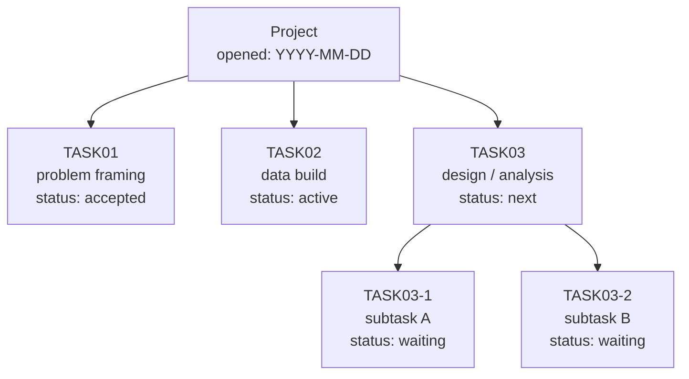
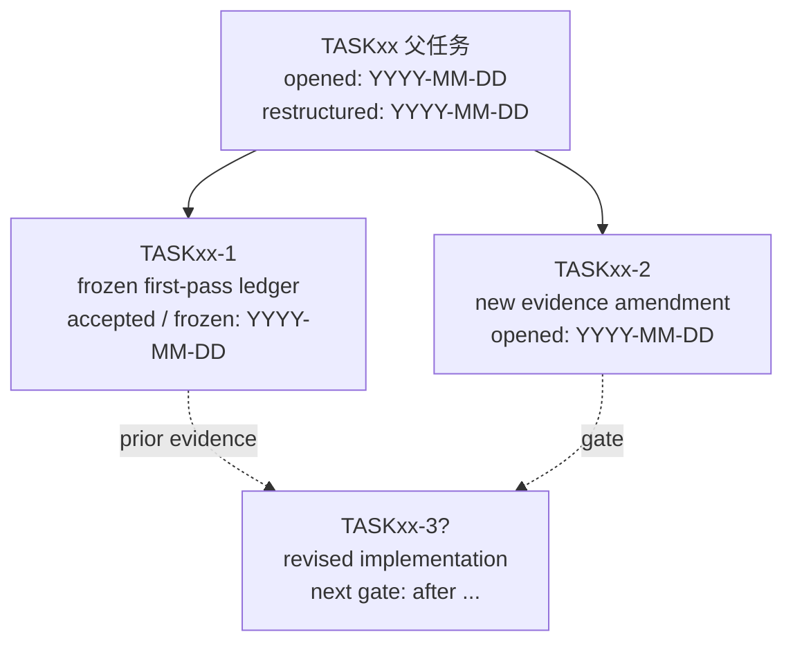
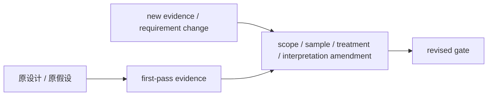

# Task-Driven Project Templates

Use these snippets when creating or updating a project. Adapt names and paths to the concrete project.

## README Sections

```markdown
# Project Name

## 1. Project Background

## 2. Key Paths

## 3. Task-Driven Architecture

## 4. Task Folder Rules

## 5. Notebook Dashboard

## 6. Environment and Makefile

## 7. TDD and Testing

## 8. Expected Final Outputs

## 9. Run Order

## 10. Notes and Risks

## 11. Phase Reviews and Evidence Maps
```

## TASKxx-说明.md Template

```markdown
# TASKxx：任务名称

## 1. 任务目的

## 2. 上游依赖

## 3. 输入文件

## 4. 执行方法

## 5. 输出文件

## 6. 完成标准

## 7. 测试要求

## 8. 注意事项

## 9. 证据与日志

- ReAct 日志：
- 关键 outputs：
- 关键 docs：
- 上游/下游双链：
```

## Large Exploratory TASK Template

```markdown
# TASKxx：大型探索任务

## 背景

## 目标

## 当前判断

## 子任务结构

```text
subtasks/
├── TASKxx-01-...
├── TASKxx-02-...
└── TASKxx-03-...
```

## 状态表

| 子任务 | 状态 | 证据 | 下一步 |
|---|---|---|---|

## 主证据链

- [[outputs/evidence-report|证据报告]]
- [[logs/log|ReAct 日志]]
- [[docs/decision-note|决策说明]]

## Done Criteria

## 反哺候选

| 经验 | 证据 | 目标 workflow/skill | 状态 |
|---|---|---|---|
```

## ReAct log Template

```markdown
## YYYY-MM-DD HH:mm ReAct：标题

### Thought

### Action

### Observation

### Reflection
```

## Project Phase Review Template

```markdown
# 项目阶段复盘：标题

## 定位

## 一句话总览

## 原始问题如何变化

## 阶段时间线

## 关键 Red -> Green

| Red | Green | 证据 |
|---|---|---|

## 证据地图

- [[tasks/TASK01-name/TASK01-说明|TASK01]]
- [[tasks/TASK02-name/outputs/report|关键报告]]

## 数据/覆盖率边界

## 工程坑与恢复策略

## 可迁移方法

## Workflow / Skill 反哺

| 经验 | 反哺位置 | 证据 |
|---|---|---|

## 下一步
```

## Default Task Lineage Map Template

Use this by default for multi-task projects, nested subtasks, multi-agent workstreams, or exploratory projects where task order may evolve.

````markdown
# Task Lineage Map

> 状态：active  
> 日期：YYYY-MM-DD  
> 目的：提供项目任务树的可视化入口。

## 读图说明

Mermaid `click` 是否可用取决于渲染器。本文同时提供 Mermaid clickable nodes 和普通 Markdown 链接表。

## 任务谱系图



## 稳定跳转表

| 节点 | 状态 | 文档 |
|---|---|---|
| Project | active | [README.md](../README.md) |
| TASK01 | accepted | [TASK01](../tasks/TASK01-name/README.md) |
| TASK02 | active | [TASK02](../tasks/TASK02-name/README.md) |
| TASK03 | next | [TASK03](../tasks/TASK03-name/README.md) |

## 更新规则

- 新增、冻结、接受或阻塞任务时更新本图。
- 若任务结构发生含义变化，例如降级、拆父、迁移或解释边界变化，另建 project change map。
````

## Project Change Map Template

Use this when an exploratory project changes structure because new evidence changes task scope, sample definition, interpretation, or downstream gates.

````markdown
# TASKxx Project Change Map

> 状态：v1  
> 日期：YYYY-MM-DD  
> 父任务：`../TASKxx-说明.md`  
> 目的：记录任务谱系、变更触发、旧结果冻结和后续入口。

## 读图说明

Mermaid `click` 是否可用取决于渲染器。本文同时提供 Mermaid clickable nodes 和普通 Markdown 链接表。

## 时间标注规则

- 图中标注关键阶段日期：opened、accepted / frozen、restructured、next gate。
- 表中标注变更日期；若同一天内存在多个顺序敏感动作，再使用具体时间。
- 历史运行命令和细粒度日志时间以各自 evidence ledger / log 为准，本文只记录项目结构层面的时间。

## 任务谱系图



## 变更路径图



## 稳定跳转表

| 节点 | 文档 |
|---|---|
| 父任务 | [README.md](../README.md) |
| 变更说明 | [docs/restructure-map.md](../docs/restructure-map.md) |
| frozen ledger | [subtasks/TASKxx-1-first-pass/README.md](../subtasks/TASKxx-1-first-pass/README.md) |
| amendment | [subtasks/TASKxx-2-amendment/README.md](../subtasks/TASKxx-2-amendment/README.md) |

## 变更追踪表

| 变更项 | 变更日期 | 原口径 | 新口径 | 处理方式 | 证据 |
|---|---|---|---|---|---|
| TASKxx 角色 | YYYY-MM-DD | 单一任务 | 父任务 / umbrella | 更新 README 和 logs |  |
| first-pass 结果 | YYYY-MM-DD | 主结果 | frozen evidence ledger | 迁入 TASKxx-1 |  |
| 新信息 | YYYY-MM-DD | 未纳入 | amendment gate | 新开 TASKxx-2 |  |

## 路径迁移表

| 迁移日期 | 旧路径 | 新路径 |
|---|---|---|
| YYYY-MM-DD | `outputs/` | `subtasks/TASKxx-1-first-pass/outputs/` |
| YYYY-MM-DD | `logs/log.md` | `subtasks/TASKxx-1-first-pass/logs/log.md` |
| YYYY-MM-DD | `subtasks/TASKxx-A/` | `subtasks/TASKxx-1-first-pass/subtasks/TASKxx-1-A/` |

## 甘特图是否必要

本次更适合 lineage / change-path 图，而不是甘特图。若问题变成排期，再补 Mermaid Gantt。
````

## Standing TASK00 Project Governance Template

Use this only when a project has several evidence-backed competing workstreams and needs a portfolio gate before opening the next substantive TASK. It is not a default burden for small linear projects.

Copyable scaffold:

```text
../assets/standing-task00-governance-template.md
```

The template includes TASK00 README, Portfolio Roadmap, Task Lineage Map, task registry, workstream portfolio, decision log, dated review, ReAct log, and governed-TASK backlink snippets. Read `standing-project-governance.md` before applying it.

## Makefile Template

```makefile
PROJECT_ROOT := $(shell pwd)
VENV := $(PROJECT_ROOT)/.venv
PYTHON := $(VENV)/bin/python
PIP := $(VENV)/bin/pip
KERNEL_NAME := project-kernel
KERNEL_DISPLAY := Python (Project Name)
REQUIREMENTS := $(PROJECT_ROOT)/common/requirements.txt

.PHONY: help init venv install kernel notebook test test-unit test-e2e test-uat freeze clean-cache

help:
	@echo "Available targets:"
	@echo "  make init        Create folders and virtual environment"
	@echo "  make install     Install dependencies"
	@echo "  make kernel      Register .venv as a Jupyter kernel"
	@echo "  make notebook    Start Jupyter Notebook"
	@echo "  make test        Run all tests"

init:
	mkdir -p common tests/unit tests/e2e tests/uat tests/fixtures tasks final_outputs docs scripts/legacy_or_experimental
	python3 -m venv $(VENV)

venv:
	python3 -m venv $(VENV)

install: venv
	$(PIP) install --upgrade pip
	$(PIP) install -r $(REQUIREMENTS)

kernel:
	$(PYTHON) -m ipykernel install --user --name "$(KERNEL_NAME)" --display-name "$(KERNEL_DISPLAY)"

notebook:
	$(PYTHON) -m notebook 00_project_dashboard.ipynb

test:
	$(PYTHON) -m pytest tests

test-unit:
	$(PYTHON) -m pytest tests/unit

test-e2e:
	$(PYTHON) -m pytest tests/e2e

test-uat:
	$(PYTHON) -m pytest tests/uat

freeze:
	$(PIP) freeze > common/requirements.lock.txt

clean-cache:
	find tasks -type d -name cache -maxdepth 3 -exec rm -rf {}/* \;
```

## requirements.txt Starter

```text
pandas
numpy
tqdm
ipykernel
notebook
pytest
openpyxl
```

Add domain packages such as `jieba`, `gensim`, `scikit-learn`, `pdfplumber`, or `python-docx` only when the project needs them.

## Test Style

```python
def test_expected_behavior():
    # GIVEN：明确的输入、fixture 或前置状态

    # WHEN：执行被测试的函数或流程

    # THEN：验证业务可见的输出或副作用
```

## Task Status Table

```markdown
| Task | 状态 | 输入 | 输出 | 是否需要人工 |
|---|---|---|---|---|
| TASK01 | 待运行 | 原始数据 | 数据盘点表 | 否 |
| TASK02 | 待运行 | 需求文档 | 基础配置/词典/规则 | 是，确认口径 |
| TASK03 | 待运行 | TASK01-02 输出 | 中间产物 | 否 |
| TASK04 | 待运行 | 中间产物 | 候选结果 | 否 |
| TASK05 | 待处理 | 候选结果 | 人工定稿结果 | 是，核心人工环节 |
| TASK06 | 待运行 | 定稿结果 | 最终交付 | 否 |
```
