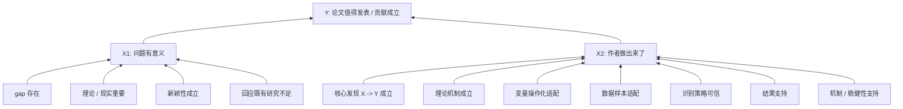

# Dialogue Insight 004: 论效题、审稿与自下而上的论证树

状态：`captured / review-pending / forward-test-pending`

## 基本信息

- 标题：论效题、审稿与自下而上的论证树
- 日期：2026-06-19
- 触发类型：`dialogue-insight`
- 触发场域：`hybrid`
- 关联 case / TASK / workflow：
  - `projects/CASE-J-260110-xinyuan-review/`
  - `workflow-argument-validity`
  - `skills/academic-review-argument-audit/`
  - `workflow-paper-writing-review`
- 关联 dialogue：
  - `001-学术论文的双层论证与汇合箭头.md`
  - `002-论文的顶层发表正当性论证.md`
- 不纳入本条的内容：
  - `003-论证作为判断决策与治理的母结构.md` 中的高阶泛化。本条只回到论效题与审稿。
- 敏感边界：
  - 本札记保存方法论对话，不复制稿件正文或审稿意见全文。
  - 真实 case 证据保存在 `projects/CASE-J-260110-xinyuan-review/inputs/`。

## 原始困惑

> 用户：OK，那我们继续聊审稿和论效题的结合。我们再回顾下论效题的基本流程吧？

> 用户：OK，我怎么越看，越觉得这就是审稿呢？尤其是我们把「内层大箭头」拆出来看，这不就是「找结论」吗？然后再拆他的分论点、分分论点、分分分论点、论据1、论据2、论据3、箭头...然后就能绘制出一棵「论证树」吧？我不知道我表达的是否清晰，请帮我总结下我的困惑。而论效题本质上也是要先绘制出来这棵「论证树」，然后分析箭头嘛，对吧？

> 用户：而且我觉得这个论证树，非常适合mermaid来话，结合obsidian，会一目了然。对不对

> 用户：OK！！！重要发现！！不过，你的那个mermaid树画倒了吧🤣 应该最终证明的那个在顶部

> 用户：我更喜欢第二中「要表达“支撑方向”，也可以让箭头从下往上」这才更清晰的嘛。OK，到这里，我们是不是可以综合一下，把从“治理国家”收回来之后的内容，总结记录一下了😆 治理国家那咕噜掐了别播

## 当时回答摘录

> Codex：论效题的底层流程是：
>
> ```text
> 找结论
> -> 找论据
> -> 拆箭头
> -> 找断点
> -> 写成“为什么推不出”的分析段
> ```
>
> 如果用一句话说：
>
> > 论效题就是：把一段材料的“相信我”拆成几条箭头，然后说明这些箭头为什么不足以支撑结论。

> Codex：论效题和审稿本质上都是先恢复一棵“论证树”，再检查树上每条从论据到分论点、从分论点到总论点的箭头是否成立；区别只是论效题是短文本小树，审稿是学术论文大树。

> Codex：Mermaid 负责看见论证树，Obsidian 负责把每个节点接回证据、笔记和审稿意见。

> Codex：如果要表达“支撑方向”，也可以让箭头从下往上：
>
> ```mermaid
> flowchart BT
>     G1["文献 gap 存在"] --> X1["X1: 问题有意义"]
>     G2["理论 / 现实重要"] --> X1
>     G3["新颖性成立"] --> X1
>
>     F1["核心发现 X -> Y 成立"] --> X2["X2: 作者做出来了"]
>     F2["理论机制成立"] --> X2
>     F3["变量操作化适配"] --> X2
>     F4["数据样本适配"] --> X2
>     F5["识别策略可信"] --> X2
>     F6["结果支持"] --> X2
>
>     X1 --> Y["Y: 论文值得发表 / 贡献成立"]
>     X2 --> Y
> ```

## 共同发现

论效题和审稿可以统一为同一个动作：

```text
先恢复论证树
再检查每条支撑箭头
最后判断哪些断点影响根结论
```

论效题是短文本小树，审稿是学术论文大树。区别不在底层逻辑，而在规模、专业证据类型和输出场景。

## 论效题基本流程

```text
1. 找结论
2. 找论据
3. 拆箭头
4. 找断点
5. 写成“为什么推不出”的分析段
```

其中“找结论”对应审稿中的：

```text
找作者真正要证明的核心发现
找论文最顶层的发表正当性命题
```

## 审稿版论证树

审稿应先把论文拆成一棵大型论证树：

```text
Y：论文值得发表 / 贡献成立
├── X1：问题有意义
│   ├── gap 存在
│   ├── 理论重要
│   ├── 现实重要
│   ├── 新颖性成立
│   └── 与既有研究不同
└── X2：作者做出来了
    ├── 核心发现 X -> Y 成立
    ├── 理论机制成立
    ├── 变量操作化适配
    ├── 数据样本适配
    ├── 识别策略可信
    ├── 主结果支持
    └── 稳健性 / 机制支持
```

但在 Mermaid 中，为了表达支撑方向，默认采用自下而上的箭头：



## 候选方法论命题

```text
如果以后做审稿，
应先绘制作者的论证树，
再把文献、理论、变量、数据、方法、结果放回对应节点，
并沿支撑方向检查每条箭头是否足以支撑上层结论。
```

## Mermaid / Obsidian 规则草案

- Mermaid 负责显示论证树。
- Obsidian 负责把每个节点链接回原文段落、TASK 输出、变量表、方法审查和审稿意见。
- 默认图形方向使用 `flowchart BT`：
  - 底部是证据、论据和子支撑；
  - 中部是一级支撑节点；
  - 顶部是最终待证明结论；
  - 箭头表示 `supports`，即下层支撑上层。
- 如果为了“拆解视角”临时使用 top-down，必须注明箭头表示 `requires / 展开`，不是支撑方向。

## 可迁移规则草案

- 输入信号：
  - 用户询问审稿与论效题的关系；
  - 用户要梳理论文主线、贡献链或“作者到底在证明什么”；
  - 用户希望用 Mermaid / Obsidian 可视化论文结构。
- 处理动作：
  - 先画论证树；
  - 每个节点标注证据来源；
  - 每条箭头标注状态：`strong / weak / broken / unclear`；
  - 每个 major concern 绑定到一条或多条断裂箭头。
- 输出要求：
  - 输出 `argument-tree.md` 或 `argument-tree.mmd`；
  - 包含 Mermaid 图、节点表、箭头状态表、对应 review issue；
  - 不把文献、方法、变量、结果写成互不相干的 checklist。
- 验收标准：
  - 能从图上看出根结论、一级支撑、二级支撑和断裂箭头；
  - 能解释每个审稿问题如何影响 `X1`、`X2` 或最终 `Y`。

## 反哺位置

| 目标 | 动作 | 状态 |
|---|---|---|
| `workflow-argument-validity/SKILL.md` | 增加“论证树 + 箭头验收”作为通用输出形态 | pending |
| `skills/argument-validity-audit/SKILL.md` | 增加论证树恢复和 Mermaid 输出规则 | pending |
| `skills/academic-review-argument-audit/SKILL.md` | 增加审稿版 `X1/X2/Y` 论证树模板 | pending |
| `assets/argument-chain-table.md` | 可扩展为节点表 + 箭头状态表 | pending |
| `workflow-paper-writing-review` | 可将某一 TASK 产物命名为 `argument-tree.md` | pending |

## 与 case 的关系

- case 是否只是触发场域：是。欣媛 case 触发了论效题与审稿结合的讨论。
- case 是否提供 primary evidence：部分提供。case 可用于测试论证树是否能解释真实审稿意见。
- 哪些内容不能从 case 泛化：
  - 不能从单个 case 推断所有论文只有同一棵固定树；
  - 不同论文可能需要增加或删减节点；
  - Mermaid 方向规则是当前偏好和审稿可读性规则，仍需 forward-test。

## 回顾判断

- 保留为 dialogue：yes。
- 进入 reference：pending。
- 升级 workflow / Skill：pending。
- 需要 forward-test：yes，需要在下一篇论文审稿中产出 `argument-tree.md` 测试可用性。

## 日志

- 2026-06-19：captured；记录“从高阶泛化收回审稿后”的论效题、审稿、论证树和 Mermaid 支撑方向讨论。
