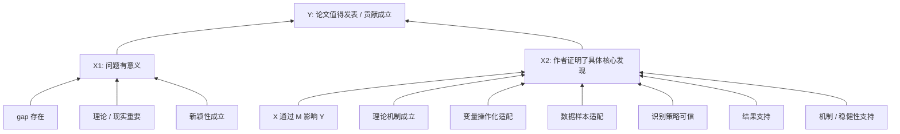
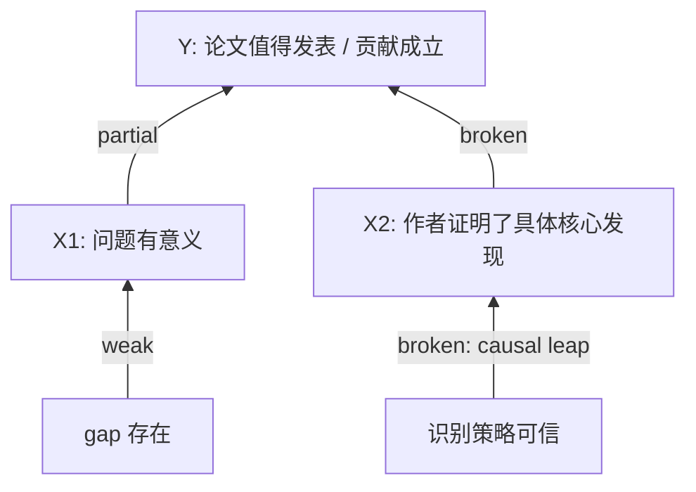

# Mermaid Argument Tree Template

默认使用 `flowchart BT`，箭头表示 supports。

```mermaid
flowchart BT
    G1["gap 存在"] --> X1["X1: 问题有意义"]
    G2["理论 / 现实重要"] --> X1
    G3["新颖性成立"] --> X1

    F1["X 通过 M 影响 Y"] --> X2["X2: 作者证明了具体核心发现"]
    F2["理论机制成立"] --> X2
    F3["变量操作化适配"] --> X2
    F4["数据样本适配"] --> X2
    F5["识别策略可信"] --> X2
    F6["结果支持"] --> X2
    F7["机制 / 稳健性支持"] --> X2

    X1 --> Y["Y: 论文值得发表 / 贡献成立"]
    X2 --> Y
```

## With Arrow Status

```mermaid
flowchart BT
    G1["gap 存在"] -- "weak" --> X1["X1: 问题有意义"]
    F5["识别策略可信"] -- "broken: causal leap" --> X2["X2: 作者证明了具体核心发现"]
    X1 -- "partial" --> Y["Y: 论文值得发表 / 贡献成立"]
    X2 -- "broken" --> Y
```
