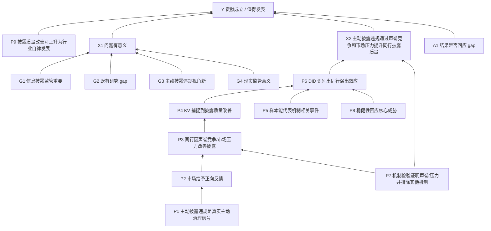
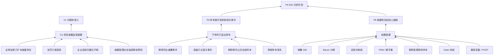

# Paper Argument Tree

## 路由判断

- 文本类型：学术论文审稿案例。
- 主轴：`workflow-argument-validity`，不是 `workflow-paper-writing-review`。
- 目标：把论文恢复为学术论文大型论证树。审稿意见如何击中断裂箭头，另见 `review-issue-arrow-map.md`。

## 图层边界

本文件只画作者自己的论证树：

```text
作者论据 -> 作者子观点 -> 作者核心发现 -> 作者贡献声称
```

不把欣媛审稿意见放进这棵树。审稿人的攻击、削弱和修改建议放在：

```text
review-issue-arrow-map.md
```

这样可以避免一张图里混入“作者如何证明”和“审稿人如何反驳”两套方向相反的箭头。

## 作者想证明的顶层命题

这篇论文表面在证明：

```text
上市公司主动披露违规
-> 同行业其他企业信息披露质量提升
```

但从发表正当性看，作者真正要证明的是：

```text
X1：这个问题有意义
+ X2：主动披露违规通过声誉竞争和市场压力提升同行披露质量
-> Y：本文贡献成立 / 值得发表
```

其中，`X2` 不能只写成“作者做出来了”这个概述标签，而应先还原作者声称自己做出的核心发现。

## X2-core：作者声称的核心发现

一句话版本：

```text
上市公司主动披露违规
-> 通过声誉竞争和市场压力
-> 提升同行业其他企业的信息披露质量
-> 进而引导行业自律发展
```

结构化 X/Y 关系：

| 角色 | 概念 | 操作化 / 证据 | 作者声称 |
|---|---|---|---|
| X | 上市公司主动披露违规 | 行业内某公司披露违规，且当年不存在与该违规有关的问询或处罚；生成同行处理组 `Peerdumy` 和时间虚拟变量 `POST` | 这是一个行业冲击和治理信号 |
| Y1 | 同行业其他企业信息披露质量 | KV 指数作为反向代理；`Peerdumy x POST` 系数显著为负 | 同行企业信息披露质量提高 |
| M1 | 声誉竞争机制 | 事件公司主动披露后获得正向 CAR；正 CAR 组同行改善更明显 | 市场奖励主动披露，同行为维持竞争地位而改善披露 |
| M2 | 市场压力机制 | 高投资者关注 / 高分析师关注组效应更强 | 外部关注增加，同行为回应市场压力而改善披露 |
| M3 | 信息传导机制排除 | 监管距离、处罚次数、处罚严重程度检验 | 作者认为信息传导不是主要机制 |
| Z1 | 情境强化因素 | 事件公司行业地位、违规对象、违规严重程度、同行外部融资依赖、行业竞争程度 | 某些情境下溢出效应更强 |
| Y2 | 行业自律发展 | 由同行信息披露质量改善进一步上升 | 该发现具有行业治理和监管政策意义 |

所以本 TASK 中，`X2` 更准确地写作：

```text
X2：作者证明了“主动披露违规 -> 同行披露质量提升”这一核心发现，
并给出声誉竞争和市场压力机制解释。
```

## X1：问题有意义

作者用于证明 `X1` 的支撑节点：

| 节点 | 作者声称 | 稿件位置 | 初步状态 | 风险 |
|---|---|---|---|---|
| G1 | 信息披露监管与资本市场治理重要 | 引言 para 1 | strong | 背景重要性较清楚 |
| G2 | 既有研究多关注内外部监督，较少关注主动披露违规对同行披露质量的影响 | 引言 para 3 | weak/unclear | gap 需要更精确地区分“披露行为”“负面信息披露”“同行影响”“披露质量” |
| G3 | 主动披露违规兼具负面信息与治理信号，能扩展信息披露影响因素研究 | 引言 para 5-6 | weak | “违规”与“主动披露”的概念关系没有完全稳住 |
| G4 | 对监管部门优化监管理念有现实意义 | 引言 para 3、para 7 | weak | 政策启示依赖 X2 是否可信，不能先行成立 |

X1 小结：

```text
信息披露重要
+ 负面/主动披露同行影响有 gap
+ 监管现实意义
-> 研究问题有意义
```

该支整体有基础，但 gap 与 novelty 需要更精确的文献和概念边界支撑。

## X2：主动披露违规通过声誉竞争和市场压力提升同行披露质量

作者用于证明 `X2` 的支撑节点：

| 节点 | 作者声称 | 稿件位置 | 初步状态 | 风险 |
|---|---|---|---|---|
| F1 | 理论机制成立：声誉竞争和市场压力使同行改善披露质量 | 理论分析 para 1-6 | weak | 行为信号、内容信息、监管信息传导之间边界滑动 |
| F2 | 核心变量测量成立：主动披露违规、同行企业、信息披露质量可以被变量识别 | 研究设计 para 1-5 | weak/broken | 主动披露定义有时序漏洞；KV 指数难承载长期“行业自律”概念 |
| F3 | 样本设计成立：筛选得到干净的同行溢出事件 | 样本选择 para 1 | weak/broken | 剔除同业集中违规可能剔除最相关机制事件 |
| F4 | 识别策略成立：多时点 DID 支持溢出效应 | 研究设计、表3-表4 | weak | 聚类层级、POST 定义、样本筛选可能影响显著性与解释 |
| F5 | 主结果支持：Peerdumy x POST 显著为负，代表披露质量提升 | 实证结果 para 2-3 | partial | 结果依赖 KV 指标解释和处理效应定义 |
| F6 | 稳健性支持：堆叠 DID、Bacon、安慰剂、PSM、Oster、替换变量等 | 稳健性 para 4-10 | partial | 多数稳健性未直接回应核心断点 |
| F7 | 机制支持：声誉竞争、市场压力成立，信息传导不成立 | 机制检验 para 1-8 | weak | 声誉机制样本一致性、信息传导排除逻辑存在疑问 |
| F8 | 异质性/进一步分析支持解释 | 进一步分析 para 1-9 | weak | 违规严重程度、外部融资依赖、行业竞争等解释需要和主机制一致 |

X2 小结：

```text
theory + measurement + data/sample + identification + results + mechanism/robustness
-> 主动披露违规通过声誉竞争和市场压力提升同行披露质量
```

后续审稿意见映射主要围绕这条 X2 核心发现链展开，详见 `review-issue-arrow-map.md`。

## Y：贡献成立 / 值得发表

作者最终上升到：

```text
主动披露违规可以通过声誉竞争和市场压力引导同行改善披露质量
-> 能促进行业自律发展
-> 丰富信息披露、负面信息披露、同行溢出和资本市场监管文献
```

但是，若 X2 的理论前提、样本、测量、识别和机制支撑不稳，则最终 `Y` 会从“贡献成立”降级为：

```text
一个有趣但尚未被当前设计可靠证明的研究设想
```

## V2：命题化论证树

上一版树已经区分了 `X1 / X2 / Y`，但部分节点仍偏“模块名”。论效式抽树要求节点必须尽量改写成可检验命题：

```text
作者用 A 推出 B，
再用 B 推出 C。
```

因此，本 case 的 X2 应进一步拆成以下命题链：

| 命题 ID | 作者要证明的命题 | 上层节点 |
|---|---|---|
| P1 | X：主动披露违规是一种真实主动的治理信号，而不是抢跑式被动披露 | X2 |
| P2 | M1 前提：事件公司的主动披露违规会获得市场正向反馈 | X2 |
| P3 | M1/M2：同行企业观察到这种反馈或压力后，会改善自身披露质量 | X2 |
| P4 | Y1 测量：KV 指数变化能够代表同行企业信息披露质量改善 | X2 |
| P5 | 样本筛选保留的是能够检验同行溢出机制的代表性事件 | X2 |
| P6 | X -> Y1：多时点 DID 设定能够识别主动披露违规对同行披露质量的影响 | X2 |
| P7 | M1/M2/M3：机制检验证明声誉竞争和市场压力成立，并能排除信息传导机制 | X2 |
| P8 | 稳健性检验回应了核心定义、样本、测量和识别威胁 | X2 |
| P9 | Y1 -> Y2：同行披露质量改善可以上升为行业自律发展 | Y |

更贴近作者实际论证链的是：

```text
P1 真实主动披露
-> P2 市场正向反馈
-> P3 同行因声誉竞争/市场压力改善披露
-> P4 同行披露质量被 KV 指标捕捉
-> P6 DID 识别出该影响
-> X2 作者证明了核心发现
-> Y 贡献成立
```

并且：

```text
P5 样本代表性
+ P8 稳健性回应核心威胁
-> P6 DID 识别可信

P7 机制检验成立
-> P3 声誉竞争/市场压力解释可信

P9 行业自律发展
-> Y 贡献上升成立
```

## V2 Mermaid 论证树



## 迁移发现

学术论文审稿不是简单按“文献、理论、变量、方法、结果”横向 checklist 检查，而是先问：

```text
这些模块分别支撑 X1、X2 还是 Y？
哪个模块的断裂会导致贡献不成立？
```

在本 case 中，本文件只负责说明作者如何试图支撑 `X2 -> Y`。这些箭头是否成立，以及审稿意见如何削弱它们，由 `review-issue-arrow-map.md` 单独承接。

## V2 质量判断

V2 相比 V1 的改进：

- V1 是 `X1/X2/Y + 模块节点`；
- V2 是 `X1/X2/Y + 可检验命题 + 支撑箭头`；
- 审稿意见不再放在作者论证树里，而是通过 `review-issue-arrow-map.md` 映射到具体 `A -> B`。

仍需下一份文件 `review-issue-arrow-map.md` 承接完整箭头表。

## V3：继续展开中层命题

V2 已经把 X2 还原为核心发现，并将模块节点改成命题节点。但按论效题标准，许多命题仍然只是中层节点，还需要继续展开为：

```text
底层论据 / 原文事实 / 表格结果 / 文献引用
-> 子观点
-> 上层命题
```

也就是说，不仅要有：

```text
P5 样本能代表机制相关事件 -> P6 DID 识别可信
```

还要继续问：

```text
作者用什么证明 P5？
这些论据真的能推出 P5 吗？
```

### G1 展开：信息披露监管重要

作者用以下论据支撑 `G1: 信息披露监管重要`：

| evidence_id | 底层论据 | 作者推出的子观点 | 上层命题 | 初步状态 |
|---|---|---|---|---|
| G1-e1 | 《证券法》修订扩充信息披露责任主体和责任范围 | 制度层面对信息披露要求提高 | G1 信息披露监管重要 | strong |
| G1-e2 | 修订后处罚力度显著提高 | 信息披露违法违规的监管成本上升 | G1 | strong |
| G1-e3 | 企业违法违规行为仍屡见不鲜 | 现有监管仍面临现实问题 | G1 | strong |
| G1-e4 | 新修订《上市公司信息披露管理办法》强调“事前预防” | 监管逻辑从事后处罚扩展到事前预防 | G1 | strong |

G1 的支撑箭头：

```text
证券法修订 + 处罚提高 + 违规仍多 + 信息披露管理办法强调事前预防
-> 信息披露监管重要
-> 研究问题有意义
```

这一支目前相对稳。它主要说明背景重要，但还不能单独推出本文贡献成立。

### P5 展开：样本能代表机制相关事件

作者用以下样本处理支撑 `P5: 样本能代表机制相关事件`：

| evidence_id | 底层论据 / 处理规则 | 作者推出的子观点 | 上层命题 |
|---|---|---|---|
| P5-e1 | 若行业内多家企业主动披露违规且时间间隔过短，则剔除该行业公司样本 | 避免事件重叠和混淆 | P5 样本能代表机制相关事件 |
| P5-e2 | 处理组仅保留行业内第一次满足条件的主动披露违规事件 | 锁定首次冲击 | P5 |
| P5-e3 | 剔除主动披露违规的公司样本 | 聚焦同行企业反应 | P5 |
| P5-e4 | 剔除 ST、金融保险、仅前后期存在、关键变量缺失样本 | 保证样本可比和数据完整 | P5 |

P5 的作者箭头：

```text
剔除同业重叠事件
+ 保留行业首次事件
+ 剔除事件公司自身样本
+ 常规数据清洗
-> 得到干净同行溢出样本
-> 样本能代表机制相关事件
```

该箭头是否成立，另在 `review-issue-arrow-map.md` 中审查。

### P8 展开：稳健性回应核心威胁

作者用以下检验支撑 `P8: 稳健性回应核心威胁`：

| evidence_id | 底层论据 / 检验 | 作者推出的子观点 | 上层命题 |
|---|---|---|---|
| P8-e1 | 堆叠 DID | 处理异质性处理效应问题 | P8 稳健性回应核心威胁 |
| P8-e2 | Bacon 分解 | 负权重问题不严重 | P8 |
| P8-e3 | 安慰剂检验 | 排除部分随机/遗漏因素干扰 | P8 |
| P8-e4 | PSM 和熵平衡 | 缓解可观测样本选择差异 | P8 |
| P8-e5 | 剔除行业信息披露政策影响样本 | 排除共同政策冲击 | P8 |
| P8-e6 | Oster 检验 | 遗漏变量问题不严重 | P8 |
| P8-e7 | 替换被解释变量和 POST 定义 | 指标与时间设定下结果仍成立 | P8 |

P8 的作者箭头：

```text
堆叠 DID + Bacon + 安慰剂 + PSM/熵平衡 + 政策剔除 + Oster + 替换变量
-> 结果稳健
-> 核心威胁已被回应
```

该箭头是否成立，另在 `review-issue-arrow-map.md` 中审查。

### V3 Mermaid 局部展开



### V3 迁移规则

学术论文论证树不应停在 `G/P/F` 中层节点。每个关键中层节点都应继续展开：

```text
node_id:
  claim:
  supporting evidence:
  author arrow:
  upstream node:
  downstream node:
```

断点、审稿质疑和修改建议不写入作者树，统一进入 `review-issue-arrow-map.md`。

优先展开：

- 支撑 `X1` 的 gap / importance / novelty 节点；
- 支撑 `X2` 的 X、M、Y、sample、identification、robustness 节点；
- 支撑 `Y` 的 contribution-upgrading 节点。

## V4：完整展开论证树

本节是当前推荐使用的作者论证树版本。它把关键中层节点全部展开为：

```text
底层论据 -> 子观点 -> 中层命题 -> X1/X2/Y
```

### V4-1 X1：问题有意义

#### G1：信息披露监管重要

| evidence_id | 底层论据 | 子观点 | author arrow |
|---|---|---|---|
| G1-e1 | 信息披露有利于资源配置和资本市场稳定 | 信息披露是资本市场基础制度 | G1-e1 -> G1 |
| G1-e2 | 《证券法》修订扩充披露责任主体和责任范围，并提高处罚力度 | 监管制度强化信息披露责任 | G1-e2 -> G1 |
| G1-e3 | 违法违规手段仍在调整，企业违规仍屡见不鲜 | 信息披露监管仍有现实压力 | G1-e3 -> G1 |
| G1-e4 | 新修订《上市公司信息披露管理办法》强调“事前预防” | 监管逻辑从事后惩罚扩展到事前预防 | G1-e4 -> G1 |

```text
G1-e1 + G1-e2 + G1-e3 + G1-e4
-> G1 信息披露监管重要
-> X1 问题有意义
```

#### G2：既有研究存在 gap

| evidence_id | 底层论据 | 子观点 | author arrow |
|---|---|---|---|
| G2-e1 | 信息披露质量研究多认为披露改善是企业响应内外部监督要求的结果 | 既有研究偏监管/监督视角 | G2-e1 -> G2 |
| G2-e2 | 市场化因素文献虽关注同行影响，但多关注环境信息、创新信息等特定披露 | 既有同行披露研究对象有限 | G2-e2 -> G2 |
| G2-e3 | 既有研究或关注披露“量”，而非披露“质” | 既有研究指标层面与本文不同 | G2-e3 -> G2 |
| G2-e4 | 尚未关注企业主动披露违规及其对同行信息披露质量的影响 | 本文找到未充分回答的问题 | G2-e4 -> G2 |

```text
G2-e1 + G2-e2 + G2-e3 + G2-e4
-> G2 既有研究没有充分解释“主动披露违规如何影响同行披露质量”
-> X1 问题有意义
```

#### G3：主动披露违规视角有新意

| evidence_id | 底层论据 | 子观点 | author arrow |
|---|---|---|---|
| G3-e1 | 主动披露违规同时包含“主动披露”和“违规”两类属性 | 该现象兼具治理信号和负面信息 | G3-e1 -> G3 |
| G3-e2 | 负面信息披露可能获得投资者信任和融资便利，也可能带来股价下跌和融资受限 | 该现象方向不确定，值得实证检验 | G3-e2 -> G3 |
| G3-e3 | 同行企业可能因声誉竞争改善披露，也可能因风险暴露减少披露 | 该现象具有同行溢出的理论张力 | G3-e3 -> G3 |
| G3-e4 | 本文把企业个体治理问题引申到行业信息披露决策问题 | 研究视角从个体扩展到行业 | G3-e4 -> G3 |

```text
G3-e1 + G3-e2 + G3-e3 + G3-e4
-> G3 主动披露违规提供新的研究视角
-> X1 问题有意义
```

#### G4：现实监管意义

| evidence_id | 底层论据 | 子观点 | author arrow |
|---|---|---|---|
| G4-e1 | 监管制度设计大多考虑事前事中监督、事后惩罚 | 现有监管工具偏硬约束 | G4-e1 -> G4 |
| G4-e2 | 作者主张监管也需要激励企业主动披露违规信息 | 主动披露可成为软性监管工具 | G4-e2 -> G4 |
| G4-e3 | 作者主张市场机制可引导行业内其他企业增强披露 | 研究结果具有行业治理政策含义 | G4-e3 -> G4 |

```text
G4-e1 + G4-e2 + G4-e3
-> G4 本文具有现实监管意义
-> X1 问题有意义
```

### V4-2 X2：主动披露违规通过声誉竞争和市场压力提升同行披露质量

#### P1：X 成立，主动披露违规是真实主动治理信号

| evidence_id | 底层论据 | 子观点 | author arrow |
|---|---|---|---|
| P1-e1 | 企业在当年披露违规行为，且不存在与该违规有关的问询或处罚 | 可把该披露识别为主动披露 | P1-e1 -> P1 |
| P1-e2 | 违规包括违反证券法、信披管理办法等监管明文禁止事项 | 研究对象确属违规信息 | P1-e2 -> P1 |
| P1-e3 | 同行业其他上市公司 Peerdumy 取 1，POST 在事件年及后两年取 1 | X 被转化为可估计的行业冲击 | P1-e3 -> P1 |

```text
P1-e1 + P1-e2 + P1-e3
-> P1 主动披露违规这一 X 被定义并操作化
-> X2 核心发现可被检验
```

#### P2：M1 前提成立，主动披露违规获得市场正向反馈

| evidence_id | 底层论据 | 子观点 | author arrow |
|---|---|---|---|
| P2-e1 | 信号传递理论认为企业可通过行为向外部投资者传递治理水平和未来潜力 | 主动披露违规可被解释为信号 | P2-e1 -> P2 |
| P2-e2 | 主动披露展示诚实守信、敢于负责和自我纠偏机制 | 市场可能把披露行为理解为治理质量 | P2-e2 -> P2 |
| P2-e3 | 图3显示公告后累计超额收益率上升 | 事件后市场反应转正 | P2-e3 -> P2 |
| P2-e4 | 表10显示 [-5,5]、[-10,10] CAR 至少在 5% 水平显著为正 | 市场平均给予主动披露违规正向反馈 | P2-e4 -> P2 |

```text
P2-e1 + P2-e2 + P2-e3 + P2-e4
-> P2 主动披露违规获得市场正向反馈
-> P3 同行有声誉竞争动机
```

#### P3：M1/M2 成立，同行因声誉竞争和市场压力改善披露

| evidence_id | 底层论据 | 子观点 | author arrow |
|---|---|---|---|
| P3-e1 | 行业内企业不仅存在产品竞争，也存在声誉竞争 | 同行会关注相对声誉位置 | P3-e1 -> P3 |
| P3-e2 | 事件公司获得诚信溢价或正向关注时，同行为维持相对地位有动力改善披露 | 声誉竞争可传导到同行披露行为 | P3-e2 -> P3 |
| P3-e3 | 主动披露违规引发投资者、分析师等对行业合规风险的警觉 | 行业内其他企业面临市场压力 | P3-e3 -> P3 |
| P3-e4 | 高投资者关注 / 高分析师关注组中处理效应更强 | 市场压力机制有经验支持 | P3-e4 -> P3 |
| P3-e5 | 正 CAR 组的 Peerdumy_PosCAR x POST 显著，负 CAR 组不显著 | 声誉反馈越正，同行改善越明显 | P3-e5 -> P3 |

```text
P3-e1 + P3-e2 + P3-e3 + P3-e4 + P3-e5
-> P3 同行因声誉竞争和市场压力改善披露
-> X2 核心发现的机制链成立
```

#### P4：Y1 被测到，KV 能代表同行披露质量改善

| evidence_id | 底层论据 | 子观点 | author arrow |
|---|---|---|---|
| P4-e1 | 作者参考 Kim and Verrecchia、陈运森等，用交易量对收益率影响系数衡量披露质量 | KV 是文献中可用的信息披露质量代理 | P4-e1 -> P4 |
| P4-e2 | KV 越小表示信息披露质量越高 | 负向系数可解释为披露质量提高 | P4-e2 -> P4 |
| P4-e3 | Peerdumy x POST 系数显著为负 | 处理后同行 KV 下降 | P4-e3 -> P4 |
| P4-e4 | 作者计算经济意义为信息披露质量平均提升 9.58% | 主结果具有经济解释 | P4-e4 -> P4 |

```text
P4-e1 + P4-e2 + P4-e3 + P4-e4
-> P4 同行信息披露质量改善被测到
-> P6 DID 识别出 X -> Y1
```

#### P5：样本能代表机制相关事件

| evidence_id | 底层论据 / 处理规则 | 子观点 | author arrow |
|---|---|---|---|
| P5-e1 | 样本期为 2007-2024 年 A 股上市公司 | 覆盖较长资本市场样本 | P5-e1 -> P5 |
| P5-e2 | 使用事件前 3 年、当年、后 2 年窗口 | 构造围绕事件的处理窗口 | P5-e2 -> P5 |
| P5-e3 | 剔除同行业多家企业间隔过短的主动披露违规样本 | 避免事件重叠混淆 | P5-e3 -> P5 |
| P5-e4 | 仅保留行业内第一次满足条件的主动披露违规事件 | 锁定首次行业冲击 | P5-e4 -> P5 |
| P5-e5 | 剔除事件公司自身样本 | 聚焦同行溢出效应 | P5-e5 -> P5 |
| P5-e6 | 剔除 ST、金融保险、仅前后期存在和关键变量缺失样本 | 提高样本可比性和数据完整性 | P5-e6 -> P5 |

```text
P5-e1 + P5-e2 + P5-e3 + P5-e4 + P5-e5 + P5-e6
-> 干净同行溢出样本
-> P5 样本能代表机制相关事件
-> P6 DID 识别可信
```

#### P6：DID 能识别 X -> Y1

| evidence_id | 底层论据 | 子观点 | author arrow |
|---|---|---|---|
| P6-e1 | 模型以 Peerdumy x POST 为核心解释变量，控制公司固定效应和年度固定效应 | 模型试图比较处理组和对照组在事件前后差异 | P6-e1 -> P6 |
| P6-e2 | 事前趋势检验中 Pre 项不显著 | 平行趋势前提得到支持 | P6-e2 -> P6 |
| P6-e3 | After 项显著为负 | 处理后信息披露质量改善 | P6-e3 -> P6 |
| P6-e4 | 基准回归中 Peerdumy x POST 在 1% 水平显著为负 | 主效应支持 X -> Y1 | P6-e4 -> P6 |
| P6-e5 | 经济意义显示披露质量平均提升 9.58% | 主效应不只是统计显著，也有经济解释 | P6-e5 -> P6 |

```text
P6-e1 + P6-e2 + P6-e3 + P6-e4 + P6-e5
-> P6 DID 识别出主动披露违规对同行披露质量的正向影响
-> X2 主动披露违规通过声誉竞争和市场压力提升同行披露质量
```

#### P7：机制检验证明 M1/M2，并排除 M3

| evidence_id | 底层论据 | 子观点 | author arrow |
|---|---|---|---|
| P7-e1 | 正 CAR 处理组显著，负 CAR 处理组不显著 | 声誉竞争机制得到支持 | P7-e1 -> P7 |
| P7-e2 | 高投资者关注和高分析师关注组效应更强 | 市场压力机制得到支持 | P7-e2 -> P7 |
| P7-e3 | 监管距离高低组均显著且组间无差异 | 信息传导机制不是主要渠道 | P7-e3 -> P7 |
| P7-e4 | 同行被处罚次数和处罚严重程度不显著 | 作者认为监管信息传导未提升监管效率 | P7-e4 -> P7 |
| P7-e5 | 作者解释违规公告多仅简述主体和行为，缺少细节 | 监管部门难以从公告获得足够信息 | P7-e5 -> P7 |

```text
P7-e1 + P7-e2 + P7-e3 + P7-e4 + P7-e5
-> P7 声誉竞争和市场压力是主要机制，信息传导不是主要机制
-> P3 / X2 机制解释成立
```

#### P8：稳健性回应核心威胁

| evidence_id | 底层论据 / 检验 | 子观点 | author arrow |
|---|---|---|---|
| P8-e1 | 堆叠 DID 重新估计仍显著 | 异质性处理效应问题不改变主结论 | P8-e1 -> P8 |
| P8-e2 | Bacon 分解显示负权重问题不严重 | 多时点 DID 权重风险较小 | P8-e2 -> P8 |
| P8-e3 | 500 次安慰剂检验 | 随机处理难以复制主结果 | P8-e3 -> P8 |
| P8-e4 | PSM 和熵平衡后仍显著 | 可观测样本差异不驱动结果 | P8-e4 -> P8 |
| P8-e5 | 剔除分行业信息披露指引影响行业后仍显著 | 共同政策冲击不驱动结果 | P8-e5 -> P8 |
| P8-e6 | Oster 检验通过 | 遗漏变量问题不严重 | P8-e6 -> P8 |
| P8-e7 | 替换为 DA 指标、重构 POST 后仍显著 | 指标和时间设定变化下结果仍成立 | P8-e7 -> P8 |

```text
P8-e1 + P8-e2 + P8-e3 + P8-e4 + P8-e5 + P8-e6 + P8-e7
-> 结果稳健
-> P8 核心威胁已被回应
-> P6 DID 识别可信
```

#### P9：Y1 能上升为 Y2，披露质量改善意味着行业自律发展

| evidence_id | 底层论据 | 子观点 | author arrow |
|---|---|---|---|
| P9-e1 | 研究结论称主动披露违规提升同行披露质量 | 同行企业行为发生改善 | P9-e1 -> P9 |
| P9-e2 | 声誉竞争和市场压力使同行主动改善披露 | 改善来自市场化内生机制 | P9-e2 -> P9 |
| P9-e3 | 政策启示主张鼓励主动披露违规信息 | 主动披露可成为治理激励工具 | P9-e3 -> P9 |
| P9-e4 | 政策启示主张利用市场机制引导行业内企业增强披露 | 个体行为可扩展为行业治理机制 | P9-e4 -> P9 |

```text
P9-e1 + P9-e2 + P9-e3 + P9-e4
-> P9 同行披露质量改善可上升为行业自律发展
-> Y 贡献成立 / 值得发表
```

### V4-3 Y：贡献成立 / 值得发表

作者最终贡献声称由三条支撑合推：

| support_id | 支撑命题 | 来自 |
|---|---|---|
| Y-s1 | 问题有意义：信息披露监管重要，既有研究存在 gap，主动披露违规视角有新意 | X1 |
| Y-s2 | 主动披露违规通过声誉竞争和市场压力提升同行披露质量 | X2 |
| Y-s3 | 发现回应 gap 并可上升为行业自律发展和监管政策启示 | P9 / A1 |

```text
X1 问题有意义
+ X2 主动披露违规通过声誉竞争和市场压力提升同行披露质量
+ P9 发现可上升为行业自律和政策启示
-> Y 本文贡献成立 / 值得发表
```

### V4 Mermaid 完整展开骨架

```mermaid
flowchart BT
    G1e1["信息披露有利于资源配置和资本市场稳定"] --> G1["G1 监管重要"]
    G1e2["证券法修订与处罚提高"] --> G1
    G1e3["企业违规仍屡见不鲜"] --> G1
    G1e4["信披管理办法强调事前预防"] --> G1

    G2e1["研究偏监管/监督视角"] --> G2["G2 文献 gap"]
    G2e2["市场化披露研究对象有限"] --> G2
    G2e3["既有研究偏披露量而非质"] --> G2
    G2e4["尚未关注主动披露违规影响同行披露质量"] --> G2

    G3e1["主动披露违规兼具治理信号和负面信息"] --> G3["G3 视角新"]
    G3e2["负面信息披露方向不确定"] --> G3
    G3e3["同行可能改善或减少披露"] --> G3
    G3e4["从企业个体治理扩展到行业披露决策"] --> G3

    G4e1["监管工具偏事前事中监督和事后惩罚"] --> G4["G4 现实意义"]
    G4e2["主动披露可作为软性监管激励"] --> G4
    G4e3["市场机制可引导行业披露"] --> G4

    G1 --> X1["X1 问题有意义"]
    G2 --> X1
    G3 --> X1
    G4 --> X1

    P1e1["当年披露且无相关问询/处罚"] --> P1["P1 X 被定义"]
    P1e2["违规事项属于监管禁止事项"] --> P1
    P1e3["Peerdumy 与 POST 操作化"] --> P1
    P1 --> P2["P2 市场正向反馈"]

    P2e1["信号传递理论"] --> P2
    P2e2["主动披露展示诚信和纠偏"] --> P2
    P2e3["图3 CAR 上升"] --> P2
    P2e4["表10 CAR 显著为正"] --> P2

    P3e1["行业声誉竞争"] --> P3["P3 同行改善披露"]
    P3e2["正反馈带来竞优动机"] --> P3
    P3e3["外部关注形成市场压力"] --> P3
    P3e4["高关注组效应更强"] --> P3
    P3e5["正 CAR 组效应更强"] --> P3
    P2 --> P3

    P4e1["KV 是文献代理指标"] --> P4["P4 Y1 被测到"]
    P4e2["KV 越小披露质量越高"] --> P4
    P4e3["Peerdumy x POST 显著为负"] --> P4
    P4e4["经济意义 9.58%"] --> P4
    P3 --> P4

    P5e1["2007-2024 A 股样本"] --> P5["P5 样本代表机制事件"]
    P5e2["事件窗口"] --> P5
    P5e3["剔除重叠事件"] --> P5
    P5e4["保留首次事件"] --> P5
    P5e5["剔除事件公司自身"] --> P5
    P5e6["常规样本清洗"] --> P5

    P6e1["DID 模型和固定效应"] --> P6["P6 DID 识别 X->Y1"]
    P6e2["事前趋势 Pre 不显著"] --> P6
    P6e3["After 显著为负"] --> P6
    P6e4["基准回归显著为负"] --> P6
    P6e5["经济意义"] --> P6
    P4 --> P6
    P5 --> P6

    P7e1["正 CAR 组显著"] --> P7["P7 机制解释成立"]
    P7e2["高关注组显著"] --> P7
    P7e3["监管距离组间无差异"] --> P7
    P7e4["处罚次数/严重程度不显著"] --> P7
    P7e5["公告细节不足解释"] --> P7
    P7 --> P3

    P8e1["堆叠 DID"] --> P8["P8 稳健性回应威胁"]
    P8e2["Bacon 分解"] --> P8
    P8e3["安慰剂"] --> P8
    P8e4["PSM / 熵平衡"] --> P8
    P8e5["剔除政策影响"] --> P8
    P8e6["Oster"] --> P8
    P8e7["替换变量 / POST"] --> P8
    P8 --> P6

    P6 --> X2["X2 主动披露违规通过声誉竞争和市场压力提升同行披露质量"]
    P7 --> X2

    P9e1["同行披露质量改善"] --> P9["P9 上升为行业自律"]
    P9e2["市场化内生机制"] --> P9
    P9e3["鼓励主动披露政策启示"] --> P9
    P9e4["市场机制引导行业披露"] --> P9

    X1 --> Y["Y 贡献成立 / 值得发表"]
    X2 --> Y
    P9 --> Y
```



## V5：底层证据台账

V4 展开了作者论证树的关键节点，但许多“底层论据”仍是摘要性表述。V5 将底层证据进一步拆出为独立台账：

```text
evidence-ledger.md
```

作者树中的 `G1-e1`、`P4-e3`、`P8-e7` 等证据节点，都应能在 evidence ledger 中找到：

```text
evidence_id
类型
原文位置
具体证据
支撑节点 / 箭头
证据粒度
```

V5 的重要规则：

```text
表格、系数、显著性、变量定义、模型设定和文献引用都可以是 evidence node。
```

例如：

| evidence_id | 具体证据 | 支撑 |
|---|---|---|
| E-P4-3 | 基准回归中 `Peerdumy x POST` 系数在 1% 水平显著为负 | P4/P6 |
| E-P4-4 | 表4 列(2)系数 `-0.0111`，经济意义 `0.0111 / 0.1159 ≈ 9.58%` | P4/P6 |
| E-P8-3 | 安慰剂检验双侧 p=0.0560、左侧 p=0.0240 | P8 |
| E-G2-2 | Dye、Gleason et al. 支持同行披露决策影响文献 | G2 |

### V5 Mermaid：证据叶子展开图

V4 的图已经有底层论据节点，但这些节点还没有和 `evidence-ledger.md` 中的证据编号显式对应。V5 增加一棵 evidence-expanded tree，用 `E-*` 节点把“具体证据 -> 子观点 -> 中层命题 -> X1/X2/Y”画出来。

```mermaid
flowchart BT
    EG11["E-G1-1 信息披露有利于资源配置"] --> G1e1["G1-e1 信披监管重要"]
    EG12["E-G1-2 2019证券法修订并提高处罚"] --> G1e2["G1-e2 监管处罚增强"]
    EG13["E-G1-3 企业违规仍屡见不鲜"] --> G1e3["G1-e3 现实问题未消失"]
    EG14["E-G1-4 2025信披办法强调事前预防"] --> G1e4["G1-e4 监管转向预防"]
    G1e1 --> G1["G1 信息披露监管重要"]
    G1e2 --> G1
    G1e3 --> G1
    G1e4 --> G1

    EG21["E-G2-1 既有研究偏监管/监督"] --> G2e1["G2-e1 既有研究视角有限"]
    EG22["E-G2-2 Dye/Gleason 支持同行披露影响"] --> G2e2["G2-e2 同行披露决策文献存在"]
    EG23["E-G2-3 相关披露研究对象分散"] --> G2e3["G2-e3 尚未聚焦本文问题"]
    EG24["E-G2-4 作者声称缺少主动披露违规影响同行研究"] --> G2e4["G2-e4 gap 声称"]
    G2e1 --> G2["G2 文献 gap 存在"]
    G2e2 --> G2
    G2e3 --> G2
    G2e4 --> G2

    EG31["E-G3-1 主动披露兼具诚信信号和负面信息"] --> G3e1["G3-e1 视角有张力"]
    EG32["E-G3-2 披露收益/成本和负面披露文献"] --> G3e2["G3-e2 理论上方向不确定"]
    EG33["E-G3-3 同行可能改善或减少披露"] --> G3e3["G3-e3 有待经验检验"]
    EG34["E-G3-4 个体治理扩展到行业披露"] --> G3e4["G3-e4 研究对象扩展"]
    G3e1 --> G3["G3 主动披露违规视角新"]
    G3e2 --> G3
    G3e3 --> G3
    G3e4 --> G3

    EG41["E-G4-1 监管政策偏监督和惩罚"] --> G4e1["G4-e1 政策工具背景"]
    EG42["E-G4-2 主动披露可作为激励"] --> G4e2["G4-e2 软性监管建议"]
    EG43["E-G4-3 市场机制可引导行业披露"] --> G4e3["G4-e3 市场治理意义"]
    G4e1 --> G4["G4 现实监管意义"]
    G4e2 --> G4
    G4e3 --> G4

    G1 --> X1["X1 问题有意义"]
    G2 --> X1
    G3 --> X1
    G4 --> X1

    EP11["E-P1-1 当年披露且无相关问询/处罚"] --> P1e1["P1-e1 X 定义"]
    EP12["E-P1-2 违规属于监管禁止事项"] --> P1e2["P1-e2 违规范围"]
    EP13["E-P1-3 Peerdumy 与 POST 操作化"] --> P1e3["P1-e3 处理和时期变量"]
    P1e1 --> P1["P1 X 被定义和操作化"]
    P1e2 --> P1
    P1e3 --> P1

    EP21["E-P2-1 信号传递理论"] --> P2e1["P2-e1 理论基础"]
    EP22["E-P2-2 主动披露展示诚信和纠偏"] --> P2e2["P2-e2 正向信号解释"]
    EP23["E-P2-3 图3 CAR 上升"] --> P2e3["P2-e3 市场反应图示"]
    EP24["E-P2-4 表10 CAR 显著为正"] --> P2e4["P2-e4 市场反应表格"]
    P1 --> P2["P2 市场给予正向反馈"]
    P2e1 --> P2
    P2e2 --> P2
    P2e3 --> P2
    P2e4 --> P2

    EP31["E-P3-1 行业声誉竞争"] --> P3e1["P3-e1 声誉竞争机制"]
    EP32["E-P3-2 外部关注形成市场压力"] --> P3e2["P3-e2 市场压力机制"]
    EP33["E-P3-3 高关注组效应显著"] --> P3e3["P3-e3 关注度机制证据"]
    EP34["E-P3-4 正CAR组效应更强"] --> P3e4["P3-e4 声誉竞争证据"]
    P2 --> P3["P3 同行因声誉竞争/市场压力改善披露"]
    P3e1 --> P3
    P3e2 --> P3
    P3e3 --> P3
    P3e4 --> P3

    EP41["E-P4-1 KV 指数文献依据"] --> P4e1["P4-e1 Y 代理指标依据"]
    EP42["E-P4-2 KV 越小披露质量越高"] --> P4e2["P4-e2 指标方向"]
    EP43["E-P4-3 Peerdumy x POST 1%显著为负"] --> P4e3["P4-e3 主效应显著"]
    EP44["E-P4-4 系数 -0.0111; 经济意义 9.58%"] --> P4e4["P4-e4 经济意义"]
    P3 --> P4["P4 Y1 被 KV 变化捕捉"]
    P4e1 --> P4
    P4e2 --> P4
    P4e3 --> P4
    P4e4 --> P4

    EP51["E-P5-1 2007-2024 A股样本"] --> P5e1["P5-e1 样本期"]
    EP52["E-P5-2 前3年/当年/后2年窗口"] --> P5e2["P5-e2 事件窗口"]
    EP53["E-P5-3 剔除同业重叠事件"] --> P5e3["P5-e3 排除污染"]
    EP54["E-P5-4 保留行业首次事件"] --> P5e4["P5-e4 首次事件规则"]
    EP55["E-P5-5 剔除事件公司自身"] --> P5e5["P5-e5 只看同行"]
    EP56["E-P5-6 最终11339个公司-年度观察"] --> P5e6["P5-e6 样本清洗结果"]
    P5e1 --> P5["P5 样本能代表机制相关事件"]
    P5e2 --> P5
    P5e3 --> P5
    P5e4 --> P5
    P5e5 --> P5
    P5e6 --> P5

    EP61["E-P6-1 DID 模型+公司/年度固定效应"] --> P6e1["P6-e1 识别模型"]
    EP62["E-P6-2 Pre 项不显著"] --> P6e2["P6-e2 平行趋势"]
    EP63["E-P6-3 After 项显著为负"] --> P6e3["P6-e3 动态效应"]
    EP64["E-P6-4 表4系数 -0.0111"] --> P6e4["P6-e4 基准回归"]
    EP65["E-P4-4 经济意义 9.58%"] --> P6e5["P6-e5 效应量解释"]
    P4 --> P6["P6 DID 识别 X -> Y1"]
    P5 --> P6
    P6e1 --> P6
    P6e2 --> P6
    P6e3 --> P6
    P6e4 --> P6
    P6e5 --> P6

    EP71["E-P7-1 正CAR组显著"] --> P7e1["P7-e1 声誉竞争机制"]
    EP72["E-P7-2 高关注组显著"] --> P7e2["P7-e2 市场压力机制"]
    EP73["E-P7-3 监管距离组间无差异"] --> P7e3["P7-e3 信息传导排除1"]
    EP74["E-P7-4 处罚次数/严重程度不显著"] --> P7e4["P7-e4 信息传导排除2"]
    EP75["E-P7-5 公告细节不足解释"] --> P7e5["P7-e5 排除理由"]
    P7e1 --> P7["P7 机制检验证明 M1/M2 并排除 M3"]
    P7e2 --> P7
    P7e3 --> P7
    P7e4 --> P7
    P7e5 --> P7
    P7 --> P3

    EP81["E-P8-1 堆叠 DID 仍显著"] --> P8e1["P8-e1 堆叠 DID"]
    EP82["E-P8-2 Bacon later-vs-earlier 权重2.4%"] --> P8e2["P8-e2 Bacon 分解"]
    EP83["E-P8-3 placebo p=0.0560/0.0240"] --> P8e3["P8-e3 安慰剂"]
    EP84["E-P8-4 PSM/熵平衡后仍显著"] --> P8e4["P8-e4 匹配与平衡"]
    EP85["E-P8-5 剔除政策影响后仍显著"] --> P8e5["P8-e5 政策剔除"]
    EP86["E-P8-6 Oster beta*/delta"] --> P8e6["P8-e6 Oster"]
    EP87["E-P8-7 替换DA/POST后仍显著"] --> P8e7["P8-e7 替换变量"]
    P8e1 --> P8["P8 稳健性回应核心威胁"]
    P8e2 --> P8
    P8e3 --> P8
    P8e4 --> P8
    P8e5 --> P8
    P8e6 --> P8
    P8e7 --> P8
    P8 --> P6

    P6 --> X2["X2 主动披露违规通过声誉竞争和市场压力提升同行披露质量"]
    P7 --> X2

    EP91["E-P9-1 主动披露提升同行披露质量"] --> P9e1["P9-e1 发现总结"]
    EP92["E-P9-2 声誉竞争和市场压力是机制"] --> P9e2["P9-e2 机制总结"]
    EP93["E-P9-3 建议主动披露豁免/减罚"] --> P9e3["P9-e3 政策启示1"]
    EP94["E-P9-4 支持市场监督"] --> P9e4["P9-e4 政策启示2"]
    P9e1 --> P9["P9 发现上升为行业自律/政策启示"]
    P9e2 --> P9
    P9e3 --> P9
    P9e4 --> P9

    X1 --> Y["Y 贡献成立 / 值得发表"]
    X2 --> Y
    P9 --> Y
```



若 restored Markdown 没有保留具体表格数值，不能假装知道。该类证据在 ledger 中标为：

```text
needs-table-qc
```

后续若要把论证树升级为可提交级审稿证据，应回到 PDF 表格或表格抽取文件补齐：

```text
表格编号
变量名
系数
t 值 / 标准误
显著性
样本量
固定效应
聚类层级
```
