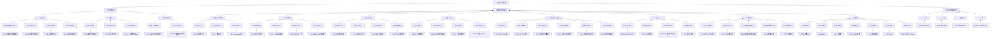

# Evidence-Expanded Mermaid Full V2

状态：`2A-author-evidence-tree`

```mermaid
flowchart BT
  EG11["E-G1-1 信披有利资源配置"] --> G1e1["G1-e1 信披监管重要"]
  EG12["E-G1-2 证券法提高处罚"] --> G1e2["G1-e2 监管强化"]
  EG13["E-G1-3 违规仍存在"] --> G1e3["G1-e3 现实问题"]
  EG14["E-G1-4 事前预防监管"] --> G1e4["G1-e4 政策转向"]
  G1e1 --> G1["G1 背景重要"]
  G1e2 --> G1
  G1e3 --> G1
  G1e4 --> G1

  EG21["E-G2-1 既有研究偏监督"] --> G2e1["G2-e1 文献视角"]
  EG22["E-G2-2 同行披露文献"] --> G2e2["G2-e2 相邻文献"]
  EG24["E-G2-4 主动披露违规 gap"] --> G2e4["G2-e4 gap 声称"]
  G2e1 --> G2["G2 文献 gap"]
  G2e2 --> G2
  G2e4 --> G2

  EG31["E-G3-1 诚信信号或自利披露"] --> G3e1["G3-e1 方向不确定"]
  EG33["E-G3-3 同行可能改善或降低披露"] --> G3e3["G3-e3 经验问题"]
  G3e1 --> G3["G3 研究问题有张力"]
  G3e3 --> G3

  G1 --> X1["X1 问题有意义"]
  G2 --> X1
  G3 --> X1

  EP11["E-P1-1 主动披露定义"] --> P1e1["P1-e1 X 定义"]
  EP12["E-P1-2 违规范围"] --> P1e2["P1-e2 违规定义"]
  EP13["E-P1-3 Peerdumy/POST"] --> P1e3["P1-e3 X 操作化"]
  P1e1 --> P1["P1 X 被定义和操作化"]
  P1e2 --> P1
  P1e3 --> P1

  EP21["E-P2-1 信号传递理论"] --> P2e1["P2-e1 理论依据"]
  EP22["E-P2-2 诚信/纠偏叙事"] --> P2e2["P2-e2 行为信号"]
  EP23["E-P2-3 图3 CAR 上升"] --> P2e3["P2-e3 市场反应"]
  EP24["E-P2-4 表10 CAR 显著为正"] --> P2e4["P2-e4 市场认可"]
  P2e1 --> P2["P2 市场正向解读"]
  P2e2 --> P2
  P2e3 --> P2
  P2e4 --> P2

  EP31["E-P3-1 声誉竞争叙事"] --> P3e1["P3-e1 声誉竞争"]
  EP32["E-P3-2 外部关注压力"] --> P3e2["P3-e2 市场压力"]
  EP33["E-P3-3 高关注组显著"] --> P3e3["P3-e3 关注机制"]
  EP34["E-P3-4 正 CAR 组显著"] --> P3e4["P3-e4 声誉机制"]
  P3e1 --> P3["P3 同行改善披露"]
  P3e2 --> P3
  P3e3 --> P3
  P3e4 --> P3

  EP41["E-P4-1 KV 文献依据"] --> P4e1["P4-e1 Y 依据"]
  EP42["E-P4-2 KV 越小质量越高"] --> P4e2["P4-e2 指标方向"]
  EP43["E-P4-3 主效应显著负"] --> P4e3["P4-e3 显著性"]
  EP44["E-P4-4 系数 -0.0111 / 9.58%"] --> P4e4["P4-e4 经济意义"]
  P4e1 --> P4["P4 Y 被 KV 捕捉"]
  P4e2 --> P4
  P4e3 --> P4
  P4e4 --> P4

  EP51["E-P5-1 2007-2024 A股"] --> P5e1["P5-e1 样本期"]
  EP52["E-P5-2 t-3 到 t+2 窗口"] --> P5e2["P5-e2 时间窗口"]
  EP53["E-P5-3 剔除同业重叠事件"] --> P5e3["P5-e3 排除污染"]
  EP54["E-P5-4 保留行业首次事件"] --> P5e4["P5-e4 首次事件"]
  EP55["E-P5-5 剔除事件公司自身"] --> P5e5["P5-e5 只看同行"]
  EP56["E-P5-6 其他样本剔除"] --> P5e6["P5-e6 清洗规则"]
  P5e1 --> P5["P5 样本支撑同行溢出"]
  P5e2 --> P5
  P5e3 --> P5
  P5e4 --> P5
  P5e5 --> P5
  P5e6 --> P5

  EP61["E-P6-1 DID+公司/年 FE"] --> P6e1["P6-e1 识别模型"]
  EP62["E-P6-2 公司层聚类"] --> P6e2["P6-e2 标准误"]
  EP63["E-P6-3 Pre 不显著/After 显著"] --> P6e3["P6-e3 动态趋势"]
  EP64["E-P6-4 表4主效应"] --> P6e4["P6-e4 基准结果"]
  P6e1 --> P6["P6 DID 识别 X -> Y"]
  P6e2 --> P6
  P6e3 --> P6
  P6e4 --> P6

  EP71["E-P7-1 正 CAR 组显著"] --> P7e1["P7-e1 声誉机制"]
  EP72["E-P7-2 高关注组显著"] --> P7e2["P7-e2 市场压力"]
  EP73["E-P7-3 监管距离无组间差异"] --> P7e3["P7-e3 排除信息传导1"]
  EP74["E-P7-4 处罚不显著"] --> P7e4["P7-e4 排除信息传导2"]
  EP75["E-P7-5 公告缺细节"] --> P7e5["P7-e5 排除解释"]
  P7e1 --> P7["P7 机制检验"]
  P7e2 --> P7
  P7e3 --> P7
  P7e4 --> P7
  P7e5 --> P7

  EP81["E-P8-1 堆叠 DID"] --> P8e1["P8-e1 稳健1"]
  EP82["E-P8-2 Bacon"] --> P8e2["P8-e2 稳健2"]
  EP83["E-P8-3 安慰剂"] --> P8e3["P8-e3 稳健3"]
  EP84["E-P8-4 PSM/熵平衡"] --> P8e4["P8-e4 稳健4"]
  EP85["E-P8-5 政策剔除"] --> P8e5["P8-e5 稳健5"]
  EP86["E-P8-6 Oster"] --> P8e6["P8-e6 稳健6"]
  EP87["E-P8-7 DA/POST_Month"] --> P8e7["P8-e7 稳健7"]
  P8e1 --> P8["P8 稳健性"]
  P8e2 --> P8
  P8e3 --> P8
  P8e4 --> P8
  P8e5 --> P8
  P8e6 --> P8
  P8e7 --> P8

  P1 --> X2["X2 作者证明核心发现"]
  P2 --> X2
  P3 --> X2
  P4 --> X2
  P5 --> X2
  P6 --> X2
  P7 --> X2
  P8 --> X2

  EP91["E-P9-1 主效应总结"] --> P9e1["P9-e1 发现"]
  EP92["E-P9-2 机制总结"] --> P9e2["P9-e2 机制"]
  EP93["E-P9-3 豁免/减罚建议"] --> P9e3["P9-e3 政策建议"]
  EP94["E-P9-4 行业透明度净化"] --> P9e4["P9-e4 上升"]
  P9e1 --> P9["P9 行业自律/政策启示"]
  P9e2 --> P9
  P9e3 --> P9
  P9e4 --> P9

  X1 --> Y["Y 贡献成立/值得发表"]
  X2 --> Y
  P9 --> Y
```
