# Paper Argument Tree Blind Run

状态：`review-frozen / manuscript-only / annotation-contaminated`

## 输入

```text
../../inputs/manuscript.md
```

未读取欣媛审稿意见。

## 一句话核心发现

上市公司主动披露违规行为（X）通过声誉竞争和市场压力机制（M），提升同行业其他企业的信息披露质量（Y），并据此上升为主动披露违规能够引导行业自律发展、改善资本市场信息透明度（Y2）。

## X / M / Y / Y2 表

| 元素 | 作者表述 | 操作化或证据位置 |
|---|---|---|
| X | 上市公司主动披露违规 | `Peerdumy × POST`；主动披露违规定义见三（二）变量定义 |
| Y | 同行业其他企业信息披露质量提升 | KV 指数；KV 越小表示信息披露质量越高 |
| M1 | 声誉竞争机制 | 事件公司主动披露违规后的市场反应；正 CAR 组效应更强 |
| M2 | 市场压力机制 | 投资者关注和分析师关注高的同行企业效应更强 |
| M3 | 信息传导机制不成立 | 监管距离、处罚次数、处罚严重程度相关检验不支持 |
| Y2 | 行业自律发展 / 监管启示 | 结论与政策启示部分 |

## 顶层论证

```text
X1：研究问题有意义
+ X2：作者证明了“主动披露违规提升同行信息披露质量”
-> Y：论文贡献成立 / 值得发表
```

## Mermaid 作者论证树

```mermaid
flowchart BT
  E11["证券法修订、处罚力度提高、事前预防监管增强<br/>引言 para 1"] --> G1["信息披露监管重要且现实问题突出"]
  E12["主动披露违规可能带来诚信信号，也可能带来行业信任风险<br/>引言 para 2"] --> G2["主动披露违规的同行溢出方向不确定"]
  E13["既有研究多关注监管、市场竞争、声誉约束或特定披露<br/>引言 para 3"] --> G3["主动披露违规影响同行信息披露质量存在研究 gap"]
  G1 --> X1["X1：研究问题有意义"]
  G2 --> X1
  G3 --> X1

  E21["信号传递理论：自曝其短可传递治理态度<br/>理论分析 para 1"] --> T1["主动披露违规可能被市场解读为积极信号"]
  E22["声誉竞争：同行为维持相对地位改善披露<br/>理论分析 para 2"] --> T2["声誉竞争机制"]
  E23["市场压力：外部利益相关者关注行业合规风险<br/>理论分析 para 3"] --> T3["市场压力机制"]
  T1 --> H1["H1：主动披露违规提升同行信息披露质量"]
  T2 --> H2["H2a：声誉竞争机制"]
  T3 --> H3["H2b：市场压力机制"]

  E31["2007-2024 沪深 A 股；同行业事件窗口；剔除事件公司自身<br/>三（一）"] --> D1["样本可用于观察同行溢出"]
  E32["KV 指数衡量信息披露质量，KV 越小披露质量越高<br/>三（二）"] --> D2["Y 被操作化为 KV 变化"]
  E33["Peerdumy × POST 定义处理组与事件后窗口<br/>三（二）"] --> D3["X 被操作化为同行业主动披露违规冲击"]
  E34["公司固定效应、年度固定效应、控制变量、公司层聚类<br/>三（三）"] --> D4["模型用于识别处理后同行变化"]
  D1 --> P1["研究设计支撑主效应检验"]
  D2 --> P1
  D3 --> P1
  D4 --> P1

  E41["事前趋势检验：Pre 系数不显著，After 系数显著为负<br/>四（二）"] --> R1["平行趋势前提被作者认为满足"]
  E42["表4：Peerdumy×POST 系数 1% 显著为负；经济意义约 9.58%<br/>四（三）"] --> R2["主结果显示同行信息披露质量提升"]
  E43["堆叠 DID、Bacon、安慰剂、PSM/熵平衡、政策剔除、Oster、替换变量<br/>四（四）"] --> R3["稳健性检验支持主结果"]
  R1 --> X2["X2：作者证明了具体核心发现"]
  R2 --> X2
  R3 --> X2

  E51["表10/图3：主动披露违规后市场反应转正；CAR 显著为正<br/>五（一）"] --> M1["市场认可是声誉竞争前提"]
  E52["表11：正 CAR 组效应显著，负 CAR 组不显著<br/>五（一）"] --> M2["声誉竞争机制获得支持"]
  E53["表12：高投资者关注/高分析师关注组效应更强<br/>五（二）"] --> M3["市场压力机制获得支持"]
  E54["表13：监管距离和处罚检验不支持信息传导机制<br/>五（三）"] --> M4["排除信息传导机制"]
  M1 --> X2
  M2 --> X2
  M3 --> X2
  M4 --> X2

  E61["行业领先企业、自涉违规、高外部融资依赖、高竞争行业效应更强<br/>六"] --> B1["边界条件和异质性补充解释"]
  B1 --> X2

  X1 --> Y["Y：论文贡献成立 / 值得发表"]
  X2 --> Y
  Y --> Y2["Y2：主动披露违规可引导行业自律发展 / 优化监管启示"]
```



## QC

| 项目 | 标记 |
|---|---|
| 表格原始数值 | manuscript 只有文字摘要，部分表格细节需 `needs-table-qc` |
| 稿件纯净度 | `annotation-contaminated`，稿件含既有批注和脚注疑问 |
| 作者树与审稿攻击 | 本文件只保留作者树，不加入欣媛意见 |
