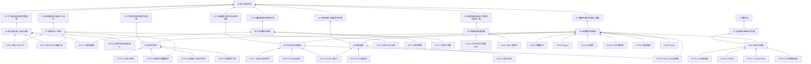

# Sensitivity-Expanded Mermaid Full V2

状态：`2B-review-sensitivity-tree`

```mermaid
flowchart BT
  EP23["E-P2-3 图3 CAR上升"] --> S1["S1 低信息含量 vs 强正反馈"]
  EP24["E-P2-4 表10 CAR显著为正"] --> S1
  EP75["E-P7-5 公告缺细节"] --> S1
  EH32["E-H3-2 危害不高/信息含量少"] --> S1
  S1 --> A1["A? 行为信号能否支撑声誉机制"]
  A1 --> X2["X2 核心发现可信"]

  EP52["E-P5-2 t-3到t+2窗口"] --> S2["S2 样本代表性"]
  EP53["E-P5-3 剔除同业重叠事件"] --> S2
  EP54["E-P5-4 仅保留行业首次事件"] --> S2
  EP55["E-P5-5 剔除事件公司"] --> S2
  S2 --> A2["A? 干净识别样本能否代表机制"]
  A2 --> X2

  EP11["E-P1-1 当年无问询/处罚"] --> S4["S4 主动性与时间编码"]
  EP13["E-P1-3 POST=t到t+2"] --> S4
  EP63["E-P6-3 Pre/After动态"] --> S4
  EP87["E-P8-7 POST_Month稳健"] --> S4
  S4 --> A4["A? 主动披露与效应时点是否匹配"]
  A4 --> X2

  EP62["E-P6-2 公司层聚类"] --> S5["S5 聚类层级"]
  EP13 --> S5
  EP64["E-P6-4 表4主效应"] --> S5
  S5 --> A5["A? 显著性统计推断是否可靠"]
  A5 --> X2

  EP41["E-P4-1 KV文献依据"] --> S6["S6 KV到行业自律"]
  EP42["E-P4-2 KV方向"] --> S6
  EP44["E-P4-4 -0.0111/9.58%"] --> S6
  EP94["E-P9-4 行业透明度净化"] --> S6
  S6 --> A6["A? 指标能否承载宏大贡献"]
  A6 --> Y["Y 贡献成立"]

  EP23 --> S7["S7 机制样本一致性"]
  EP24 --> S7
  EP71["E-P7-1 表11正CAR组"] --> S7
  EP53 --> S7
  S7 --> A7["A? 机制前提是否来自同一样本"]
  A7 --> X2

  EP73["E-P7-3 监管距离"] --> S8["S8 不显著排除机制"]
  EP74["E-P7-4 处罚不显著"] --> S8
  EP75 --> S8
  S8 --> A8["A? 不显著能否排除信息传导"]
  A8 --> X2

  EH41["E-H4-1 RZ方法公司年度EFD"] --> S9["S9 外部融资依赖层级"]
  EH42["E-H4-2 表17异质性"] --> S9
  S9 --> A9["A? 经典指标层级与本文操作化是否一致"]
  A9 --> X2

  EP81["E-P8-1 堆叠DID"] --> S10["S10 稳健性回应威胁"]
  EP82["E-P8-2 Bacon"] --> S10
  EP83["E-P8-3 安慰剂"] --> S10
  EP84["E-P8-4 PSM/熵平衡"] --> S10
  EP85["E-P8-5 政策剔除"] --> S10
  EP86["E-P8-6 Oster"] --> S10
  EP87 --> S10
  S2 --> S10
  S4 --> S10
  S5 --> S10
  S6 --> S10
  S10 --> A10["A? 稳健性是否回应核心威胁"]
  A10 --> X2
```
