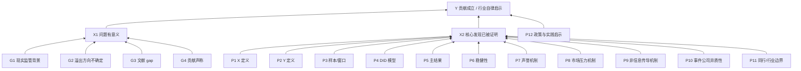
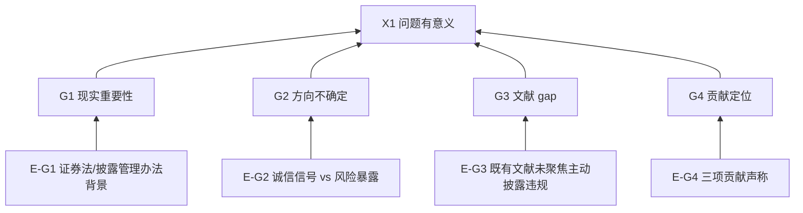
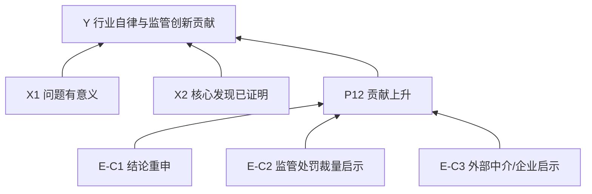

# Evidence-Expanded Mermaid

## Top Tree

```mermaid
flowchart BT
  G1["G1 现实监管背景"] --> X1["X1 问题有意义"]
  G2["G2 溢出方向不确定"] --> X1
  G3["G3 文献 gap"] --> X1
  G4["G4 贡献声称"] --> X1

  P1["P1 X 定义"] --> X2["X2 核心发现已被证明"]
  P2["P2 Y 定义"] --> X2
  P3["P3 样本/窗口"] --> X2
  P4["P4 DID 模型"] --> X2
  P5["P5 主结果"] --> X2
  P6["P6 稳健性"] --> X2
  P7["P7 声誉机制"] --> X2
  P8["P8 市场压力机制"] --> X2
  P9["P9 非信息传导机制"] --> X2
  P10["P10 事件公司异质性"] --> X2
  P11["P11 同行/行业边界"] --> X2

  X1 --> Y["Y 贡献成立 / 行业自律启示"]
  X2 --> Y
  P12["P12 政策与实践启示"] --> Y
```

## X1 Evidence

```mermaid
flowchart BT
  EG1["E-G1 证券法/披露管理办法背景"] --> G1["G1 现实重要性"]
  EG2["E-G2 诚信信号 vs 风险暴露"] --> G2["G2 方向不确定"]
  EG3["E-G3 既有文献未聚焦主动披露违规"] --> G3["G3 文献 gap"]
  EG4["E-G4 三项贡献声称"] --> G4["G4 贡献定位"]
  G1 --> X1["X1 问题有意义"]
  G2 --> X1
  G3 --> X1
  G4 --> X1
```

## X2 Evidence

```mermaid
flowchart BT
  ED1["E-D1 2007-2024 A股 11339观测"] --> P3["P3 样本/窗口"]
  ED2["E-D2 剔除规则"] --> P3
  EV3["E-V3 t至t+2 POST"] --> P3
  EV2["E-V2 主动披露违规定义"] --> P1["P1 X定义"]
  EV1["E-V1 KV越小质量越高"] --> P2["P2 Y定义"]
  EMODEL["E-MODEL DID+FE+聚类"] --> P4["P4 模型设定"]

  ER1["E-R1 表4 主结果负系数"] --> P5["P5 主结果"]
  ER2["E-R2 堆叠DID"] --> P6["P6 稳健性"]
  ER3["E-R3 Bacon/安慰剂"] --> P6
  ER4["E-R4 PSM/熵平衡"] --> P6
  ER5["E-R5 剔除共同政策"] --> P6
  ER6["E-R6 Oster"] --> P6
  ER7["E-R7 替换变量/POST"] --> P6

  EM1["E-M1 CAR为正"] --> P7["P7 声誉机制"]
  EM1A["E-M1A 正CAR组显著"] --> P7
  EM2["E-M2 高关注组显著"] --> P8["P8 市场压力机制"]
  EM3["E-M3 处罚检验不显著"] --> P9["P9 信息传导非主要路径"]

  EH1["E-H1 Leader组显著"] --> P10["P10 事件公司特征"]
  EH2["E-H2 自涉违规显著"] --> P10
  EH3["E-H3 严重程度均显著"] --> P10
  EH4["E-H4 高融资依赖显著"] --> P11["P11 同行/行业边界"]
  EH5["E-H5 高竞争负低竞争正"] --> P11

  P1 --> X2["X2 主动披露违规提升同行披露质量"]
  P2 --> X2
  P3 --> X2
  P4 --> X2
  P5 --> X2
  P6 --> X2
  P7 --> X2
  P8 --> X2
  P9 --> X2
  P10 --> X2
  P11 --> X2
```

## Y Evidence

```mermaid
flowchart BT
  EC1["E-C1 结论重申"] --> P12["P12 贡献上升"]
  EC2["E-C2 监管处罚裁量启示"] --> P12
  EC3["E-C3 外部中介/企业启示"] --> P12
  X1["X1 问题有意义"] --> Y["Y 行业自律与监管创新贡献"]
  X2["X2 核心发现已证明"] --> Y
  P12 --> Y
```

