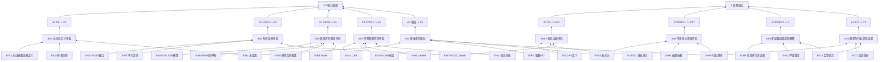

# Sensitivity-Expanded Mermaid

```mermaid
flowchart BT
  EV2["E-V2 主动披露违规定义"] --> S01["S01 主动性定义待验"]
  ED2["E-D2 样本剔除"] --> S01
  ER1["E-R1 主结果"] --> S01
  S01 --> A01["A? P1 -> X2"]
  A01 --> X2["X2 核心发现"]

  EV3["E-V3 POST窗口"] --> S02["S02 时间结构待验"]
  EPT["E-PT 平行趋势"] --> S02
  ER7["E-R7 POST_Month"] --> S02
  S02 --> A02["A? P3/P4 -> X2"]
  A02 --> X2

  EV1["E-V1 KV定义"] --> S04["S04 Y构念适配待验"]
  EDESC["E-DESC 描述统计"] --> S04
  ER7 --> S04
  S04 --> A04["A? P2 -> X2/Y"]
  A04 --> Y["Y 贡献成立"]

  EMODEL["E-MODEL DID模型"] --> S05["S05 因果识别跃迁待验"]
  ER4["E-R4 PSM/熵平衡"] --> S05
  ER5["E-R5 排除共同政策"] --> S05
  ER6["E-R6 Oster"] --> S05
  S05 --> A05["A? P4/P6 -> X2"]
  A05 --> X2

  EM1["E-M1 CAR"] --> S07["S07 声誉机制方向待验"]
  EM1A["E-M1A CAR分组"] --> S07
  EH1["E-H1 Leader"] --> S07
  EH2["E-H2 自涉违规"] --> S07
  S07 --> A07["A? P7/P10 -> X2"]
  A07 --> X2

  EM2["E-M2 高关注"] --> S08["S08 市场压力测量待验"]
  EH4["E-H4 融资依赖"] --> S08
  EH5["E-H5 行业竞争"] --> S08
  S08 --> A08["A? P8/P11 -> X2/Y"]
  A08 --> Y

  EM3["E-M3 信息传导非显著"] --> S09["S09 非显著结果反向解释"]
  EH3["E-H3 严重程度"] --> S09
  EC2["E-C2 监管启示"] --> S09
  S09 --> A09["A? P9/P12 -> Y"]
  A09 --> Y

  EH5 --> S10["S10 低竞争行业反向结果"]
  EC1["E-C1 结论归纳"] --> S10
  EC2 --> S10
  S10 --> A10["A? P11 -> Y2"]
  A10 --> Y

  ER1 --> S12["S12 表格视觉核验"]
  ER2["E-R2 堆叠DID"] --> S12
  EM2 --> S12
  EH5 --> S12
  S12 --> A12["A? 表值 -> X2"]
  A12 --> X2
```

