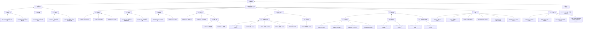

# Evidence-Expanded Mermaid

从 canonical ledgers 派生。为保证可读性，只绘制关键路径和最小证据节点；完整证据见 `evidence-ledger.md`。

```mermaid
flowchart BT
    EXREG1["E-X1-REG-1 证券法强化披露责任"] --> G1["G1 制度背景"]
    EXREG2["E-X1-REG-2 2025 管理办法事前预防"] --> G1
    EXGAP1["E-X1-GAP-1 监督响应文献为主"] --> G3["G3 文献缺口"]
    EXGAP2["E-X1-GAP-2 尚未关注主动披露违规外溢"] --> G3
    EXPUZ["E-X1-PUZZLE-1 正负方向并存"] --> G2["G2 现实谜题"]
    G1 --> X1["X1 问题有意义"]
    G2 --> X1
    G3 --> X1

    EXDEF1["E-XDEF-1 Peerdumy 定义"] --> P1["P1 X 操作化"]
    EXDEF4["E-XDEF-4 POST 定义"] --> P1
    EXDEF5["E-XDEF-5 t 至 t+2 为 1"] --> P1
    EYDEF2["E-YDEF-2 KV=交易量对收益率影响系数"] --> P3["P3 Y 操作化"]
    EYDEF3["E-YDEF-3 KV 越小披露质量越高"] --> P3
    ESAMP1["E-SAMPLE-1 2007-2024 A股"] --> P4["P4 样本数据"]
    ESAMP8["E-SAMPLE-8 N=11339"] --> P4
    EMOD2["E-MODEL-2 公司/年份 FE"] --> P5["P5 识别设计"]
    EMOD3["E-MODEL-3 公司层面聚类"] --> P5
    EPT1["E-PT-1 Pre t-3 不显著"] --> P51["P5.1 事前趋势"]
    EPT2["E-PT-2 Pre t-2 不显著"] --> P51
    P51 --> P5

    EMAIN1["E-MAIN-1 表4列1 -0.0157***"] --> P61["P6.1 主系数显著为负"]
    EMAIN2["E-MAIN-2 括号值 -3.92"] --> P61
    EMAIN3["E-MAIN-3 表4列2 -0.0111***"] --> P61
    EMAIN4["E-MAIN-4 括号值 -2.81"] --> P61
    EMAIN5["E-MAIN-5 N=11339"] --> P61
    EMAIN6["E-MAIN-6 经济意义 9.58%"] --> P62["P6.2 经济意义"]
    P61 --> P6["P6 主结果支持 H1"]
    P62 --> P6

    ERC3["E-MECH-RC-3 CAR[-5,5]=0.0182***"] --> P71["P7.1 声誉竞争"]
    ERC4["E-MECH-RC-4 CAR[-10,10]=0.0342***"] --> P71
    ERC5["E-MECH-RC-5 PosCAR[-1,1] -0.0174***"] --> P71
    ERC7["E-MECH-RC-7 PosCAR[-5,5] -0.0204***"] --> P71
    EMP3["E-MECH-MP-3 HighInv -0.0146**"] --> P72["P7.2 市场压力"]
    EMP5["E-MECH-MP-5 HighAna -0.0259***"] --> P72
    EIT4["E-MECH-IT-4 PunishCount 不显著"] --> P73["P7.3 信息传导非主机制"]
    EIT5["E-MECH-IT-5 PunishStrict 不显著"] --> P73
    P71 --> P7["P7 机制证据"]
    P72 --> P7
    P73 --> P7

    ER1["E-ROB-1 堆叠DID -0.0184***"] --> P8["P8 稳健性"]
    ER2["E-ROB-2 堆叠DID -0.0129***"] --> P8
    ER7["E-ROB-7 PSM -0.0116***"] --> P8
    ER8["E-ROB-8 熵平衡 -0.0103**"] --> P8
    ER10["E-ROB-10 Oster beta*=-0.0035"] --> P8
    ER13["E-ROB-13 POST_Month -0.0117***"] --> P8

    EH2["E-HET-LEAD-2 Leader1 -0.0230***"] --> P10["P10 进一步分析"]
    EHO2["E-HET-OWN-2 Own -0.0183***"] --> P10
    EHR2["E-HET-RELY-2 HighRely1 -0.0174***"] --> P10
    EHC2["E-HET-COMP-2 HighCom1 -0.0224*** / LowCom1 0.0128**"] --> P10

    P1 --> X2["X2 作者证明核心发现"]
    P3 --> X2
    P4 --> X2
    P5 --> X2
    P6 --> X2
    P7 --> X2
    P8 --> X2
    P10 --> X2
    X1 --> Y["Y 贡献成立"]
    X2 --> Y
    EPOL["E-X1-POLICY-1 主动披露豁免/减轻处罚"] --> P9["P9 政策启示"]
    P9 --> Y
```
