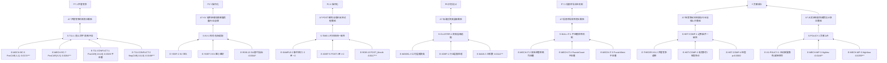

# Sensitivity-Expanded Mermaid

```mermaid
flowchart BT
    ERC5["E-MECH-RC-5 PosCAR[-1,1] -0.0174***"] --> ST11["S-T11-1 表11文字-表格冲突"]
    ERC7["E-MECH-RC-7 PosCAR[-5,5] -0.0204***"] --> ST11
    ET111["E-T11-CONFLICT-1 PosCAR[-10,10] -0.0028 不显著"] --> ST11
    ET112["E-T11-CONFLICT-2 NegCAR[-10,10] -0.0168***"] --> ST11
    ST11 --> AT11["A? 声誉竞争机制箭头需验"]
    AT11 --> P71["P7.1 声誉竞争"]

    EY2["E-YDEF-2 KV 定义"] --> SKV["S-KV-1 构念-指标适配"]
    EY3["E-YDEF-3 KV 越小越好"] --> SKV
    ER12["E-ROB-12 DA 替代指标 -0.0044*"] --> SKV
    SKV --> AKV["A? KV 是否承载信息披露质量/行业自律"]
    AKV --> P3["P3 Y 操作化"]

    ES2["E-SAMPLE-2 事件窗口 -3 至 +2"] --> STIME["S-TIME-1 时间结构一致性"]
    EX5["E-XDEF-5 POST t 至 t+2"] --> STIME
    ER13["E-ROB-13 POST_Month -0.0117***"] --> STIME
    STIME --> ATIME["A? POST 编码与理论反应过程需验"]
    ATIME --> P1["P1 X 操作化"]

    EM3["E-MODEL-3 公司层面聚类"] --> SCL["S-CLUSTER-1 聚类层级适配"]
    EX1["E-XDEF-1 行业层面处理"] --> SCL
    EMN3["E-MAIN-3 主系数 -0.0111***"] --> SCL
    SCL --> ACL["A? 标准误聚类层级需验"]
    ACL --> P5["P5 识别设计"]

    EI2["E-MECH-IT-2 高低监管距离均显著"] --> SNULL["S-NULL-IT-1 不显著排除机制"]
    EI4["E-MECH-IT-4 PunishCount 不显著"] --> SNULL
    EI5["E-MECH-IT-5 PunishStrict 不显著"] --> SNULL
    SNULL --> ANULL["A? 信息传导排除箭头需验"]
    ANULL --> P73["P7.3 信息传导非主机制"]

    ETH2["E-THEORY-H1-2 声誉竞争逻辑"] --> SHET["S-HET-COMP-1 边界条件一致性"]
    EHC2["E-HET-COMP-2 高竞争负/低竞争正"] --> SHET
    EHC4["E-HET-COMP-4 组差 p=0.0000"] --> SHET
    SHET --> AHET["A? 低竞争反向结果与行业自律上升需验"]
    AHET --> Y["Y 贡献成立"]

    EPOL["E-X1-POLICY-1 主动披露豁免/减轻处罚"] --> SPOL["S-POLICY-1 贡献上升"]
    EMP3["E-MECH-MP-3 HighInv -0.0146**"] --> SPOL
    EMP5["E-MECH-MP-5 HighAna -0.0259***"] --> SPOL
    SPOL --> APOL["A? 从实证结果到政策设计跃迁需验"]
    APOL --> Y
```
