# Evidence-Expanded Mermaid

Status: `mermaid-render-limit`. The graph below prioritizes completeness but is still a renderable derived view, not the canonical tree. The full recursive structure is preserved in `recursive-tree-master.md`; node/evidence authority remains in `canonical-node-ledger.md`, `canonical-edge-ledger.md`, and `evidence-ledger.md`.

```mermaid
flowchart BT
  Y0["Y0 论文贡献成立: 主动披露违规可引导行业自律并改善同行信息披露质量"]
  X1["X1 研究问题有意义且存在文献缺口"]
  X2["X2 作者声称企业主动披露违规改善同行业其他企业的信息披露质量, 并主要通过声誉竞争和市场压力引导行业自律"]
  P9["P9 贡献与政策启示上升"]
  X1 --> Y0
  X2 --> Y0
  P9 --> Y0

  G1["G1 监管转向与现实案例"]
  G2["G2 作用方向不确定"]
  G3["G3 文献缺口"]
  G4["G4 贡献入口"]
  G1 --> X1
  G2 --> X1
  G3 --> X1
  G4 --> X1
  EX1POL1["E-X1-POL-1 2019证券法修订"]
  EX1POL2["E-X1-POL-2 2025信披管理办法"]
  EX1EX1["E-X1-EX-1 天虹股份主动披露案例"]
  EX1M1["E-X1-MECH-1 诚信信号/降低损失"]
  EX1M2["E-X1-MECH-2 股价下跌/融资受限风险"]
  EX1M3["E-X1-MECH-3 揭示行业共有违规手段"]
  ECITG1["E-CIT-GAP-1 监督/监管信披质量文献"]
  ECITG2["E-CIT-GAP-2 Dye/Gleason 同行披露影响"]
  ECITG3["E-CIT-GAP-3 环境/创新/ESG披露同群"]
  ECITG4["E-CIT-GAP-4 Seo 披露量而非质"]
  EX1CONTR1["E-X1-CONTR-1 作者明示研究空白"]
  EX1POL1 --> G1
  EX1POL2 --> G1
  EX1EX1 --> G1
  EX1M1 --> G2
  EX1M2 --> G2
  EX1M3 --> G2
  ECITG1 --> G3
  ECITG2 --> G3
  ECITG3 --> G3
  ECITG4 --> G3
  EX1CONTR1 --> G4

  P1["P1 X/冲击定义: 主动披露违规与POST窗口"]
  P2["P2 理论机制: 信号/声誉竞争/市场压力"]
  P3["P3 Y定义: KV越小披露质量越高"]
  P4["P4 样本与数据适配"]
  P5["P5 DID识别设计"]
  P6["P6 表4主结果支持X->Y"]
  P7["P7 机制: 声誉竞争/市场压力, 非信息传导"]
  P8["P8 稳健性与边界条件"]
  P1 --> X2
  P2 --> X2
  P3 --> X2
  P4 --> X2
  P5 --> X2
  P6 --> X2
  P7 --> X2
  P8 --> X2

  P1a["P1a 主动披露违规定义"]
  P1b["P1b Peerdumy与POST编码"]
  P1c["P1c 同行溢出样本范围"]
  P1a --> P1
  P1b --> P1
  P1c --> P1
  EXDEF1["E-XDEF-1 披露违规且无相关问询/处罚"]
  EXDEF2["E-XDEF-2 虚构利润/内幕交易/违规担保等"]
  EXDEF3["E-XDEF-3 表1 Peerdumy定义"]
  EDIDT1["E-DID-TREAT-1 同行业其他上市公司为处理对象"]
  EDIDP1["E-DID-POST-1 t至t+2为1"]
  EDIDP2["E-DID-POST-2 t-3至t-1为0"]
  ES3["E-SAMPLE-3 多事件间隔过短剔除"]
  ES4["E-SAMPLE-4 保留首次事件窗口"]
  ES5["E-SAMPLE-5 剔除事件公司"]
  EXDEF1 --> P1a
  EXDEF2 --> P1a
  EXDEF3 --> P1a
  EDIDT1 --> P1b
  EDIDP1 --> P1b
  EDIDP2 --> P1b
  ES3 --> P1c
  ES4 --> P1c
  ES5 --> P1c

  P2a["P2a 主动披露违规可作为诚信/合规信号"]
  P2b["P2b 声誉竞争促使同行改善披露"]
  P2c["P2c 市场压力促使同行提升披露"]
  P2a --> P2
  P2b --> P2
  P2c --> P2
  ETHSIG["E-THEORY-SIGNAL-1 诚实守信/敢于负责"]
  ECITSIG1["E-CIT-SIGNAL-1 Connelly信号理论"]
  ETHREP["E-THEORY-REP-1 诚信溢价/分析师关注带来竞优"]
  ETHPRESS["E-THEORY-PRESS-1 外部关注行业合规风险"]
  ETHSIG --> P2a
  ECITSIG1 --> P2a
  ETHREP --> P2b
  ETHPRESS --> P2c

  EYDEF1["E-YDEF-1 KV为交易量对收益率影响系数"]
  EYDEF2["E-YDEF-2 KV越小披露质量越高"]
  EDESC1["E-DESC-1 表2 KV均值0.1159, N=11339"]
  EYDEF1 --> P3
  EYDEF2 --> P3
  EDESC1 --> P3

  P4a["P4a 样本期/数据源"]
  P4b["P4b 事件窗口/筛选规则"]
  P4c["P4c 最终样本/缩尾"]
  P4a --> P4
  P4b --> P4
  P4c --> P4
  ES1["E-SAMPLE-1 2007-2024沪深A股"]
  ES2["E-SAMPLE-2 前3年/当年/后2年窗口"]
  ES6["E-SAMPLE-6 剔除ST/金融业/单边存在/缺失"]
  ES7["E-SAMPLE-7 CNRDS/CSMAR/WIND"]
  ES8["E-SAMPLE-8 最终11339公司-年度"]
  ES9["E-SAMPLE-9 连续变量1%/99%缩尾"]
  ES1 --> P4a
  ES7 --> P4a
  ES2 --> P4b
  ES3 --> P4b
  ES4 --> P4b
  ES5 --> P4b
  ES6 --> P4b
  ES8 --> P4c
  ES9 --> P4c

  P5a["P5a 模型/FE/聚类"]
  P5b["P5b 事前趋势"]
  P5c["P5c 堆叠DID与Bacon"]
  P5a --> P5
  P5b --> P5
  P5c --> P5
  EMOD1["E-MODEL-1 式(1) DID模型"]
  EMOD2["E-MODEL-2 控制变量"]
  EMOD3["E-MODEL-3 年份FE与公司FE"]
  EMOD4["E-MODEL-4 公司层面聚类"]
  EPT1["E-PRETREND-1 Pre t-3=0.0086 (1.38)"]
  EPT2["E-PRETREND-2 Pre t-2=0.0029 (0.60)"]
  EPT3["E-PRETREND-3 Aft t+1=-0.0079*"]
  EPT4["E-PRETREND-4 Aft t+2=-0.0175***"]
  ERS1["E-ROB-STACK-1 构建队列/干净控制组"]
  ERS2["E-ROB-STACK-2 表5 -0.0129***"]
  ERB1["E-ROB-BACON-1 later-vs-earlier权重2.4%"]
  EMOD1 --> P5a
  EMOD2 --> P5a
  EMOD3 --> P5a
  EMOD4 --> P5a
  EPT1 --> P5b
  EPT2 --> P5b
  EPT3 --> P5b
  EPT4 --> P5b
  ERS1 --> P5c
  ERS2 --> P5c
  ERB1 --> P5c

  P6a["P6a 基准交互项为负且显著"]
  P6b["P6b 经济意义9.58%"]
  P6a --> P6
  P6b --> P6
  EM1["E-MAIN-1 表4列1 -0.0157***"]
  EM2["E-MAIN-2 表4列2 -0.0111***"]
  EM3["E-MAIN-3 表4 N=11339"]
  EM4["E-MAIN-4 作者解释KV下降为披露质量提高"]
  EM5["E-MAIN-5 0.0111/0.1159≈9.58%"]
  EM1 --> P6a
  EM2 --> P6a
  EM3 --> P6a
  EM4 --> P6a
  EM5 --> P6b
  EDESC1 --> P6b

  P7a["P7a 声誉竞争机制"]
  P7b["P7b 市场压力机制"]
  P7c["P7c 信息传导不是主要机制"]
  P7a --> P7
  P7b --> P7
  P7c --> P7
  EMCAR1["E-MECH-CAR-1 事件研究设计"]
  EMCAR2["E-MECH-CAR-2 CAR[-5,5]=0.0182***"]
  EMCAR3["E-MECH-CAR-3 CAR[-10,10]=0.0342***"]
  EMREP1["E-MECH-REP-1 PosCAR[-1,1]显著/Neg不显著"]
  EMREP2["E-MECH-REP-2 PosCAR[-5,5]显著/Neg不显著"]
  EMREP3["E-MECH-REP-3 表11列3与正文冲突"]
  EMP1["E-MECH-PRESS-1 投资者关注=互动平台提问"]
  EMP2["E-MECH-PRESS-2 分析师关注=跟踪人数"]
  EMP3["E-MECH-PRESS-3 HighInv -0.0146**"]
  EMP4["E-MECH-PRESS-4 HighAna -0.0259***"]
  EMP5["E-MECH-PRESS-5 差异p=0.0608/0.0001"]
  EMI1["E-MECH-INFO-1 监管距离分组"]
  EMI2["E-MECH-INFO-2 高低距离均显著且差异不显著"]
  EMI3["E-MECH-INFO-3 对处罚次数不显著"]
  EMI4["E-MECH-INFO-4 对处罚严重程度不显著"]
  EMCAR1 --> P7a
  EMCAR2 --> P7a
  EMCAR3 --> P7a
  EMREP1 --> P7a
  EMREP2 --> P7a
  EMREP3 --> P7a
  EMP1 --> P7b
  EMP2 --> P7b
  EMP3 --> P7b
  EMP4 --> P7b
  EMP5 --> P7b
  EMI1 --> P7c
  EMI2 --> P7c
  EMI3 --> P7c
  EMI4 --> P7c

  P8a["P8a PSM/熵平衡"]
  P8b["P8b 排除共同因素"]
  P8c["P8c Oster/替代变量/POST"]
  P8d["P8d 安慰剂"]
  P8e["P8e 行业领先"]
  P8f["P8f 自涉违规/严重程度"]
  P8g["P8g 外部融资依赖"]
  P8h["P8h 行业竞争"]
  P8a --> P8
  P8b --> P8
  P8c --> P8
  P8d --> P8
  P8e --> P8
  P8f --> P8
  P8g --> P8
  P8h --> P8
  ERM2["E-ROB-MATCH-2 PSM -0.0116***"]
  ERM3["E-ROB-MATCH-3 熵平衡 -0.0103**"]
  ERC2["E-ROB-COMMON-2 排除共同因素 -0.0117**"]
  ERO1["E-ROB-OSTER-1 beta*=-0.0035"]
  ERO2["E-ROB-OSTER-2 delta=1.4633"]
  ERA1["E-ROB-ALT-1 DA -0.0044*"]
  ERA3["E-ROB-ALT-3 POST_Month -0.0117***"]
  ERP2["E-ROB-PLACEBO-2 p=0.0560/0.0240"]
  EHL2["E-HET-LEADER-2 Leader1 -0.0230***"]
  EHL3["E-HET-LEADER-3 Leader2 -0.0256***"]
  EHO2["E-HET-OWN-2 Own -0.0183***"]
  EHM2["E-HET-MON-2 High/Low金额均显著"]
  EHR2["E-HET-RELY-2 HighRely1 -0.0174***"]
  EHR3["E-HET-RELY-3 HighRely2 -0.0190***"]
  EHC2["E-HET-COM-2 HighCom1 -0.0224***, LowCom1 0.0128**"]
  EHC3["E-HET-COM-3 HighCom2 -0.0237***, LowCom2 0.0124**"]
  ERM2 --> P8a
  ERM3 --> P8a
  ERC2 --> P8b
  ERO1 --> P8c
  ERO2 --> P8c
  ERA1 --> P8c
  ERA3 --> P8c
  ERP2 --> P8d
  EHL2 --> P8e
  EHL3 --> P8e
  EHO2 --> P8f
  EHM2 --> P8f
  EHR2 --> P8g
  EHR3 --> P8g
  EHC2 --> P8h
  EHC3 --> P8h

  P9a["P9a 信息披露影响因素贡献"]
  P9b["P9b 负面信息披露/同行溢出贡献"]
  P9c["P9c 政策启示"]
  P9a --> P9
  P9b --> P9
  P9c --> P9
  ECONTR1["E-CONTR-1 主动披露违规与企业违规同框架"]
  ECONTR2["E-CONTR-2 个体治理延伸至行业披露决策"]
  EPOL1["E-POLICY-1 主动披露豁免/减轻处罚"]
  EPOL2["E-POLICY-2 支持市场化监督"]
  EPOL3["E-POLICY-3 差异化监管并甄别策略性披露"]
  ECONTR1 --> P9a
  ECONTR2 --> P9b
  EPOL1 --> P9c
  EPOL2 --> P9c
  EPOL3 --> P9c
```

## Mermaid Render Limit

Evidence leaves not individually rendered above but preserved in `recursive-tree-master.md` and `evidence-ledger.md`:

- citation evidence details: `E-CIT-CONTR-*`, `E-CIT-RELY-1`, `E-CIT-COM-*`
- some repeated sample/model/table notes already represented through parent evidence sets
- lower-level heterogeneity support not all individually rendered: `E-HET-LEADER-1`, `E-HET-LEADER-4`, `E-HET-MON-1`, `E-HET-MON-3`, `E-HET-RELY-1`, `E-HET-COM-1`

QC tag: `mermaid-render-limit`; canonical full structure retained outside Mermaid.
