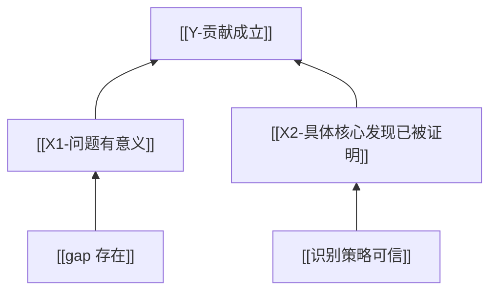
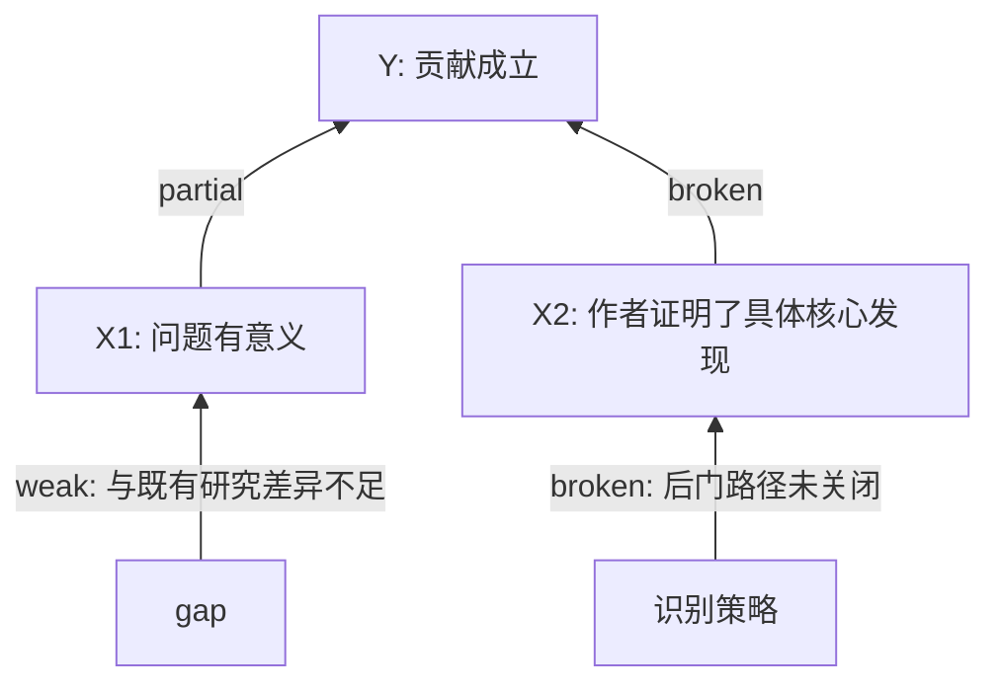

# Mermaid / Obsidian 论证树规则

## 分工

```text
Mermaid = 让论证树可见
Obsidian = 让论证树可追溯、可积累、可复用
```

## 默认方向

默认使用 `flowchart BT` 表达支撑方向：

```text
底部：证据 / 论据 / 子支撑
中部：分论点 / 一级支撑
顶部：根结论
箭头：supports，下层支撑上层
```

不要默认使用 top-down 表达支撑方向。若临时使用 top-down，必须注明箭头表示 `requires / 展开`，不是 supports。

## 节点命名

- 节点 ID 使用稳定短 ID：`Y`, `X1`, `X2`, `G1`, `F1`。
- 节点 label 写人能读懂的判断句。
- Obsidian 场景可使用双链：



## 箭头标签

可用标签表达状态：



## 最小输出

每个 `argument-tree.md` 至少包含：

1. Mermaid 图；
2. 节点表；
3. 箭头审计表；
4. 断点摘要；
5. 对根结论影响。

## 可读性规则

- 不把所有细节塞进节点 label；
- 复杂证据放到节点表，不放图里；
- 同一层节点数量过多时拆成多个子图；
- 图用于看结构，表用于承载证据。
