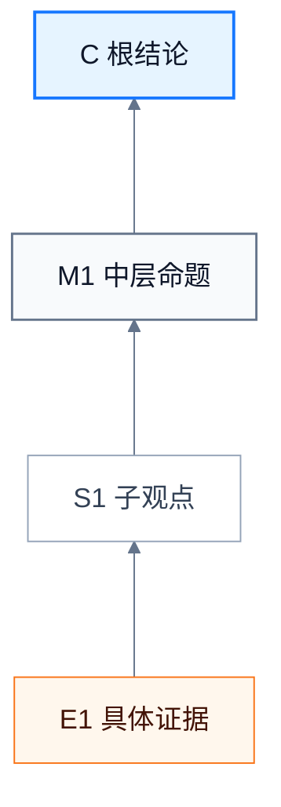

# Evidence-Expanded Mermaid

```mermaid
%%{init: {
  "flowchart": {
    "nodeSpacing": 70,
    "rankSpacing": 90,
    "curve": "linear",
    "htmlLabels": true
  },
  "theme": "base",
  "themeVariables": {
    "fontFamily": "Arial, PingFang SC, Hiragino Sans GB, Microsoft YaHei, sans-serif",
    "fontSize": "18px",
    "primaryColor": "#F8FAFC",
    "primaryBorderColor": "#334155",
    "lineColor": "#64748B"
  }
}}%%
flowchart BT
    E1["E1 具体证据"]:::evidenceLeaf --> S1["S1 子观点"]:::subClaim
    S1 --> M1["M1 中层命题"]:::middleClaim
    M1 --> C["C 根结论"]:::rootClaim

    classDef rootClaim fill:#E6F4FF,stroke:#1677FF,stroke-width:2px,color:#0F172A;
    classDef majorClaim fill:#F0FDF4,stroke:#22C55E,stroke-width:2px,color:#0F172A;
    classDef middleClaim fill:#F8FAFC,stroke:#64748B,stroke-width:1.5px,color:#0F172A;
    classDef subClaim fill:#FFFFFF,stroke:#94A3B8,stroke-width:1px,color:#334155;
    classDef evidenceLeaf fill:#FFF7ED,stroke:#F97316,stroke-width:1px,color:#431407;
    classDef needsQc fill:#FEF2F2,stroke:#EF4444,stroke-width:1.5px,stroke-dasharray: 5 5,color:#7F1D1D;
    classDef implicitPremise fill:#F5F3FF,stroke:#8B5CF6,stroke-width:1.5px,color:#2E1065;
```
