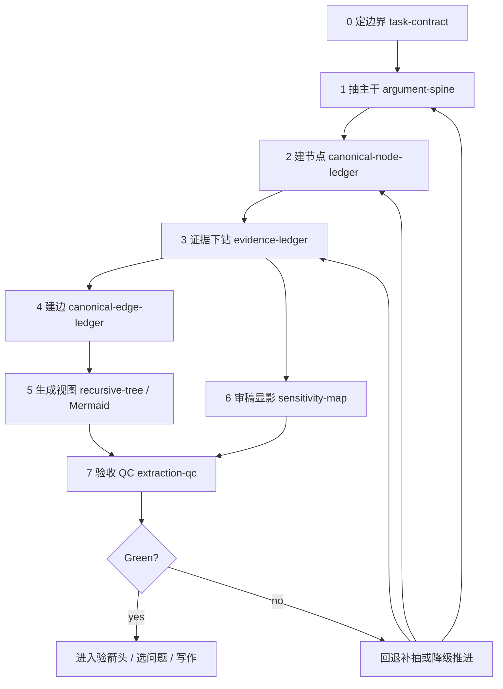

# Argument Tree Main Axis

## 一句话

复杂抽树不是一个单点动作，而是论证树对象的生命周期：

```text
task contract
-> argument spine
-> canonical node ledger
-> evidence ledger
-> canonical edge ledger
-> derived views
-> review sensitivity map
-> extraction QC
```

这条轴同时适用于学术论文、论效题、GRE argument 和其他长论证文本；差异由子 Skill 或 adapter 承接。

## Mermaid 主轴



## 状态定义

| 状态 | 问题 | 产物 | Green 标准 |
|---|---|---|---|
| 0 定边界 | 这次抽什么、禁读什么、输出到哪里 | `task-contract.md` | 输入、模式、禁读材料、输出契约清楚 |
| 1 抽主干 | 作者/题干到底要证明什么 | `argument-spine.md` | root claim、X1/X2/Y 或 C/M/S 清楚 |
| 2 建节点 | 树有哪些 claim 节点 | `canonical-node-ledger.md` | 非叶节点有 parent/child/status |
| 3 证据下钻 | 每个 claim 的最小证据是什么 | `evidence-ledger.md` | 无“主结果/支持材料/案例证明”等抽象叶子 |
| 4 建边 | 谁支撑谁 | `canonical-edge-ledger.md` | edge status 至少为 `not-yet-audited` |
| 5 生成视图 | 如何让人看懂 | `recursive-tree-master.md`、`evidence-expanded-mermaid.md`、`mermaid-views/` | Mermaid 从 ledger 派生；完整图和阅读分图分离 |
| 6 移交提示 | 哪些证据组合后续可能值得验箭头 | `extraction-qc.md` handoff hints | 只写提示，不生成 review-sensitivity-map |
| 7 验收 QC | 是否可进入下一环节 | `extraction-qc.md` | 缺口、降级、回退点明确 |

## 产物写权限

| 产物 | 唯一写入者 | 消费者 |
|---|---|---|
| `task-contract.md` | orchestrator / 父入口 | 所有后续环节 |
| `argument-spine.md` | spine 环节 / 场景子 Skill | node 环节 |
| `canonical-node-ledger.md` | node 环节 | evidence、edge、view、QC |
| `evidence-ledger.md` | evidence 环节 | edge、view、arrow audit、QC |
| `canonical-edge-ledger.md` | edge 环节 | view、QC、arrow audit |
| `recursive-tree-master.md` | view 环节 | 人类阅读、arrow audit |
| `evidence-expanded-mermaid.md` | view 环节 | 人类阅读、回归测试 |
| `mermaid-views/` / `mermaid-zh-views/` | Mermaid rendering 环节 | 人类阅读、汇报、Obsidian 可视化 |
| `extraction-qc.md` | QC 环节 | orchestrator、后续 TASK |

禁止一个后续环节偷偷重写前序产物。如果发现前序产物缺失，写入 QC 或开回退任务。

`review-sensitivity-map.md` 是 `academic-argument-arrow-audit` 的前置显影产物，不属于抽树主轴产物。抽树阶段只能在 `extraction-qc.md` 中提示哪些 evidence 组合可移交验箭头。

## 最小证据原则

证据环节必须把抽象证据拆到最小可核单位。

合格叶子：

```text
单个原文句子
单个变量定义
单条规则 / 条件 / 假设
单个数据点 / 统计值 / 观察事实
单个案例事实
单个引用材料的用途
场景子 Skill 定义的专属最小证据
```

不合格叶子：

```text
主结果
稳健性检验
机制检验
文献支持
样本规则
图表显示
作者证明了
案例支持
数据说明
```

## 场景专属证据

父层不规定所有文本都必须有表格、图像或文献证据。场景子 Skill 应定义自己的必需证据类：

```text
academic paper: citation / table cell / figure / model evidence
exam argument: prompt quote / assumption / causal leap evidence
policy report: policy clause / data point / case evidence
business argument: metric / customer quote / operational fact evidence
```

若子 Skill 定义了必需证据类但本轮未完成，使用场景专属 QC 标记，例如 `missing-citation-evidence`、`missing-prompt-anchor` 或 `missing-metric-evidence`。

## 回退规则

| 断点 | 处理 |
|---|---|
| 没有 task contract | 回到状态 0 |
| spine 不清 | 回到状态 1，不进入 evidence |
| node ledger 缺 parent/child | 回到状态 2 |
| evidence leaf 抽象 | 回到状态 3 |
| 场景必需证据缺失 | 回到对应子 Skill 或开补抽子任务 |
| Mermaid 与 ledger 不一致 | 重新从 ledger 派生 view |
| Mermaid 看不清 / 重叠 / 只有框没有字 | 交给 `argument-tree-mermaid-rendering` 重新生成完整图、分图和高清图 |
| sensitivity 无 evidence_ids | 回到状态 6 |

## Green / Red

Green:

- 主干清楚；
- node/edge/evidence ledger 齐；
- evidence 拆到最小可核单位；
- 场景必需证据有明确完成或缺口标记；
- Mermaid 明确从 ledger 派生；
- Mermaid 区分 claim / evidence / needs-qc，并有可读分图；
- 2A 作者树与 2B 审稿显影分离；
- QC 可判断是否能进入验箭头。

Red:

- 只有 Mermaid，没有 ledger；
- Mermaid PNG 只有框没有字却标为高清图；
- 为了让图好看删除底层 evidence；
- evidence 仍是“主结果/机制/稳健性/案例支持”等概括词；
- 后续环节重写前序产物；
- 场景必需证据只写概括短语；
- 审稿攻击混进作者树；
- QC 未做却写成已完成。
