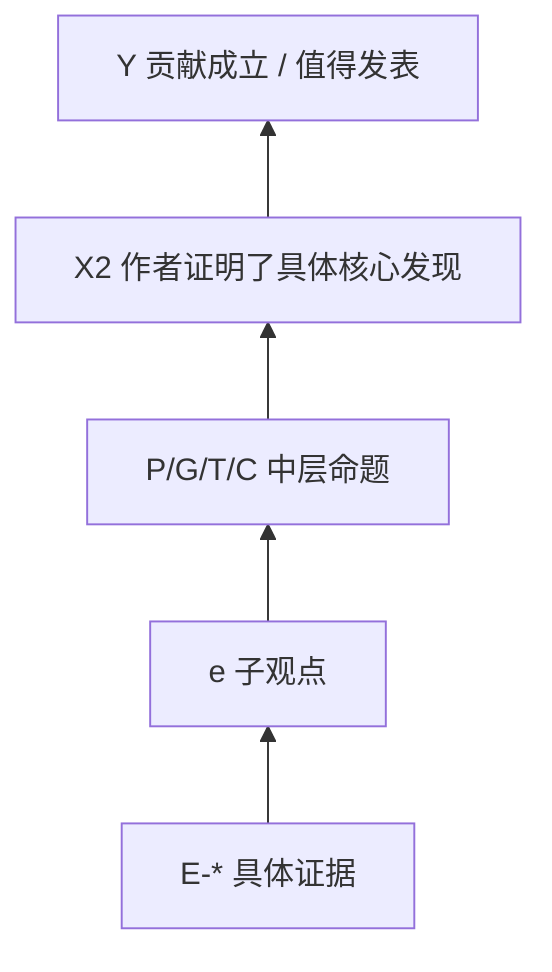

# Paper Argument Tree

## 一句话核心发现

```text
X:
M:
Y1:
Y2 / contribution:
```

## 顶层论证

```text
X1：问题有意义
+ X2：作者证明了具体核心发现
-> Y：论文贡献成立 / 值得发表
```

## X/M/Y/Y2 表

| 元素 | 作者说法 | 操作化 / 证明方式 | 原文位置 | 备注 |
|---|---|---|---|---|

## 命题节点表

| node_id | node_label | parent | evidence_ids | status |
|---|---|---|---|---|

## Evidence-Expanded Mermaid


