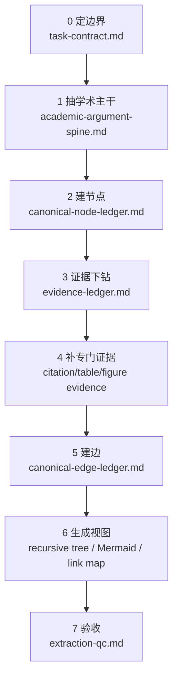

# Academic Paper Main Axis

## 定位

学术论文抽树是复合型任务，不应由单一提示一次性完成。它需要一条学术主轴来协调多个内部环节：

```text
task contract
-> academic argument spine
-> academic canonical node ledger
-> evidence drilling
-> citation / table / figure evidence completion
-> academic edge ledger
-> derived views
-> extraction QC
```

本 reference 是 `academic-paper-argument-tree-extraction` 的内部 workflow 主轴。父层 `argument-tree-extraction` 只提供通用抽树协议；这里承载学术论文特有章法。

## Mermaid 主轴



## 环节分工

| 环节 | 负责 | 不负责 | 主要产物 |
|---|---|---|---|
| 0 定边界 | 输入、禁读材料、论文类型、模式、输出目录 | 不抽树 | `task-contract.md` |
| 1 抽学术主干 | 一句话核心发现、X/M/Y/Y2、X1/X2/Y | 不抽表格系数 | `academic-argument-spine.md` |
| 2 建 claim 层级 | 按论文实际论证递归建立 claim 层级 | 不填满证据、不机械补固定层数 | `canonical-node-ledger.md` |
| 3 证据下钻 | 文本、变量、样本、模型、表格、图、文献的最小证据 | 不重新设计树 | `evidence-ledger.md` |
| 4 补专门证据 | 表格视觉 QC、图像 QC、citation evidence | 不写审稿意见 | evidence ledger 增补、QC |
| 5 建边 | 还原作者声称的 evidence -> claim -> higher claim 支撑关系 | 不新增证据、不判断强弱 | `canonical-edge-ledger.md` |
| 6 生成视图 | master tree、Mermaid、Obsidian link map、中文版/分图/高清图 | 不发明节点 | `recursive-tree-master.md`、`evidence-expanded-mermaid.md`、`mermaid-zh-views/`、`obsidian-link-map.md` |
| 7 验收 | 完整性、红灯、缺口、降级状态、是否可移交验箭头 | 不补分析正文、不写审稿显影 | `extraction-qc.md` |

`review-sensitivity-map.md` 不属于 paper 抽树产物。它是 `academic-argument-arrow-audit` 的前置显影产物，消费 paper 抽树输出的 node / edge / evidence ledger。

## 建边边界

建边阶段回答：

```text
作者在文中用 A 支撑 B 吗？
```

不回答：

```text
A 真的足以支撑 B 吗？
```

因此 `canonical-edge-ledger.md` 在 paper 抽树阶段只能使用：

```text
not-yet-audited
needs-qc
```

`strong / weak / broken / unclear` 是 `academic-argument-arrow-audit` 的输出状态，不得在 paper 抽树阶段提前标注。

## 学术主干

学术论文的 spine 必须明确：

```text
X1：问题有意义
X2：作者证明了具体核心发现
Y：论文贡献成立 / 值得发表
```

其中 X2 必须写成具体发现，不得写成“作者做出来了”：

```text
哪个 X
通过什么 M
影响哪个 Y
上升到哪个 Y2 / 贡献 / 政策启示
```

X2 也不得写成“核心经验发现成立”“作者证明了核心发现”等空泛占位。必须把核心发现说出来：

```text
X2 = 作者声称 A 影响 B / A 通过 M 影响 B，并用哪些主类证据支撑。
```

## 证据下钻顺序

学术论文 evidence drilling 推荐顺序：

1. 变量定义和操作化；
2. 样本期、样本筛选、数据源和事件窗口；
3. 模型设定、固定效应、聚类层级；
4. 主结果表格单元格；
5. 机制检验表格单元格；
6. 稳健性 / 异质性 / 进一步分析；
7. 文献证据；
8. 贡献上升和政策启示；
9. 图像和表格视觉 QC 状态。

不要先画完整 Mermaid 再倒推 evidence。Mermaid 必须从 ledger 派生。

## Citation Evidence

学术论文 full-tree 中，文献证据是单独环节。至少尝试覆盖：

| 位置 | 应抽什么 |
|---|---|
| X1 文献 gap | 每组文献被作者用于说明什么已有研究、什么缺口 |
| P2 理论机制 | 哪篇文献支撑信号、声誉、市场压力、信息传导 |
| P1/P3 变量操作化 | 指标来源文献，如 KV、DA、融资依赖、竞争程度 |
| P5 方法 | DID、Bacon、Oster、PSM、熵平衡等方法文献 |
| P10 异质性 | 分组变量或指标来源文献 |
| Y 贡献上升 | 作者如何用文献或政策文件支撑上升 |

合格 citation evidence：

```text
E-CIT-KV-1 | citation-evidence | 变量定义段 | Kim and Verrecchia (2001) 被作者用于支持 KV 指数度量信息披露质量 | P3 | minimal / needs-citation-link
```

不合格：

```text
现有文献支持
已有研究认为
文献 gap
```

如果本轮没有完成 citation 下钻，`extraction-qc.md` 必须标：

```text
missing-citation-evidence
```

## Table / Figure Evidence

表格证据合格叶子包括：

```text
表号
列号
变量名
系数
t 值 / 标准误 / 括号值
显著性星号
样本量
R2 / p 值
固定效应
聚类层级
表注
视觉 QC 状态
```

图像证据合格叶子包括：

```text
图号
图题
关键趋势
坐标轴或图例含义
作者文字解释
图像 QC 状态
```

如果图表没有视觉复核，不得标 `verified`。

## Green / Red

Green:

- `academic-argument-spine.md` 明确 X/M/Y/Y2；
- canonical node/edge/evidence ledger 齐；
- 表格证据拆到单元格；
- citation evidence 已拆或明确标缺；
- Mermaid 从 ledger 派生；
- Mermaid 视图区分 claim / evidence / needs-qc，必要时有中文版、高清图和阅读分图；
- Mermaid reading view 节点第一行是自然语言，代号只是回查锚点；
- Mermaid full-reading view 保留 full-tree 证据颗粒度；若是 summary-reading view，明确标注已合并证据；
- evidence-expanded Mermaid 尽量从 root claim 画到 minimal evidence；
- 作者树与审稿显影 / 验箭头分离；
- QC 说明可否进入 `academic-argument-arrow-audit`。

Red:

- X2 写成“作者做出来了”“核心发现成立”或其他空泛占位；
- evidence leaf 仍是“主结果/机制检验/文献支持”；
- 表格没有视觉 QC 却标 verified；
- citation 只在 Obsidian link map 出现，没有 evidence ledger；
- Mermaid 独立发明新节点；
- Mermaid 只有 `E033` / `C-MECH` 等代号，必须读 ledger 才懂；
- Mermaid reading view 为了可读性合并大量 evidence，却没有标注 summary / merged-evidence；
- Mermaid PNG 只有框没有字却标为高清图；
- Mermaid 大图重叠严重却没有分图或 README；
- 为了可读性删掉底层 evidence leaf，导致 full-tree Mermaid 只有概括层；
- 表文冲突、审稿攻击或 sensitivity 结论混入作者树本体。

## 内部子 Skill 预留

后续可按需要拆出内部子 Skill：

```text
skills/
  academic-argument-spine-extraction/
  academic-node-ledger-builder/
  academic-evidence-drilling/
  academic-citation-evidence-extraction/
  academic-table-figure-evidence-qc/
  academic-tree-view-generation/
  academic-tree-extraction-qc/
```

拆分原则：每个子 Skill 只拥有一个环节的主要产物写权限。
