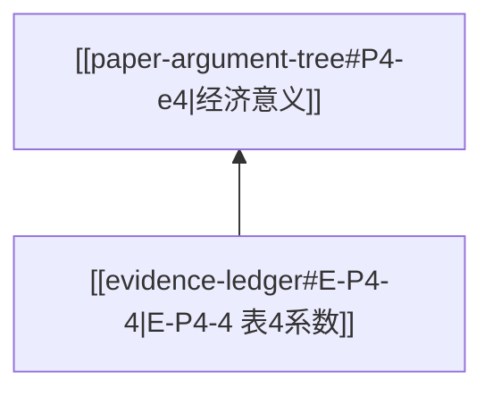

# Obsidian Evidence Linking

用于把论证树节点链接到 Obsidian vault 中的稿件、图表、表格、文献卡片和审稿 issue。

## 链接原则

每个关键 evidence node 尽量有 1-4 类链接：

```text
manuscript_link
table_or_figure_link
citation_link
review_issue_link
```

链接不要替代证据摘要；摘要用于快速阅读，链接用于回溯。

## 稿件链接

如果稿件 Markdown 有标题、段落编号或块 ID，优先使用：

```text
[[manuscript#Table 4]]
[[manuscript#para-120]]
[[manuscript#^block-id]]
```

若没有稳定锚点，先写：

```text
needs-anchor
```

并在 `extraction-qc.md` 记录需要给稿件补段落号或块 ID。

## 图表链接

表格、图、公式建议统一别名：

```text
[[manuscript#Table 4|Table 4]]
[[manuscript#Figure 2|Figure 2]]
[[manuscript#Equation 1|Eq. 1]]
```

若表格抽取文件单独存在，可链接到表格 Markdown：

```text
[[tables/Table 4|Table 4]]
```

## 文献链接

优先链接到已有文献笔记：

```text
[[Karpoff et al. 2008]]
[[Dye 1985]]
```

如果没有文献笔记，写：

```text
needs-literature-note
```

不要把未核验 DOI、URL 或作者年份当成已核实链接。

## Link Map 字段

建议输出：

```text
node_id | node_label | manuscript_link | table_or_figure_link | citation_link | ledger_link | review_issue_link | status
```

`status` 可用：

```text
linked
partial
needs-anchor
needs-citation-link
needs-table-qc
```

## Mermaid 双链

Obsidian Mermaid 节点 label 可以使用双链，但节点不要过长：



复杂链接放到 `obsidian-link-map.md`，Mermaid 只保留短 label。
