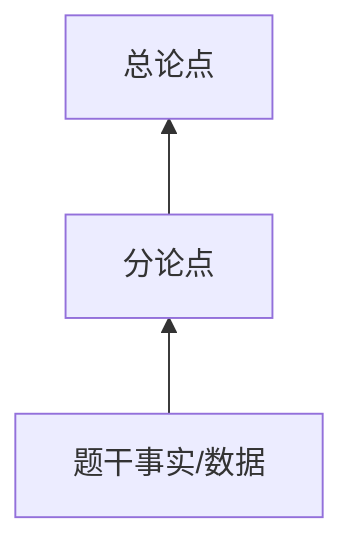

# Exam Argument Tree Extraction

## 定位

这是 `argument-tree-extraction` 的考试型子 Skill。它只负责把短材料快速抽成小型论证树和可写断点候选，不负责写完整作文；完整写作仍交给 `workflow-exam-argument-validity` 的写作规则。

## 输入

- 管综/经综论效题材料；
- GRE Analyze an Argument prompt；
- 课程范例题、练习题、解析对照；
- 用户粘贴的一段短论证。

## 主流程

1. 审题：
   - 找总论点 / 总结论；
   - 找分论点；
   - 找事实、数据、例子、比较、预测、建议；
   - 标出“因此、所以、由此可见、建议、必须、将会”等结构关键词。
2. 抽小型论证树：

   ```text
   题干事实 / 数据 / 例子
   -> 分论点
   -> 总论点
   ```

3. 标箭头：

   ```text
   arrow_id | from_node | to_node | 作者用什么推出什么 | 初步疑点
   ```

4. 找隐含前提：
   - A 能代表 B；
   - A 和 B 可比；
   - 样本可代表总体；
   - 过去可推未来；
   - 相关可推因果；
   - 局部改善可推整体改善；
   - 手段可推结果。
5. 生成断点候选：
   - 每个候选必须绑定一条箭头；
   - 优先影响总论点；
   - 优先选择好写、好解释、能回扣结论的 3-4 个。
6. 根据题型输出：
   - 中文论效题：输出可写断点和本论段素材；
   - GRE：按 prompt instruction 输出 assumptions / questions / evidence / alternatives。

## 输出

```text
root claim:
argument tree:
arrow table:
hidden assumptions:
candidate flaws:
best 3-4 writable points:
Mermaid:
```

## Mermaid

默认使用：



论效题通常不需要很大的 evidence ledger；除非用户要求 Obsidian 化或做案例学习。

## 中文论效题适配

抽树时服务于写作：

```text
定位：作者用 A 推出 B。
分析：A 不足以推出 B，因为...
收尾：因此，结论 C 仍有待商榷。
```

不要为了术语而术语。优先让断点能写成清楚段落。

## GRE 适配

先识别 prompt instruction：

| 指令 | 输出 |
|---|---|
| assumptions | assumption -> arrow -> impact if false |
| evidence needed | evidence -> strengthen/weaken arrow |
| questions | question -> target arrow -> yes/no impact |
| alternative explanations | rival mechanism -> original arrow weakened |

## 边界

- 不保存未授权题库全文到通用 Skill。
- 不把学术论文的 X1/X2/Y 框架硬套到论效题。
- 不把所有候选断点都写进作文；抽树阶段和选点阶段分开。

## 回归测试

本 Skill 是考试型抽树子 Skill。凡修改父 Skill `argument-tree-extraction`、本 Skill 主流程、管理类论效适配、GRE 适配、输出字段或与 issue selection 的衔接规则，都应按 `workflow-tao` 的回归测试协议处理：

```text
/Users/narra/Documents/alib/Writer/00 信息/miy-skills/workflows/workflow-tao/references/regression-test-protocol.md
```

如果是 Skill 修改触发回归，优先开纯净 subAgent 执行，用新产物与 baseline / target md 做质量对比。不能由修改者只凭主观判断“没有被改坏”。

exam 分支回归至少检查：

- 是否快速抓到总论点 / 分论点；
- 是否按题干事实、数据、例子恢复小型论证树；
- 是否没有被学术论文 X1/X2/Y、citation evidence、table/figure evidence 污染；
- 是否能输出 arrow table、hidden assumptions、candidate flaws；
- 是否能筛出可写的 3-4 个断点；
- 中文论效题是否服务于成文段落；
- GRE prompt 是否按 assumptions / evidence / questions / alternatives 等指令适配。
