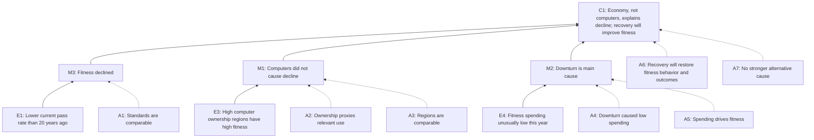

# GRE Argument Tree: Corpora Fitness

## Prompt Type

GRE Analyze an Argument: assumptions prompt.

The instruction asks the writer to analyze stated or unstated assumptions, explain how the argument depends on them, and explain what happens if they do not hold.

## Root Claim

C1: Corpora's citizens' physical fitness has declined mainly because of the economic downturn, not because of increased computer use; once the economy improves, citizens' fitness will improve.

## Support Chain

1. E1: About one-quarter of citizens now meet current fitness standards, compared with about one-half meeting the standards used twenty years ago.
2. E2: Some experts claim too much computer use caused the decline in fitness.
3. E3: Regions with the highest computer ownership also have the highest overall fitness levels.
4. M1: Computer use has not caused Corpora's decline in physical fitness.
5. E4: Spending on fitness-related products and services is unusually low this year.
6. M2: The economic downturn is the main cause of the decline in physical fitness.
7. C1: When the economy improves, fitness levels will improve.

## Node Ledger

| node_id | node_label | node_type | parent | evidence_ids | status |
|---|---|---|---|---|---|
| C1 | Economy, not computers, explains the fitness decline; recovery will improve fitness | root | - | E1, E3, E4 | extracted |
| M1 | Computer use did not cause the fitness decline | middle-claim | C1 | E3 | extracted |
| M2 | Economic downturn is the main cause of fitness decline | middle-claim | C1 | E4 | extracted |
| M3 | Fitness has declined over time | subclaim | C1 | E1 | extracted |
| E1 | Current standard pass rate is about one-quarter; twenty years ago about one-half met then-current standards | prompt-evidence | M3 | E1 | summarized |
| E2 | Experts blame excessive computer use | prompt-context | M1 | E2 | summarized |
| E3 | Highest computer-ownership regions also show highest overall fitness levels | prompt-evidence | M1 | E3 | summarized |
| E4 | Fitness-related spending is unusually low this year | prompt-evidence | M2 | E4 | summarized |
| A1 | Current and past standards are comparable enough to show real decline | implicit-premise | M3 | - | inferred |
| A2 | Regional computer ownership is a valid proxy for individual computer use and its fitness effects | implicit-premise | M1 | - | inferred |
| A3 | High-fitness, high-computer regions are comparable to the rest of Corpora | implicit-premise | M1 | - | inferred |
| A4 | Low fitness spending is caused by the economic downturn rather than by lower demand, substitution, or prior purchases | implicit-premise | M2 | - | inferred |
| A5 | Spending on fitness products and services is a major determinant of citizens' actual physical fitness | implicit-premise | M2 | - | inferred |
| A6 | Economic recovery will restore fitness spending and that spending will raise fitness levels | implicit-premise | C1 | - | inferred |

## Arrow Table

| arrow_id | from_node | to_node | support_type | status | why |
|---|---|---|---|---|---|
| AR1 | E1 | M3 | comparison-over-time | weak | Different fitness standards may not be comparable; pass-rate change may reflect standard changes rather than health changes. |
| AR2 | E3 | M1 | correlation-to-disproof | weak | A regional positive association does not rule out individual-level harm or subgroup effects from computer use. |
| AR3 | M1 | C1 | elimination-of-rival-cause | weak | Showing computers are not the cause would not by itself show that the economy is the main cause. |
| AR4 | E4 | M2 | spending-to-cause | weak | Low spending may be an effect, proxy, or unrelated symptom rather than the causal driver of low fitness. |
| AR5 | M2 | C1 | cause-to-policy-prediction | weak | Even if downturn contributes, future improvement depends on recovery changing behavior and fitness outcomes. |
| AR6 | M3 + M1 + M2 | C1 | combined causal inference | weak | The chain needs comparability, valid proxies, causal direction, and exclusion of alternatives. |

## Hidden Assumptions

| assumption_id | assumption | target_arrow | impact_if_false |
|---|---|---|---|
| A1 | The current and twenty-year-old fitness standards measure similar levels of fitness. | AR1 | If the standards changed, the apparent decline may be overstated, understated, or nonexistent. |
| A2 | Computer ownership in a region accurately reflects the amount of computer use relevant to physical fitness. | AR2 | If ownership is a poor proxy, the regional comparison cannot refute the experts' computer-use explanation. |
| A3 | Regions with high computer ownership are otherwise comparable to lower-ownership regions. | AR2 | If wealth, urban services, age composition, climate, or recreation access differs, higher fitness could be due to those factors rather than harmless computer use. |
| A4 | Low spending on fitness products and services results from the economic downturn. | AR4 | If spending fell for other reasons, the downturn is not established as the main cause. |
| A5 | Lower spending on fitness products and services leads to lower physical fitness. | AR4 | If people exercise without paid products or services, the spending data may not explain actual fitness decline. |
| A6 | Economic improvement will increase fitness-related spending and participation. | AR5 | If people do not redirect improved finances toward fitness, recovery will not necessarily improve fitness. |
| A7 | No stronger alternative cause explains the decline. | AR6 | If aging, diet, work hours, public health, transportation habits, or changed standards explain the trend, the main conclusion weakens. |

## Evidence Needs And Diagnostic Questions

| item_id | evidence/question | target_arrow | strengthen_or_weaken_effect |
|---|---|---|---|
| Q1 | Were the current and twenty-year-old fitness standards equivalent in difficulty and scope? | AR1 | Equivalent standards strengthen the decline claim; changed standards weaken it. |
| Q2 | Do individuals who use computers more have lower fitness after controlling for age, occupation, income, and exercise access? | AR2 | A controlled negative relationship revives the computer-use explanation; no relationship strengthens the author's rebuttal. |
| Q3 | Are high-computer-ownership regions richer, younger, more urban, or better served by fitness facilities? | AR2 | Major differences weaken the regional comparison. |
| Q4 | Did fitness spending fall because incomes fell, or because citizens shifted to free exercise, home exercise, or non-fitness priorities? | AR4 | A downturn-driven fall supports M2; alternative explanations weaken M2. |
| Q5 | Is reduced paid fitness spending associated with lower measured fitness outcomes in Corpora? | AR4 | A direct link supports the economic explanation; no link weakens it. |
| Q6 | During previous economic recoveries, did Corpora's fitness spending and fitness levels rise? | AR5 | Historical parallel strengthens the prediction; no rebound weakens it. |

## Candidate Flaws

| flaw_id | candidate_flaw | bound_arrow | why_it_matters |
|---|---|---|---|
| F1 | Apples-to-oranges comparison of fitness standards across time | AR1 | The initial decline may not be a real decline in health. |
| F2 | Ecological fallacy / bad proxy: regional computer ownership is treated as individual computer-use effect | AR2 | High regional fitness does not prove computer use is harmless. |
| F3 | Confounding in regional comparison | AR2 | High-computer regions may also have resources that independently improve fitness. |
| F4 | Treating low fitness spending as proof of economic causation | AR4 | Spending data alone does not establish causal direction or mechanism. |
| F5 | Assuming paid fitness consumption is necessary for physical fitness | AR4 | Citizens may maintain fitness through free or informal activity. |
| F6 | Unsupported forecast from economic recovery to fitness recovery | AR5 | Even a better economy may not change behavior or measured fitness. |
| F7 | False dilemma between computers and economy | AR6 | Both may contribute, or a third factor may dominate. |

## Best 3-4 Issue Points

1. Comparability of the fitness standards: the argument's opening evidence depends on the assumption that the two pass rates measure the same underlying fitness level.
2. Weak rebuttal of the computer-use explanation: regional computer ownership and regional fitness do not prove that heavy computer use has no harmful effect on individuals.
3. Weak causal move from low fitness spending to economic downturn as the main cause: the spending fact needs causal direction, mechanism, and exclusion of other explanations.
4. Unsupported prediction: economic recovery will improve fitness only if recovery changes fitness spending or activity in ways that actually improve measured health.

## Mermaid

## QC

| check | result | note |
|---|---|---|
| GRE prompt type identified | pass | Assumptions prompt. |
| Root claim captured | pass | Includes causal explanation and prediction. |
| Support chain captured | pass | Decline evidence, computer rebuttal, spending/economy cause, recovery prediction. |
| Arrow table included | pass | Six arrows, all preliminarily weak with reasons. |
| Hidden assumptions included | pass | Assumptions are bound to arrows and include impact if false. |
| Evidence needs/questions included | pass | Questions target the same arrows and indicate strengthen/weaken effects. |
| Candidate flaws included | pass | Flaws are bound to arrows. |
| Best 3-4 issue points included | pass | Four high-yield points selected. |
| Mermaid included | pass | `flowchart BT`; evidence and assumptions support upward claims. |
| Avoided Chinese essay-only template | pass | No paragraph-writing template used. |
| Avoided academic-paper contamination | pass | Uses exam-style prompt evidence and assumptions only. |
| Source boundary | pass | Uses only the contract-provided prompt summary and required Skill instructions. |
