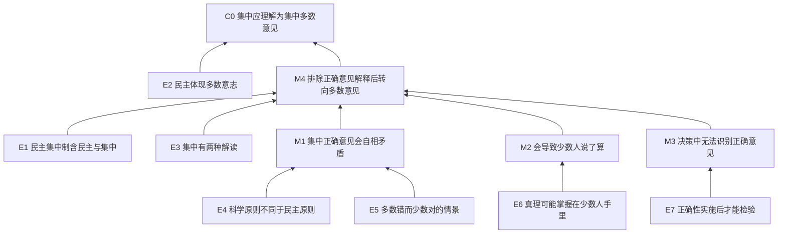

# Management Exam Smoke: Argument Tree

## root claim

民主集中制中的“集中”不应理解为“集中正确的意见”，而应理解为“集中多数人的意见”。

## structure keywords

| keyword / phrase | role in argument |
|---|---|
| “第一种解读看似有理，实际上是一种误解” | 否定备选解释：集中正确意见 |
| “这样解读……就会” | 从解释推出后果 |
| “如果这样” | 条件推理，引出民主形同虚设 |
| “不可能在决策过程中完成” | 用时间顺序否定可操作性 |
| “既然……当然就应该” | 从排除一个选项转向总论点 |

## argument tree

### C0 root

C0. 民主集中制中的“集中”当然应该是集中多数人的意见，而不是集中正确的意见。

### M-level subclaims

M1. 把“集中”解释为“集中正确的意见”会使民主集中制自相矛盾。

M2. 把“集中”解释为“集中正确的意见”会让少数人说了算，从而使民主形同虚设。

M3. 在决策过程中无法知道什么意见正确，所以“集中正确意见”在决策时不可操作。

M4. 如果“集中正确意见”这一解释错误或不可行，就应采用“集中多数人的意见”的解释。

### prompt facts / examples

E1. 民主集中制包含民主和集中两个不可缺少的基本点。

E2. 民主被界定为体现多数人的意志。

E3. 对“集中”有两种解读：集中正确意见，或集中多数意见。

E4. 科学强调真理原则，即谁对听谁的；民主强调多数原则，即谁占多数听谁的。

E5. 若多数人的意见错误而少数人的意见正确，按多数意见办就“不集中”，不按多数意见办就“不民主”。

E6. “真理往往掌握在少数人手里”被作者用来说明：正确意见可能来自少数人。

E7. 判断一项决策是否正确，只能在决策实施之后由实践检验。

### compact tree

```text
E1 + E2 + E3
-> C0 的解释问题成立：需要判定“集中”的含义。

E4 + E5
-> M1：集中正确意见会使民主集中制自相矛盾。

E6
-> M2：集中正确意见会为少数人说了算提供依据，使民主形同虚设。

E7
-> M3：决策过程中无法识别正确意见，所以集中正确意见不可操作。

M1 + M2 + M3
-> M4：集中正确意见应被排除。

M4 + E2 + E3
-> C0：集中应理解为集中多数人的意见。
```

## node ledger

| node_id | node_label | node_type | parent | source |
|---|---|---|---|---|
| C0 | 集中应是集中多数人的意见 | root | - | 题干结尾 |
| M1 | 集中正确意见会造成自相矛盾 | subclaim | C0 | 科学原则/民主原则与多数错少数对情景 |
| M2 | 集中正确意见会导致少数人说了算 | subclaim | C0 | 少数人掌握真理的论述 |
| M3 | 决策中无法知道何为正确 | subclaim | C0 | 实践检验只能在实施后完成 |
| M4 | 排除集中正确意见后应采纳多数意见 | subclaim | C0 | 两种解读的排除式推理 |
| E1 | 民主集中制含民主与集中 | prompt fact | M4 | 题干开头 |
| E2 | 民主体现多数人的意志 | prompt fact | C0 | 题干开头 |
| E3 | 集中有两种解读 | prompt fact | M4 | 题干开头 |
| E4 | 科学是真理原则，民主是多数原则 | prompt fact / comparison | M1 | 五四两面旗帜段 |
| E5 | 多数错少数对的设想情景 | example | M1 | 设想情景段 |
| E6 | 真理可能掌握在少数人手里 | prompt fact / quoted idea | M2 | 毛泽东话语段 |
| E7 | 正确性须由实施后的实践检验 | prompt fact | M3 | 实践检验段 |

## arrow table

| arrow_id | from_node | to_node | 作者用什么推出什么 | initial status | initial doubt |
|---|---|---|---|---|---|
| A1 | E4 | M1 | 用科学/民主原则的差异推出两种原则根本对立 | weak | 科学求真与民主决策未必在制度中完全排斥，可能分属不同环节 |
| A2 | E5 | M1 | 用“多数错、少数对”的情景推出集中正确意见造成自相矛盾 | weak | 情景成立也只说明存在冲突，不必然说明概念自相矛盾 |
| A3 | E6 | M2 | 用真理可能在少数人手里推出集中正确意见会让少数人说了算 | weak | 少数人意见正确不等于制度上允许少数人任意裁决 |
| A4 | E7 | M3 | 用正确性实施后才能检验推出决策中无法集中正确意见 | weak | 决策前可能有证据、程序和专业判断，未必完全无法判断相对正确性 |
| A5 | M1 + M2 + M3 | M4 | 用矛盾、少数人说了算、不可操作共同排除“集中正确意见” | unclear | 即使第一种解释有问题，也未必只剩第二种解释或第二种解释更好 |
| A6 | M4 + E2 + E3 | C0 | 用排除第一种解释和民主多数原则推出集中应为多数意见 | weak | 民主体现多数意志不等于集中只能等同于多数意见 |

## hidden assumptions

1. “民主”只等同于多数决定，而不包括讨论、协商、权利保护、程序约束等其他制度要素。
2. “集中正确意见”必然由少数人或自称正确的人决定，而不能通过民主程序、专家论证和实践经验来约束。
3. 科学的真理原则和民主的多数原则在同一决策机制中不能协调，只能互相排斥。
4. 决策实施前完全不能判断意见的相对正确性。
5. 如果多数意见和正确意见冲突，制度只能在二者之间二选一。
6. 排除“集中正确意见”后，“集中多数意见”就是唯一合理解释。

## candidate flaws

| flaw_id | linked_arrow | candidate flaw | why it matters |
|---|---|---|---|
| F1 | A1 / A2 | 把“科学求真”和“民主多数”绝对对立 | 若二者可在不同程序环节互补，所谓自相矛盾就不成立 |
| F2 | A3 | 从“真理可能在少数人手里”跳到“少数人说了算” | 可能正确不等于获得决策权，作者混淆了认识正确性和权力归属 |
| F3 | A4 | 夸大决策前判断正确性的困难 | 实践检验虽在实施后完成，但决策前仍可依据经验、信息和论证作比较判断 |
| F4 | A5 / A6 | 排除一个解释后直接推出另一个解释正确 | 题干只列出两种解读，并未证明它们穷尽全部可能，也未证明多数意见一定适合作为集中标准 |
| F5 | A6 | 从“民主体现多数意志”推出“集中就是多数意见” | 民主和集中是两个基本点，不能因为民主含多数原则就把集中也化约为多数原则 |
| F6 | A2 | 用极端设想替代一般制度分析 | 多数错少数对只是特殊情形，不能直接证明一种解释通常错误 |

## best 3-4 writable points

1. 科学原则与民主原则未必根本对立。民主集中制可能先通过民主程序广泛表达意见，再通过讨论、论证和组织程序形成较优决策；因此，“集中正确意见”并不必然把制度推入自相矛盾。
2. 真理可能掌握在少数人手里，不等于少数人可以说了算。少数意见是否被采纳仍可受程序、证据和多数讨论约束，作者把“少数意见可能正确”偷换成“少数人获得最终裁决权”。
3. 决策实施前并非完全不能判断正确性。虽然最终检验来自实践，但决策前仍能依据事实、经验、专业知识和风险评估判断哪个方案更合理，所以“无法集中正确意见”的结论过强。
4. 即便“集中正确意见”的解释存在缺陷，也不能自然推出“集中多数意见”就是正确解释。作者没有证明两种解释穷尽所有可能，也没有说明多数意见在错误时仍应被集中。

## Mermaid



## QC

| item | status | note |
|---|---|---|
| root claim captured | pass | 题干结尾的总论点已抽出 |
| subclaims captured | pass | 自相矛盾、少数人说了算、不可操作、排除式转向均已列出 |
| prompt facts/examples restored | pass | 五四对比、设想情景、少数人掌握真理、实践检验均进入树 |
| arrow table included | pass | 每条关键推理均绑定初步疑点 |
| hidden assumptions included | pass | 覆盖代表性、可比性、二选一、可操作性等前提 |
| candidate flaws included | pass | 每个候选断点绑定箭头 |
| best writable points selected | pass | 已筛出 4 个可成段问题 |
| exam style maintained | pass | 使用中文论效题抽树格式，未使用学术论文式框架 |
| prohibited academic contamination | pass | 未引入论文式变量框架、引文材料、表格材料或图像材料 |
