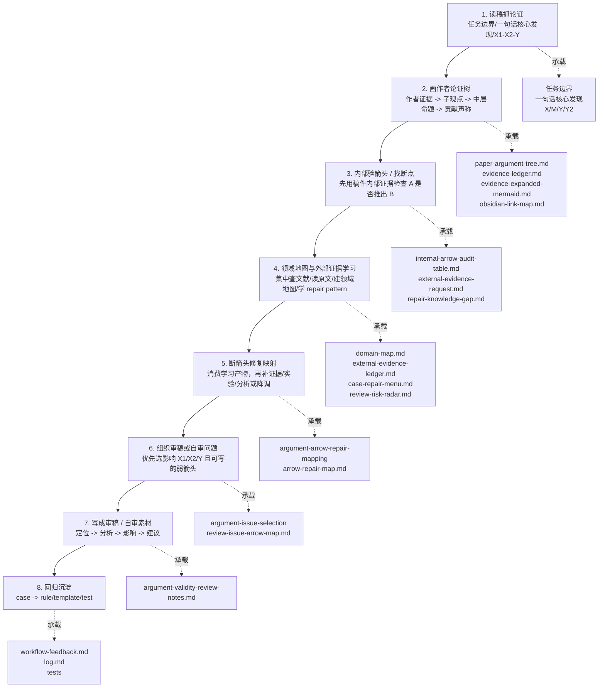

# Academic Argument Validity Workflow

状态：`seed / structural-green / source-case-calibration-green / forward-test-pending`

## 定位

这是 `workflow-argument-validity` 的学术论文子 workflow。它只处理“论文作为论证”的主轴：

父 workflow 负责通用能力：

```text
恢复论证树 -> 检查支撑箭头 -> 标注断点影响 -> 输出可读文本
```

本子 workflow 负责学术论文专用实现：

```text
读稿抓论证 -> 画作者论证树 -> 内部验箭头/找断点 -> 领域地图与外部证据学习 -> 断箭头修复映射 -> 组织审稿或自审问题 -> 写成审稿/自审素材 -> 回归沉淀
```

它不替代 `workflow-paper-writing-review` 的审稿项目管理、PDF 还原、文献检索、最终审稿表填报等业务流程。论文审稿业务流程可以调用本子 workflow 作为论证有效性审查模块。

## 总流程图



## 适用场景

- 学术论文外部审稿；
- 投稿前自审；
- 论文写作中的“贡献是否成立”检查；
- 返修前重读审稿意见和原文论证；
- 需要用 Mermaid / Obsidian 展开论文论证树和证据链。

## 八步主流程

1. 读稿抓论证：
   - 固定任务边界：审稿、写作自审、投稿前自查或返修复盘；
   - 还原一句话核心发现：哪个 X 通过什么机制 M 影响哪个 Y，是否还有 Y2 或政策/贡献上升；
   - 区分 `X1：问题有意义`、`X2：作者证明了核心发现`、`Y：贡献成立 / 值得发表`；
   - 先只读作者想证明什么，不把审稿攻击混入作者树。
2. 画作者论证树：
   - 默认使用父 workflow 的 `flowchart BT`，让底层证据向上支撑作者命题；
   - 本步骤内部拆为 `2A 作者证据树` 和 `2B 审稿显影树`；
   - 2A 把作者树写成 canonical recursive evidence tree，只忠实还原作者证明链；
   - 2A 的主产物是 `canonical-node-ledger.md`、`canonical-edge-ledger.md` 和 `evidence-ledger.md`，Mermaid 只是由 ledger 派生的视图；
   - 2B 审稿显影不属于抽树必交付；它由步骤 3 的 `academic-argument-arrow-audit` 基于 2A 的 evidence ledger 生成；
   - `canonical-node-ledger.md`、`canonical-edge-ledger.md`、`evidence-ledger.md`、`recursive-tree-master.md`、`evidence-expanded-mermaid.md` 和 `obsidian-link-map.md` 属于本步骤的承载物，不单独升格为主流程步骤。
   - 若任务是外部审稿、投稿前自审、case 回测、与专家审稿意见对照或正式写作自审，本步骤默认 `full-tree`，不得只输出简版作者树；
   - `full-tree` 必须至少交付 `canonical-node-ledger.md`、`canonical-edge-ledger.md`、`recursive-tree-master.md`、`evidence-ledger.md`、`evidence-expanded-mermaid.md` 和 `extraction-qc.md`。缺少 canonical ledgers 时，标记 `incomplete-canonical-tree`；缺少 evidence ledger 或 evidence-expanded Mermaid 时，标记 `incomplete-full-tree`。
3. 内部验箭头 / 找断点：
   - 检查每条 `A -> B` 是否成立；
   - 调用 `../../skills/argument-arrow-audit/skills/academic-argument-arrow-audit`，并读取父验箭头库 `../../skills/argument-arrow-audit/references/arrow-audit-core.md`；
   - 本步骤先做稿件内部诊断：接收作者论证树、逐条改写箭头、判断箭头类型、第一轮内部验箭头并集中标记外部学习需求；
   - 若论文是经管/社科实证论文，调用 `../../skills/argument-arrow-audit/skills/academic-argument-arrow-audit/skills/empirical-social-science-review-adapter` 显影构念-代理变量、样本-总体、模型-因果、控制变量、聚类推断、机制和稳健性等敏感箭头；
   - 若论文处于中文经管/中文社科审稿语境，继续调用中文经管子 adaptor，显影指标方向、文本口径、本土制度语境、中文文献谱系、政策化表达和本地报告规范；
   - 学术验箭头子 Skill 详见 `../../skills/argument-arrow-audit/skills/academic-argument-arrow-audit/references/academic-arrow-audit-main-axis.md`；
   - `review-sensitivity-map.md`、`internal-arrow-audit-table.md`、`external-evidence-request.md` 和 `repair-knowledge-gap.md` 都属于本步骤的承载物，不回写作者树；
   - 对学术论文，重点看 gap、理论机制、变量测量、样本、模型、识别、表格结果、稳健性、机制检验和贡献上升；
   - 复杂高频箭头可路由到文献 gap、因果识别、统计结果等子 Skill；DAG 只作为因果识别箭头的审查方法之一；
   - 本步骤不边验边零散查文献；只有第一轮内部审计标记 `needs-external-evidence`、`method-qc`、`citation-qc`、`repair-knowledge-gap` 或领域不熟的请求，交给第 4 步集中处理；
   - 标注强箭头、弱箭头、断裂箭头和证据不足箭头；
   - 本步骤只做全量诊断，不决定哪些问题进入 major concern。
   - 如果输入作者树标记为 `incomplete-full-tree`，先补齐步骤 2；除非用户明确要求临时推进，否则不得把 quick-tree 当成正式审计输入。
4. 领域地图与外部证据学习：
   - 调用 `../../skills/academic-field-evidence-learning`；
   - 消费步骤 3 的 `external-evidence-request.md`、`repair-knowledge-gap.md`、`internal-arrow-audit-table.md` 和领域关键词；
   - 将分散的“查文献、建领域认知、判断外部证据、学习 repair pattern”集中处理；
   - 文献检索默认通过 `$scholar-kit-literature-search` 路由 OpenAlex / WoS / CNKI；
   - 对陌生领域、跨学科稿件、工科/医学/方法密集稿件，默认至少生成 `domain-map.md` 和 `review-risk-radar.md`；
   - 对 `judge-arrow` 请求，生成 `external-evidence-ledger.md` 和 `handoff-to-arrow-audit.md`，供第 3 步判断回填；
   - 对 `repair-arrow` 请求，生成 `repair-search-strategy.md`、`abstract-scan-ledger.md`、`fulltext-pattern-ledger.md`、`case-repair-menu.md` 和 `handoff-to-repair-mapping.md`；
   - 没有合法全文时标记 `needs-fulltext-acquisition`、`requires-human-access` 或 `needs-fulltext-pattern-check`，不得把摘要当成原文证据包。
5. 断箭头修复映射：
   - 调用 `../../skills/argument-arrow-repair-mapping/skills/academic-arrow-repair-mapping`；
   - 消费步骤 3 的 `academic-arrow-audit-table.md` / `internal-arrow-audit-table.md`、`academic-arrow-break-summary.md`，以及步骤 4 的 `external-evidence-ledger.md`、`case-repair-menu.md`、`handoff-to-repair-mapping.md` 和 QC 标记；
   - 先声明模式：`menu-assisted / learning-required / hybrid`，默认 `hybrid`；
   - 优先消费第 4 步学习产物；只有发现新的知识缺口时，才回到第 4 步补一轮，不在本步骤另起零散检索；
   - 对每条重要断点写清楚：最低修复、强修复、补不了时如何降调；
   - 对实验、方法、文献或官方资料知识仍不足的断点标记 `repair-knowledge-gap`，不要硬编；
   - 如果通过本案学习到临时证据标准，输出 `case-repair-menu.md`，并标注 `case-only / candidate-general / stable-menu`；
   - 本步骤仍不选择 major concern，只给选点层提供“可修性、修复成本、是否需要外部证据”的判断。
6. 组织审稿或自审问题：
   - 调用 `../../skills/argument-issue-selection/skills/academic-argument-issue-selection`；
   - 从全量箭头审计表中优先选择影响 `X1/X2/Y` 的问题；
   - 同时消费经管/社科实证 adaptor 与中文经管 adaptor 的候选输出，判断低层技术点是否卡住 parent claim；
   - 同时消费 `arrow-repair-map.md`，判断问题是否可执行、修复成本是否适合写入审稿意见；
   - 每个 major concern 或 revision action 都必须绑定 `review issue -> target arrow -> weakened node -> impact on Y`；
   - `review-issue-arrow-map.md` 属于本步骤的承载物，不单独升格为主流程步骤。
7. 写成审稿 / 自审素材：
   - 审稿：按“问题定位 -> 为什么推不出 -> 对贡献的影响 -> 可执行修改建议”写；
   - 自审：按“当前论证缺口 -> 需要补的证据/模型/文字 -> 修改优先级”写；
   - 中文主体要可读，必要英文术语放括号中，不用作者式绕法掩盖问题。
8. 回归沉淀：
   - 个案证据留在项目 case 或 TASK；
   - 稳定技术动作沉淀到 references、assets 或 tests；
   - 新规则必须说明来自哪个 case、解决什么失败模式、是否可迁移。

## 步骤与承载关系

| 阶段 | 调用 |
|---|---|
| 1. 读稿抓论证 | `../../skills/argument-tree-extraction/skills/academic-paper-argument-tree-extraction/SKILL.md`；`references/academic-workflow-routing.md` |
| 2. 画作者论证树 | `../../skills/argument-tree-extraction/SKILL.md`；`../../skills/argument-tree-extraction/assets/evidence-ledger-template.md`；`../../skills/argument-tree-extraction/assets/evidence-expanded-mermaid-template.md` |
| 3. 内部验箭头 / 找断点 | `../../skills/argument-arrow-audit/skills/academic-argument-arrow-audit/SKILL.md` |
| 4. 领域地图与外部证据学习 | `../../skills/academic-field-evidence-learning/SKILL.md`；`$scholar-kit-literature-search`；必要时全文获取/还原 Skill |
| 5. 断箭头修复映射 | `../../skills/argument-arrow-repair-mapping/skills/academic-arrow-repair-mapping/SKILL.md` |
| 6. 组织审稿或自审问题 | `../../skills/argument-issue-selection/skills/academic-argument-issue-selection/SKILL.md` |
| 7. 写成审稿 / 自审素材 | `assets/academic-argument-workflow-output-template.md` |
| 8. 回归沉淀 | 项目 `workflow-feedback.md`、`log.md`、父 workflow tests |

## 论文类型路由

先判断论文类型，再选择抽树 adapter：

| 论文类型 | 抽树重点 |
|---|---|
| 实证论文 | X/M/Y、变量、数据、样本、模型、识别、表格、系数、显著性、稳健性 |
| 理论 / 模型论文 | 定义、假设、公理、命题、证明、比较静态、边界条件 |
| 综述 / 概念 / 框架论文 | 文献谱系、概念边界、分类维度、整合逻辑、研究议程 |

## Skills

| Skill | 职责 |
|---|---|
| `../../skills/argument-tree-extraction` | 通用抽树、节点/箭头/evidence/Mermaid/link map 协议与路由 |
| `../../skills/argument-tree-extraction/skills/academic-paper-argument-tree-extraction` | 学术论文作者论证树抽取 |
| `../../skills/argument-arrow-audit` | 通用验箭头协议 |
| `../../skills/argument-arrow-audit/skills/academic-argument-arrow-audit` | 学术论文专用箭头审计 |
| `../../skills/argument-arrow-audit/skills/academic-argument-arrow-audit/skills/empirical-social-science-review-adapter` | 经管/社科实证审稿敏感箭头适配 |
| `../../skills/argument-arrow-audit/skills/academic-argument-arrow-audit/skills/empirical-social-science-review-adapter/skills/chinese-management-econ-review-adapter` | 中文经管/中文社科审稿语境适配 |
| `../../skills/academic-field-evidence-learning` | 领域地图、外部证据、文献学习与 repair pattern 集中学习层 |
| `../../skills/argument-arrow-repair-mapping` | 通用断箭头修复映射协议 |
| `../../skills/argument-arrow-repair-mapping/skills/academic-arrow-repair-mapping` | 学术论文专用补证据、补实验、补分析或降调映射 |
| `../../skills/argument-issue-selection` | 通用问题选择协议 |
| `../../skills/argument-issue-selection/skills/academic-argument-issue-selection` | 把断裂箭头选择成 major concern、minor concern 或 revision action |
| `../../skills/academic-review-argument-audit` | 把已选问题写成审稿或自审段落 |

## References

| Reference | 何时读取 |
|---|---|
| `references/academic-workflow-routing.md` | 判断任务边界、论文类型和输出分支 |
| `references/academic-review-21-cell-gap-matrix.md` | 需要从真实案例漏点判断补强落位，或审查经管/中文经管 adaptor 是否覆盖 7 步 x 3 层能力时 |
| `../../references/argument-tree-core.md` | 需要回到父层论证树协议时 |
| `../../skills/argument-arrow-audit/references/arrow-audit-core.md` | 执行验箭头、断点分类或逻辑谬误映射时优先读取 |
| `../../skills/argument-issue-selection/references/issue-selection-principles.md` | 已有全量箭头审计表，需要选择审稿或自审问题时 |
| `../../skills/argument-issue-selection/skills/academic-argument-issue-selection/references/academic-issue-selection.md` | 需要生成 review issue arrow map 或 major concern candidates 时 |
| `../../references/arrow-break-taxonomy.md` | 历史断点分类参考；新增验箭头任务优先使用 `arrow-audit-core.md` |
| `../../references/mermaid-obsidian-rules.md` | 需要画 Mermaid 或建立 Obsidian 链接时 |

## Assets

| Asset | 用途 |
|---|---|
| `assets/academic-argument-workflow-output-template.md` | 学术论文论证有效性输出模板 |
| `../../skills/argument-tree-extraction/assets/evidence-ledger-template.md` | 底层证据台账模板 |
| `../../skills/argument-tree-extraction/assets/evidence-expanded-mermaid-template.md` | evidence-expanded Mermaid 模板 |

## Tests

| Test / Case | 用途 |
|---|---|
| `../../tests/argument-validity-fixtures.md` | 父 workflow 回归入口 |
| `../../projects/CASE-J-260110-xinyuan-review/tasks/TASK01-学术论文论证树迁移校准` | 学术论文作者树、审稿 issue arrow map 和欣媛 case 校准 |

## 输出契约

`quick-tree` 最小输出只适用于临时讨论或快速定位：

```text
一句话核心发现：
X1 / X2 / Y：
作者关键论证链：
最可疑的 3-5 条箭头：
每条断点的影响：
审稿 / 自审素材：
```

`full-tree` 适用于外部审稿、投稿前自审、case 回测、专家意见对照和正式写作自审。步骤 2 抽树输出放到项目 TASK 的 `outputs/`：

```text
canonical-node-ledger.md
canonical-edge-ledger.md
recursive-tree-master.md
paper-argument-tree.md
evidence-ledger.md
evidence-expanded-mermaid.md
obsidian-link-map.md
extraction-qc.md
```

步骤 3 内部验箭头输出：

```text
review-sensitivity-map.md
sensitivity-expanded-mermaid.md
empirical-review-sensitivity-map.md
empirical-arrow-candidate-ledger.md
empirical-method-qc-request.md
chinese-reviewer-sensitive-candidates.md
chinese-literature-gap-request.md
local-expression-and-format-qc.md
external-evidence-request.md
repair-knowledge-gap.md
internal-arrow-audit-table.md
academic-arrow-audit.md
academic-arrow-break-summary.md
issue-selection-candidates.md
```

步骤 4 领域地图与外部证据学习输出：

```text
domain-map.md
field-topic-ledger.md
seed-literature-ledger.md
key-journal-map.md
method-and-metric-map.md
sota-benchmark-map.md
evidence-standard-map.md
review-risk-radar.md
external-reading-log.md
external-evidence-ledger.md
repair-search-strategy.md
abstract-scan-ledger.md
deep-read-shortlist.md
fulltext-pattern-ledger.md
case-repair-menu.md
repair-feedback-candidates.md
field-learning-qc.md
handoff-to-arrow-audit.md
handoff-to-repair-mapping.md
```

步骤 5 修复映射输出：

```text
arrow-repair-map.md
repair-knowledge-gap.md
repair-feedback-candidates.md
```

步骤 6-7 选点和行文输出：

```text
review-issue-arrow-map.md
argument-validity-review-notes.md
```

其中 `obsidian-link-map.md` 在无法稳定定位时可降级为 `needs-anchor` 清单；但 `evidence-ledger.md` 和 `evidence-expanded-mermaid.md` 不能省略。若省略，输出状态必须是：

```text
incomplete-full-tree
```

case 回测、正式审稿和专家意见对照中，`canonical-node-ledger.md` 和 `canonical-edge-ledger.md` 也不能省略。若省略，输出状态必须是：

```text
incomplete-canonical-tree
```

`review-sensitivity-map.md` 不属于抽树完整性要求；它属于步骤 3 验箭头阶段的准备物。若步骤 3 需要但未生成，应在验箭头输出中标记 `missing-review-sensitivity-map`，而不是把抽树结果判为不完整。

## 完成标准

- 已还原一句话核心发现；
- 已给出 X/M/Y/Y2 或对应理论/概念结构；
- 已区分 `X1：问题有意义`、`X2：作者证明了具体核心发现`、`Y：贡献成立 / 值得发表`；
- 作者树与审稿攻击分离；
- 已建立 canonical-node-ledger 和 canonical-edge-ledger；
- 已递归拆到最小证据单位，不用“主结果、稳健性、样本规则、机制检验”等抽象叶子冒充 evidence；
- 关键证据进入 evidence ledger；
- 关键证据画回 evidence-expanded Mermaid；
- 进入步骤 3 后，可疑证据组合应进入 review-sensitivity-map；
- 每个 major concern 候选绑定具体箭头；
- 缺少表格、图、文献或段落锚点时标记 QC，不伪造；
- 输出能被审稿业务流程或写作自审流程继续使用。
- 对 case 回测、正式审稿或专家意见对照，未完成 full-tree 不得宣称“抽树完成”。

## 边界

- 不保存具体保密稿件内容到通用 Skill 主流程；
- 不把单篇论文的判断硬编码为普遍规则；
- 不直接决定接收、拒稿或投稿策略；
- 不把审稿人的攻击节点画进作者树；
- 不复制 `workflow-paper-writing-review` 的项目归档、PDF 转 Markdown、文献检索和最终表单流程。
