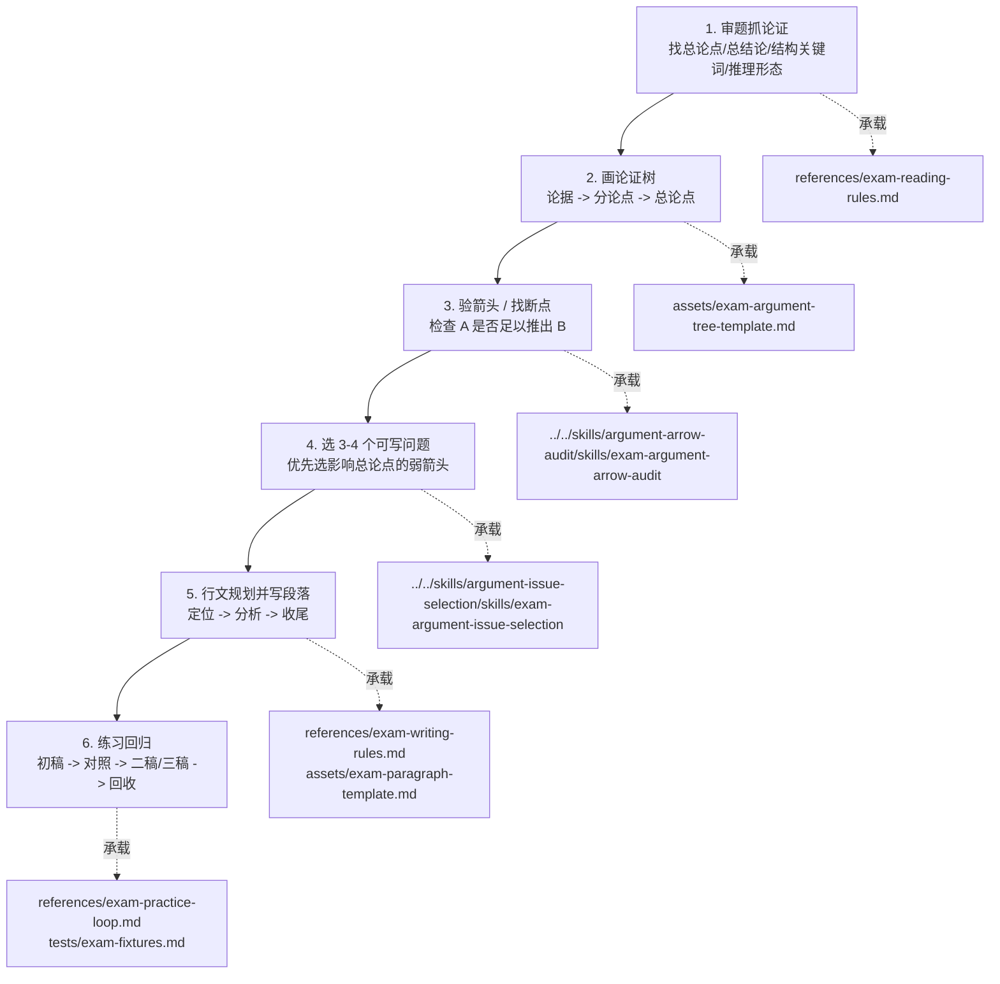

# Exam Argument Validity Workflow

状态：`seed / structural-green / forward-test-green / case-learning-green / gre-assisted-uat-green / gre-question-branch-green`

## 定位

这是 `workflow-argument-validity` 的论效题子 workflow。

父 workflow 负责通用能力：

```text
恢复论证树 -> 检查支撑箭头 -> 标注断点影响 -> 输出可读文本
```

本子 workflow 负责论效题专用实现：

```text
审题抓论证 -> 画论证树 -> 验箭头/找断点 -> 选 3-4 个可写问题 -> 行文成文 -> 练习回归
```

考试型论证有效性目前有两个输出分支：

```text
中文论效题
-> 选 3-4 个断点
-> 定位 -> 分析 -> 收尾
-> 论效题文章

GRE Analyze an Argument
-> 按题目指令选择 hidden assumptions / evidence / questions / alternatives
-> assumption/question -> target arrow -> impact
-> GRE argument essay
```

## 总流程图



## 适用场景

- 管理类/经济类联考论证有效性分析题；
- GRE Analyze an Argument 题，尤其是要求分析 assumptions / hidden premises / evidence needed 的题；
- 课程笔记整理后的练习题；
- 需要把一段材料写成“定位-分析-收尾”式论效作文；
- 需要用 Mermaid / Obsidian 画出论效题论证树。

## 六步主流程

1. 审题抓论证：
   - 找总论点和总结论；
   - 比较话题关键词；
   - 按“句号先，逗号后”找结构关键词；
   - 区分直推、合推、分推。
2. 画小型论证树：
   - 默认使用父 workflow 的 `flowchart BT`；
   - 下层论据向上支撑分论点或总论点；
   - 复杂段落可先画局部树。
3. 标注断裂箭头：
   - 每个问题必须绑定一条箭头；
   - 先判断“作者用 A 推出 B，A 是否足以推出 B”，再选择断点类型；
   - 本步骤只做全量诊断，不决定最终写哪 3-4 个问题。
4. 选 3-4 个可写问题：
   - 从全量箭头审计表中选点；
   - 优先选择影响上层结论、最容易写清、最符合题目指令的问题；
   - 不为了凑数量堆术语；
   - 未入选但重要的问题进入 `discarded but noted`。
5. 行文规划并写段落：
   - 中文论效题：标题、开头、本论 3-4 段、结尾；
   - GRE Argument：开头概括 conclusion 和 assumptions / questions，本论按题目指令展开，结尾说明需要哪些证据；
   - 中文论效题：定位作者用什么推出什么；分析为什么推不出；收尾回扣结论；
   - GRE Argument：说明作者假设什么，或提出哪个待回答问题；该假设/问题支撑或检验哪条箭头；若假设不成立或问题答案不同，根结论或上层结论如何被削弱。
6. 练习回归：
   - 初稿；
   - 对照解析；
   - 修改二稿；
   - 必要时三稿；
   - 把稳定问题回收到 references 或 tests。

## 步骤与承载关系

| 步骤 | 目标 | 主要承载 |
|---|---|---|
| 1. 审题抓论证 | 用老王技术动作把材料读成论证结构 | `skills/exam-argument-validity-orchestrator`；`references/exam-reading-rules.md` |
| 2. 画论证树 | 把论据、分论点、总论点画成 Mermaid 小树 | `assets/exam-argument-tree-template.md`；父层 Mermaid/Obsidian 规则 |
| 3. 验箭头 / 找断点 | 检查每条 `A -> B` 是否成立，标出弱箭头或断裂箭头 | `../../skills/argument-arrow-audit/skills/exam-argument-arrow-audit`；父层 `argument-arrow-audit` |
| 4. 选 3-4 个可写问题 | 从所有断点中选最影响结论、最容易写清楚的问题 | `../../skills/argument-issue-selection/skills/exam-argument-issue-selection` |
| 5. 行文规划并写段落 | 写标题、开头、本论、结尾；本论段按“定位-分析-收尾”展开 | `references/exam-writing-rules.md`；`assets/exam-paragraph-template.md` |
| 6. 练习回归 | 初稿、对照、二稿/三稿，并把稳定问题沉淀回 workflow | `references/exam-practice-loop.md`；`tests/exam-fixtures.md` |

## GRE Argument 分支

GRE Analyze an Argument 与中文论效题共享“抽树、验箭头、标断点”的底层动作，但写作目标不同。遇到 GRE 题目时，优先按题目指令选择输出：

| 指令信号 | 输出重点 |
|---|---|
| `assumptions` / `unstated assumptions` | 假设影响链：assumption -> arrow -> impact |
| `evidence needed` | 缺证据清单：需要什么证据才能判断箭头强弱 |
| `questions that need to be answered` | 问题影响链：答案不同如何改变结论可信度 |
| `alternative explanations` | 替代解释：同一事实还能由什么机制解释 |

GRE 本论段默认结构：

```text
Assumption: The argument assumes H.
Role: H is needed for A -> B.
Impact: If H is false, B or the root claim no longer follows.
```

若题目要求 `questions that need to be answered`，默认结构改为：

```text
Question: Q needs to be answered.
Target arrow: Q tests whether A really supports B.
Impact: If the answer is yes, the argument is strengthened in this way; if no, the argument is weakened in that way.
```

不要把 GRE 段落写成“我同意/不同意作者观点”，也不要只列问题；必须说明假设或问题答案如何影响原论证。

## Skills

| Skill | 职责 |
|---|---|
| `skills/exam-argument-validity-orchestrator` | 论效题总编排：审题、抽树、验箭头、选点、规划、成文、回归 |
| `../../skills/argument-arrow-audit/skills/exam-argument-arrow-audit` | 全量验箭头：检查 `A -> B` 是否成立，输出 exam arrow audit table |
| `../../skills/argument-issue-selection/skills/exam-argument-issue-selection` | 选点：从全量箭头审计表中选择 3-4 个可写问题 |

## References

| Reference | 何时读取 |
|---|---|
| `references/exam-reading-rules.md` | 审题、找论点、结构关键词、标点、直推/合推/分推 |
| `references/exam-writing-rules.md` | 标题、开头、本论、结尾和本论段写法 |
| `references/exam-practice-loop.md` | 初稿、二稿、三稿和回归训练 |
| `../../skills/argument-issue-selection/skills/exam-argument-issue-selection/references/exam-issue-selection.md` | 已有箭头审计表，需要选 3-4 个可写问题时 |
| `../../references/course-notes/extractions/00-课程忠实提取总览.extract.md` | 需要回到课程来源总览时 |

## Assets

| Asset | 用途 |
|---|---|
| `assets/exam-argument-tree-template.md` | 论效题 Mermaid 小型论证树模板 |
| `assets/exam-paragraph-template.md` | 本论段“定位-分析-收尾”模板 |

## Tests

| Test | 用途 |
|---|---|
| `tests/README.md` | 测试入口、回归纪律和 UAT 边界 |
| `tests/exam-fixtures.md` | 待测样本、预期输出和状态 |
| `tests/unit-course-regression-20260619.md` | 老王课堂范例单元测试 / 回归测试；状态为 `course-regression-pass / not-uat` |

## 输出契约

最小输出：

```text
材料总论点：
关键论证链：
最可写的 3-4 个断点：
每个断点对应的箭头：
本论段草稿：
```

GRE Argument 最小输出：

```text
argument conclusion:
key support chain:
hidden assumptions / questions needed:
assumption -> supporting arrow -> impact if false:
question -> target arrow -> yes/no impact:
GRE response paragraph draft:
```

完整输出：

1. 审题记录；
2. Mermaid 论证树；
3. 箭头断点表；
4. 行文规划；
5. 完整论效题作文草稿；
6. 修改清单。

## 边界

- 本子 workflow 只保存论效题可迁移方法，不保存具体未授权题库全文。
- 课程逐字稿和忠实提取稿保留在父 workflow 的 `references/course-notes/`。
- 若从真题或练习题中抽取新模式，应写入 tests 或 case，而不是直接硬编码成普遍规则。
