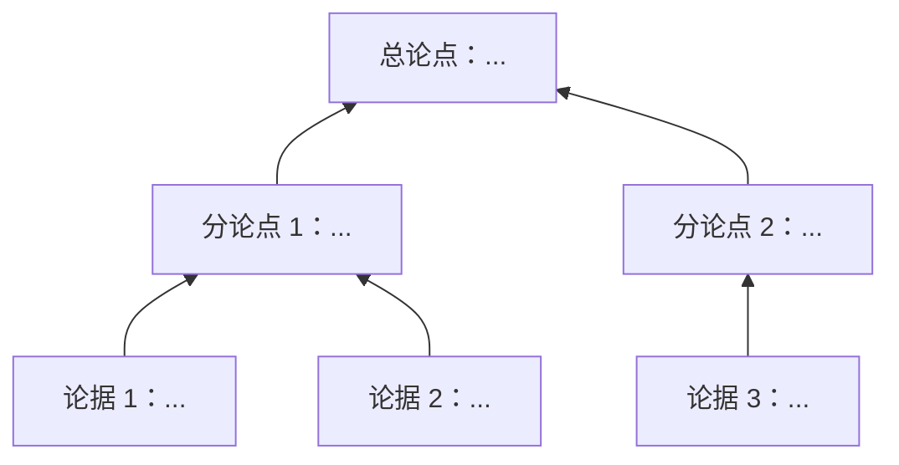
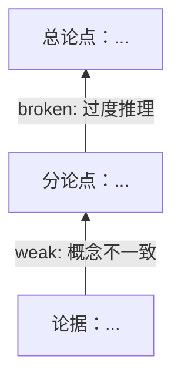

# Exam Argument Tree Template

默认使用 `flowchart BT`。箭头表示“下层支持上层”。

```mermaid
flowchart BT
  E1["论据 1：..."] --> M1["分论点 1：..."]
  E2["论据 2：..."] --> M1
  E3["论据 3：..."] --> M2["分论点 2：..."]
  M1 --> C["总论点：..."]
  M2 --> C
```

断裂箭头可标注：

```mermaid
flowchart BT
  E1["论据：..."] -- "weak: 概念不一致" --> M1["分论点：..."]
  M1 -- "broken: 过度推理" --> C["总论点：..."]
```

