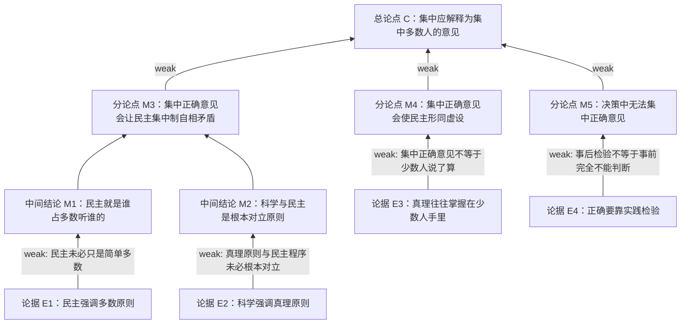

# Argument Tree

状态：`blind-run / generated-from-prompt-only`

输入：`inputs/prompt.md`

冻结材料：`inputs/reference.md`

## 审题记录

### 总论点

材料的总论点是：

> 民主集中制中的“集中”应当解释为集中多数人的意见，而不是集中正确的意见。

### 关键概念

| 概念 | 材料理解 | 需要审查的关系 |
|---|---|---|
| 民主 | 多数原则，谁占多数听谁的 | 是否等同于简单多数决定 |
| 集中 | 材料认为应为集中多数人的意见 | 是否只能在“正确意见”和“多数意见”中二选一 |
| 科学 / 真理原则 | 谁对听谁的 | 是否必然与民主原则根本对立 |
| 正确意见 | 材料认为决策前无法知道 | 是否完全不能在决策前通过理由、证据和讨论进行判断 |
| 少数人意见 | 可能是真理所在 | 是否必然导致少数人说了算 |

## 主要论证链

1. 民主集中制包括民主和集中；
2. 民主就是多数原则；
3. 科学是真理原则，与民主的多数原则根本对立；
4. “集中正确意见”等于引入真理原则；
5. 因而“集中正确意见”会使民主集中制自相矛盾；
6. 又因为正确与否只能在决策实施后由实践检验，决策过程中无法知道正确意见；
7. 所以“集中”只能解释为集中多数人的意见。

## Mermaid 论证树

## 节点表

| 节点 | 内容 | 类型 | 说明 |
|---|---|---|---|
| C | 集中应解释为集中多数人的意见 | 总论点 | 结尾给出 |
| M1 | 民主就是多数原则 | 中间结论 | 材料把民主简化为多数 |
| M2 | 科学与民主根本对立 | 中间结论 | 材料把真理原则和多数原则写成对立 |
| M3 | 集中正确意见导致自相矛盾 | 分论点 | 依赖 M1/M2 |
| M4 | 集中正确意见会让少数人说了算 | 分论点 | 引用“真理往往掌握在少数人手里” |
| M5 | 决策过程中无法知道正确意见 | 分论点 | 由实践检验推出 |

## 断点摘要

最值得写的断点：

1. 材料把“民主”简化为“多数人的意见”，忽视民主也包含程序、讨论和少数意见保护等因素。
2. 材料把“真理原则”和“民主原则”写成根本对立，但二者可能是不同维度，并非必然冲突。
3. 材料把“集中正确意见”推出“少数人说了算”，缺少必要前提。
4. 材料由“正确要靠实践检验”推出“决策前无法判断正确意见”，推理过强。

## 对概念关系审查的观察

本题证明“概念关系审查”确实有迁移价值。关键断点不是事实细节，而是概念关系被作者处理得过强：

- 把“民主”和“多数原则”当作同一关系；
- 把“真理原则”和“多数原则”当作对立关系；
- 把“集中正确意见”和“少数人说了算”当作因果关系；
- 把“事后实践检验”和“事前无法判断”当作必然推出关系。
