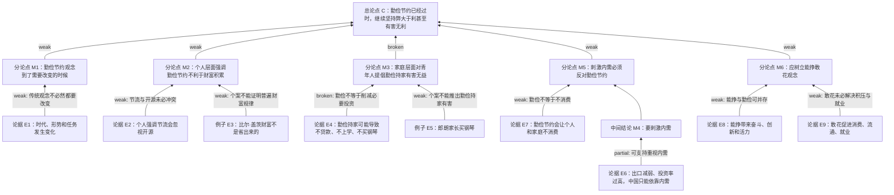

# Argument Tree

状态：`blind-run / generated-from-prompt-only`

输入：`inputs/prompt.md`

冻结材料：`inputs/reference.md`、`inputs/final/` 中的解析、范文和点评。

## 审题记录

### 总论点

材料的总论点是：

> “勤俭节约”作为一种传统已经过时了。在经济全球化的时代，如果继续坚持“勤俭节约”的理念，对个人、对家庭，特别是对国家弊大于利，甚至有害无利。

### 结构关键词

| 位置 | 关键词 / 结构 | 作用 |
|---|---|---|
| 第 2 段 | “形势在变，任务在变，人的观念也要适应这种变化” | 从时代变化推出观念需要改变 |
| 第 3 段 | “个人、家庭、国家三个层面” | 给出并列分论点框架 |
| 个人层面 | “过分强调勤俭节约 -> 关注节流 -> 不重视开源” | 建立个人财富链条 |
| 家庭层面 | “勤俭持家 -> 省学费/不买钢琴 -> 耽误前途” | 建立家庭长期利益链条 |
| 国家层面 | “出口不行、投资过高 -> 只能依靠内需 -> 勤俭节约刺激不起来内需” | 建立宏观经济链条 |
| 结尾 | “综上所述” | 总结性结论 |

### 主要论证链

1. 时代变化链：
   - 国际形势变化、任务变化；
   - 人的观念要与时俱进；
   - 所以“勤俭节约”观念需要改变；
   - 所以“勤俭节约”作为传统已经过时。
2. 个人财富链：
   - 过分强调勤俭节约会关注节流；
   - 关注节流会不重视开源；
   - 财富主要靠开源；
   - 所以个人层面不应强调勤俭节约。
3. 家庭发展链：
   - 勤俭持家会让家庭为了省钱放弃教育、抵押贷款或能力投资；
   - 放弃必要投资会损害孩子前途和家庭长远利益；
   - 所以对工作年龄者和青年家庭，勤俭持家有害无益。
4. 国家内需链：
   - 出口和投资不能继续作为主要拉动方式；
   - 中国只能依靠内需；
   - 勤俭节约会抑制消费和内需；
   - 所以必须揭示勤俭节约弊端，树立“能挣敢花”观念。
5. 能挣敢花链：
   - 能挣可以带来奋斗、创新、经济活力；
   - 敢花可以鼓励消费、促进流通、减少积压、增加就业；
   - 所以能挣敢花优于勤俭节约。

## Mermaid 论证树

## 节点表

| 节点 | 内容 | 类型 | 说明 |
|---|---|---|---|
| C | 勤俭节约已经过时，坚持它弊大于利甚至有害无利 | 总论点 | 结尾明确给出 |
| M1 | 时代变化要求改变勤俭节约观念 | 分论点 | 从“与时俱进”推出具体传统要变 |
| M2 | 个人层面勤俭节约不利于财富积累 | 分论点 | 把勤俭节约理解为重节流轻开源 |
| M3 | 家庭层面对青年人提倡勤俭持家有害无益 | 分论点 | 把勤俭持家理解为削减教育等必要投入 |
| M4 | 中国需要刺激内需 | 中间结论 | 由出口和投资问题推出 |
| M5 | 刺激内需必须反对勤俭节约 | 分论点 | 从内需问题跳到观念批判 |
| M6 | 应树立能挣敢花观念 | 分论点 | 作为替代性观念 |

## 断点摘要

最值得写的断点集中在四处：

1. “形势变化 -> 勤俭节约过时”：时代变化不必然推出某一传统观念应被否定。
2. “勤俭节约 -> 忽视开源”：勤俭节约与开源并不必然冲突。
3. “勤俭持家 -> 放弃必要教育投资”：勤俭不等于该花的钱也不花。
4. “刺激内需 -> 必须反对勤俭节约”：合理消费、扩大内需与勤俭节约未必对立。

## 对根结论影响

材料的主要分论点大多只能支持一个较弱结论：在某些情境下，过度节俭或不合理节省可能带来问题；或者在当下经济环境中，应鼓励合理消费和增加收入。

但这些论据尚不足以支持更强的根结论：勤俭节约作为传统已经过时，继续坚持就弊大于利甚至有害无利。
