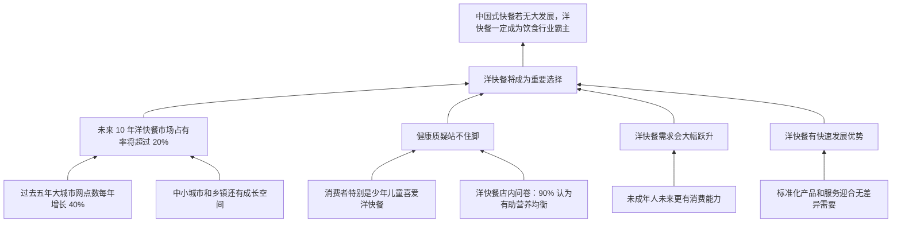

# TASK04 论证树

## 材料总论点

如果中国式快餐未来没有较大发展，洋快餐一定会成为中国饮食行业的霸主。

## 关键概念

| 概念 | 材料用法 | 审查点 |
|---|---|---|
| 大城市增长 | 过去网点增长速度 | 能否外推到未来、中小城市和市场份额 |
| 喜爱 | 消费偏好 | 能否推出健康无害或长期消费 |
| 店内问卷 | 洋快餐消费者意见 | 能否代表中国消费者总体 |
| 未成年人 | 当前偏好群体 | 成年后偏好是否稳定 |
| 中国饮食行业 | 目标总体 | 是否只有中式快餐与洋快餐两大选择 |
| 霸主 | 强结论 | 超过 20% 或快餐增长是否足够支持 |
