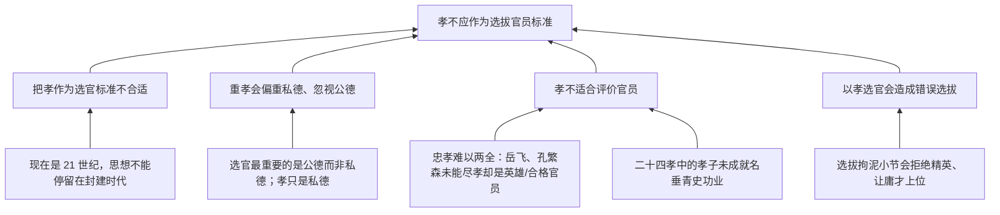

# TASK05 论证树

## 材料总论点

“孝”不应作为选拔官员的一项标准。

## 关键概念

| 概念 | 材料用法 | 审查点 |
|---|---|---|
| 孝 | 私德、小节、封建意识 | 是否被偷换为唯一标准、封建观念或不顾大局 |
| 孝心 / 尽孝行为 | 材料混用 | 不能尽孝是否等于没有孝心或不孝 |
| 公德 / 私德 | 对立处理 | 二者是否必然冲突，私德能否作为辅助标准 |
| 忠诚职守 | 公德定义 | 是否等同于忠于君主或国家 |
| 精英 / 庸才 | 选拔结果 | 是否有证据说明重孝会排斥精英、吸纳庸才 |
