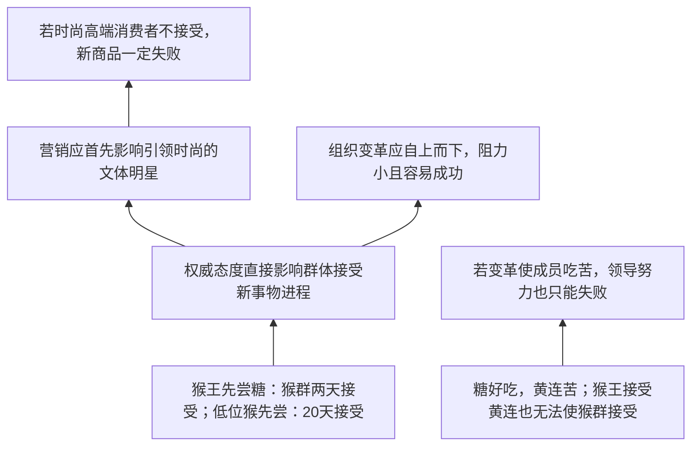

# TASK06 论证树

## 材料总论点

权威对群体接受新事物有直接影响；营销应先影响时尚明星，组织变革应自上而下；若变革使成员吃苦，领导再努力也会失败。

## 关键概念

| 概念 | 材料用法 | 审查点 |
|---|---|---|
| 猴王权威 | 猴群中的等级影响 | 能否类比明星、消费者、企业领导 |
| 糖/黄连 | 新事物本身的好坏 | 商品/变革的复杂价值不能简单等同口味 |
| 接受速度 | 群体接受进程 | 能否推出成功、失败或组织支持 |
| 时尚高端消费者 | 商品传播节点 | 是否等同于所有消费者的权威 |
| 自上而下 | 变革路径 | 是否总是阻力较小、容易成功 |
