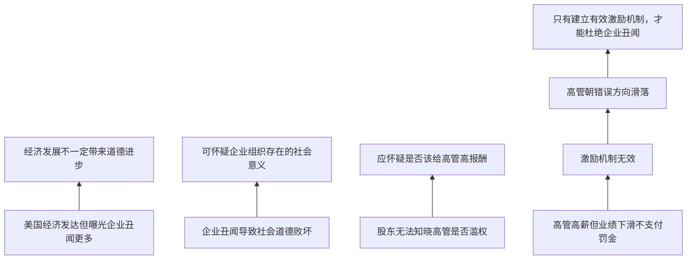

# TASK07 论证树

## 材料总论点

只有建立有效激励机制，才能杜绝企业丑闻发生。

## 关键概念

| 概念 | 材料用法 | 审查点 |
|---|---|---|
| 曝光数量 | 被报道或发现的丑闻数量 | 能否代表真实发生数量 |
| 道德进步 | 社会道德水平 | 能否由企业丑闻数量直接衡量 |
| 企业组织意义 | 企业存在价值 | 能否由丑闻推出整体否定 |
| 高管报酬 | 激励机制一部分 | 是否等同全部激励约束 |
| 有效激励机制 | 杜绝丑闻的条件 | 是否是唯一必要且充分手段 |
