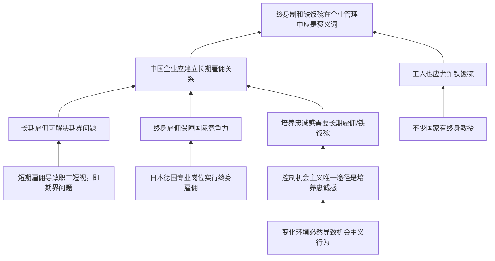

# TASK08 论证树

## 材料总论点

在企业管理中，“终身制”和“铁饭碗”应是褒义词；中国企业劳动关系应向长期雇佣方向发展。

## 关键概念

| 概念 | 材料用法 | 审查点 |
|---|---|---|
| 终身制 / 铁饭碗 | 长期雇佣关系 | 是否与改革语境中的弊端概念完全相同 |
| 期界问题 | 短期雇佣带来短视 | 是否所有岗位、所有企业都严重存在 |
| 德日经验 | 专业岗位终身雇佣 | 能否外推到中国企业和普通工人 |
| 忠诚感 | 控制机会主义的手段 | 是否唯一途径，是否必须靠铁饭碗 |
| 终身教授 | 高校制度 | 能否类比企业工人岗位 |
