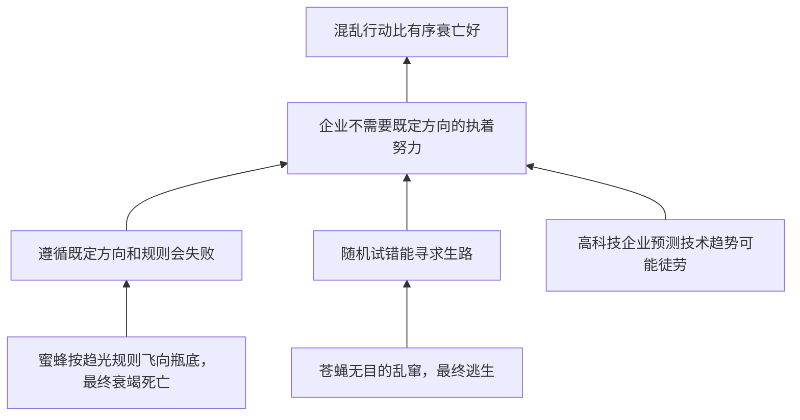

# TASK09 论证树

## 材料总论点

在不确定经营环境中，企业需要随机试错和突破规则，而不是朝既定方向执着努力；混乱行动比有序衰亡好。

## 关键概念

| 概念 | 材料用法 | 审查点 |
|---|---|---|
| 蜜蜂趋光 | 生物习性 | 是否等同于企业战略规则 |
| 苍蝇乱窜 | 无目的试错 | 是否等同于有效创新或探索 |
| 不确定环境 | 企业经营背景 | 是否所有企业、所有阶段都如此 |
| 规则突破 | 生存策略 | 是否排斥规则遵循和方向坚持 |
| 混乱行动 | 正面选择 | 是否可能带来更大风险 |
