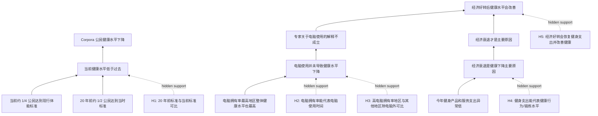

# TASK10 论证树

## 文本类型路由

| 字段 | 判断 |
|---|---|
| text_type | GRE Analyze an Argument |
| route | 父层 `workflow-argument-validity` + 论效题子 workflow 的抽树/验箭头动作 |
| output_target | hidden assumptions + implication analysis |
| independence | `prior-exposed / assisted` |
| reason | 题目要求分析明示或暗含假设，不是表达自己对健康、电脑或经济的观点 |

## 作者想证明的根结论

Corpora 公民健康水平下降的主要原因不是电脑使用，而是经济衰退；经济好转后，健康水平会改善。

## Mermaid 论证树

## 节点台账

| node_id | type | content | 备注 |
|---|---|---|---|
| A1/A2 | evidence | 当前与 20 年前达标比例对比 | 依赖标准可比性 |
| A3 | evidence | 高电脑拥有率地区健康水平也高 | 依赖拥有率代表使用时间，且排除第三因素 |
| A4 | evidence | 健身支出异常低 | 依赖支出代表实际锻炼和健康投入 |
| B1 | subclaim | 健康水平下降 | 若标准不可比，基础现象不稳 |
| B2 | subclaim | 电脑不是健康下降原因 | 若拥有率不等于使用时间或有第三因素，箭头断裂 |
| B3 | subclaim | 经济衰退是主要原因 | 若存在免费锻炼或其他原因，箭头过强 |
| F | root claim | 经济好转后健康水平会改善 | 需要经济、支出、健康行为、健康结果之间连续成立 |
