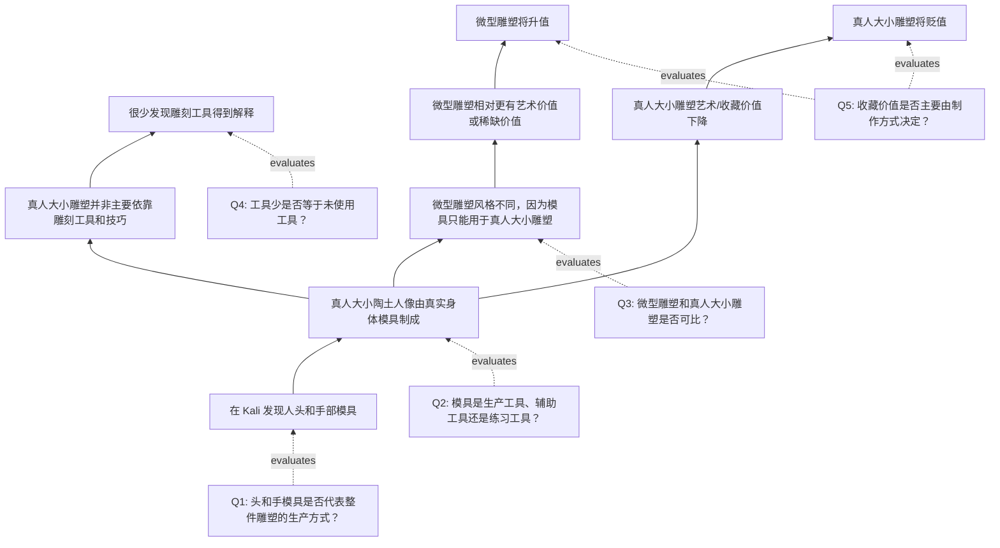

# TASK11 论证树

## 文本类型路由

| 字段 | 判断 |
|---|---|
| text_type | GRE Analyze an Argument |
| route | 论效 workflow 的 GRE Argument 分支 |
| output_target | questions-to-evaluate + impact analysis |
| independence | `prior-exposed / assisted` |
| reason | 题目要求讨论需要回答哪些问题，并说明答案如何帮助评估预测 |

## 作者想证明的根结论

关于 Kali Island 古代雕塑的发现会导致收藏价值变化：真人大小雕塑会贬值，微型雕塑会升值。

## Mermaid 论证树

## 节点台账

| node_id | type | content | 备注 |
|---|---|---|---|
| A1 | evidence | 发现头部和手部模具 | 局部证据 |
| B1 | subclaim | 真人大小雕塑由真实身体模具制成 | 需要证明模具覆盖整件雕塑和主要生产方式 |
| B2 | subclaim | 雕刻工具和技巧不是主要原因 | 需要排除工具/技巧与模具并用 |
| B3 | subclaim | 微型雕塑风格不同因不能用模具 | 需要排除材料、时期、用途、审美传统等替代解释 |
| B4 | subclaim | 工具少说明不靠雕刻工具 | 需要考虑工具腐坏、未发现、被转移、材料不同 |
| D/E | root prediction | 真人大小贬值，微型升值 | 需要市场机制与收藏者价值标准支撑 |
