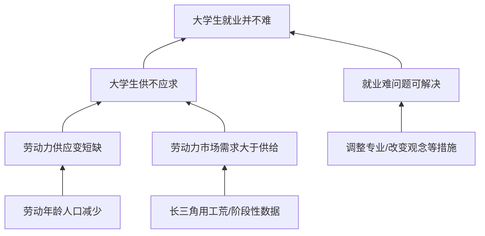
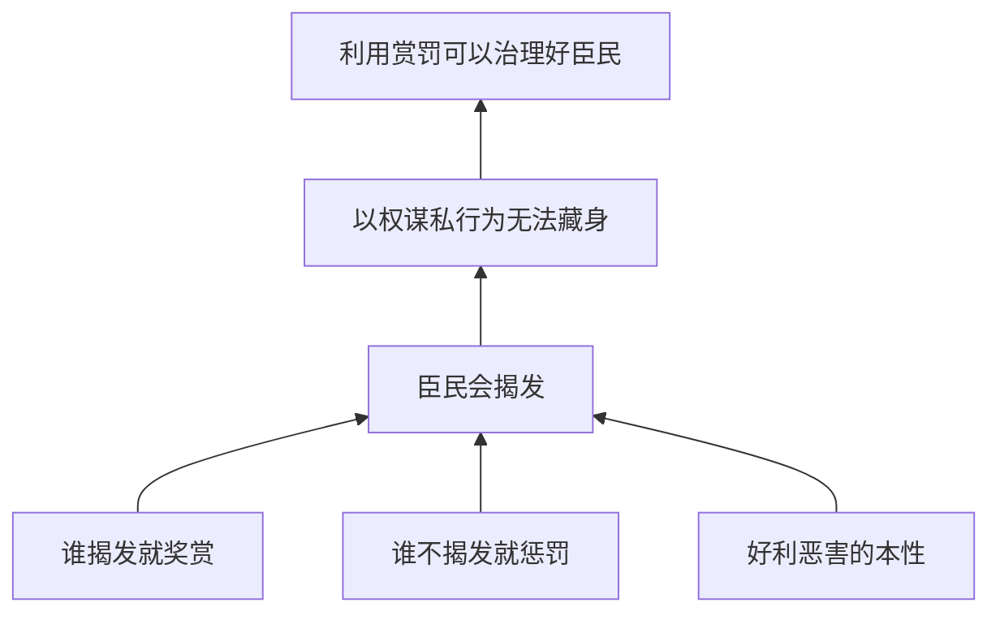

# Unit Course Regression 2026-06-19

## 测试边界

本轮只做课程范例单元测试，不做总体 UAT。

```text
课堂范例 = 已参与规则提炼的材料
=> 可用于 regression / unit test
=> 不可用于 forward-test-green
```

## 被测对象

| 对象 | 路径 |
|---|---|
| 论效子 workflow | `../SKILL.md` |
| 编排 Skill | `../skills/exam-argument-validity-orchestrator/SKILL.md` |
| 审题规则 | `../references/exam-reading-rules.md` |
| 行文规则 | `../references/exam-writing-rules.md` |
| 练习回归 | `../references/exam-practice-loop.md` |
| 论证树模板 | `../assets/exam-argument-tree-template.md` |
| 父层验箭头断点库 | `../../../skills/argument-arrow-audit/references/arrow-audit-core.md` |
| 父层历史断点分类 | `../../../references/arrow-break-taxonomy.md` |

## 课程范例来源

| Case | 来源位置 | 用途 |
|---|---|---|
| UT01-2016-就业题审题结构 | `../../../references/course-notes/02-论证有效性分析-审题.md` | 验证总论点、结构关键词、直推/合推/分推识别 |
| UT02-2016-就业题行文规划 | `../../../references/course-notes/04-论证有效性分析-行文2.md`；`../../../references/course-notes/05-论证有效性分析-行文3.md` | 验证本论段规划、组合分析和定位-分析-收尾 |
| UT03-2017-赏罚治理复杂结构 | `../../../references/course-notes/02-论证有效性分析-审题.md`；`../../../references/course-notes/08-论证有效性分析-谬误识别3.md` | 验证复杂合推/分推、手段目的断点 |
| UT04-A350-航空器例 | `../../../references/course-notes/06-论证有效性分析-谬误识别1.md`；`../../../references/course-notes/07-论证有效性分析-谬误识别2.md` | 验证概念不一致、过度推理、另找他因 |
| UT05-知识经济例 | `../../../references/course-notes/06-论证有效性分析-谬误识别1.md` | 验证过度推理与段落表达 |

## UT01：2016 就业题审题结构

### 预期

- 能按 `exam-reading-rules.md` 先找总论点和总结论；
- 能识别材料主体中多组论证；
- 能用直推、合推、分推描述局部结构；
- 能转成 Mermaid 小树。

### 回归结果



### 判定

`pass`

说明：当前审题规则能覆盖课堂中的“找论点、看结构关键词、标箭头、识别多组论证”动作。

## UT02：2016 就业题行文规划

### 预期

- 能从一组复杂论证中拆出多个可写段；
- 能把“劳动年龄人口减少 -> 劳动力短缺 -> 大学生供不应求”拆成组合分析；
- 能写出定位-分析-收尾结构。

### 回归结果

| 箭头 | 断点 | 可写段落方向 |
|---|---|---|
| 劳动年龄人口减少 -> 劳动力变短缺 | 过度推理 / 忽略原本过剩规模 | 减少不等于短缺，仍需说明原有供需基数 |
| 劳动力短缺 -> 大学生供不应求 | 概念/群体错配 | 劳动力整体不等于大学生群体 |
| 长三角/二季度数据 -> 全国全年劳动力供需 | 以偏概全 / 时间范围外推 | 局部地区和短期数据不能直接代表全国全年 |
| 专业调整/观念改变 -> 就业难消失 | 手段目的 / 另找他因 | 措施未必能覆盖就业难的真实成因 |

### 判定

`pass`

说明：`exam-writing-rules.md` 与 `exam-paragraph-template.md` 能承接课堂中的段落规划和组合分析。

## UT03：2017 赏罚治理复杂结构

### 预期

- 能处理自问自答、解释说明、合推和分推组合；
- 能识别“赏罚手段 -> 防止以权谋私/治理好臣民”的手段目的箭头；
- 能把复杂结构局部画树，而不是被故事带跑。

### 回归结果



| 箭头 | 断点 | 判定 |
|---|---|---|
| 赏罚规则 -> 臣民都会揭发 | 不当假设 / 手段目的 | weak |
| 臣民揭发 -> 以权谋私无法藏身 | 过度推理 / 忽略共同利益和事实不可知 | weak |
| 以权谋私无法藏身 -> 治理好臣民 | 过度推理 | weak |

### 判定

`pass`

说明：子 workflow 能把课堂中的复杂结构压回“支撑箭头”审计。

## UT04：A350 航空器例

### 预期

- 能识别“局部参与 -> 制造能力系统提升”的过度推理；
- 能识别“A350/民用飞机/航空器”之间的范围变化；
- 能允许同一箭头从概念不一致、过度推理、另找他因多个视角切入。

### 回归结果

| 箭头 | 断点类型 | 说明 |
|---|---|---|
| 参与部分设计制造 -> 制造能力系统提升 | 过度推理 | 部分参与不必然说明系统能力提升 |
| A350/民用飞机 -> 航空器整体 | 概念范围扩大 | 不能用局部类别直接代表更大范围 |
| 被邀请参与 -> 对方认可能力 | 另找他因 | 可能还有市场、成本、政策等其他原因 |

### 判定

`pass`

说明：父层历史 `arrow-break-taxonomy.md` 能覆盖该课堂例子的多角度切断方式；新增验箭头任务应从 `arrow-audit-core.md` 调用这些断点。

## UT05：知识经济例

### 预期

- 能识别“知识有限/可查询 -> 知识尺度无意义/无需学习”的过度推理；
- 能写成非术语化分析段。

### 回归结果

| 箭头 | 断点 | 可写表达 |
|---|---|---|
| 知识有限 -> 知识尺度无意义 | 过度推理 | 知识有限至多说明应持续学习，并不说明知识尺度没有意义 |
| 能查询知识 -> 不必系统学习 | 过度推理 / 不当假设 | 能查到不等于理解、掌握和创造性运用 |

### 判定

`pass`

说明：`exam-writing-rules.md` 的“少贴术语，多解释为什么推不出”能覆盖该例。

## 汇总

| 模块 | 覆盖的测试 | 结果 |
|---|---|---|
| 审题抓论证 | UT01, UT03 | pass |
| 画论证树 | UT01, UT03 | pass |
| 验箭头 / 找断点 | UT02, UT03, UT04, UT05 | pass |
| 选可写问题 | UT02, UT03 | pass |
| 行文规划并写段落 | UT02, UT05 | pass |
| 练习回归 | 本报告本身进入 tests | pass |

## 结论

`workflow-exam-argument-validity` 对老王课堂范例具备回归解释力：

- 能复现课堂里的结构识别；
- 能把课堂范例画成论证树；
- 能把问题绑定到箭头；
- 能把断点转为可写段落方向。

但本轮不能证明迁移能力。

当前状态应保持：

```text
course-regression-pass
structural-green / forward-test-pending
not-uat
```

## 后续 UAT 需求

需要一篇未参与提炼的新论效材料，至少包含：

1. 完整题干；
2. 参考解析或范文；
3. 最好有一版学生初稿或可修改稿。

通过新题完整跑出：

```text
审题记录 -> Mermaid 论证树 -> 箭头断点表 -> 行文规划 -> 文章草稿 -> 修改清单
```

才可把状态推进到 `forward-test-green`。
