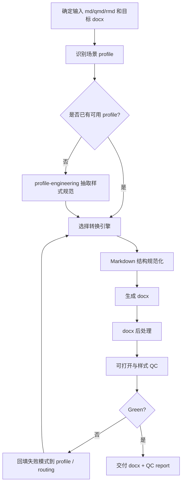

# Workflow: Markdown to Word Formatting

## 定位

这是一个 workflow 型复合 Skill，负责把结构化文本转换为 Word docx，并让输出符合目标场景的版式要求。

它不从零发明转换器，而是编排成熟工具：

```text
Pandoc / Quarto / R Markdown / markdown2docx / python-docx
```

本 workflow 负责：

- 判断目标场景；
- 选择转换引擎；
- 选择或生成 Word reference-doc / journal template；
- 应用 style profile；
- 做 docx 后处理；
- 生成 QC report；
- 把失败模式反哺到 profile 或 engine routing。

## 执行模式

```text
mode: diagnose-only
  只检查输入、目标格式、可用引擎和目标 profile；
  输出 conversion-plan.md，不生成 docx。

mode: convert-fast
  使用已有 profile / reference-doc 快速生成 docx；
  做可打开检查和段落抽样检查。

mode: full-profile-qc
  生成 docx 后执行样式后处理和 QC；
  输出 docx、conversion-log.md、style-qc-report.md；
  适合投稿、审稿意见定稿、对外提交版本。

mode: profile-engineering
  从期刊指南、Word 模板、截图、VBA 或历史 docx 中抽取 style profile；
  产出 reusable profile，而不只产出单个 docx。
```

默认 mode：`convert-fast`。若用户说“投稿/提交/版式不理想/建 Skill/做模板”，默认升级到 `full-profile-qc` 或 `profile-engineering`。

## 主轴



## 场景路由

读取 `references/routing.md`。

| 场景 | 默认 profile | 默认引擎 |
|---|---|---|
| 审稿意见 / 给编辑说明 / 返修信 | `profiles/review-comment.yaml` | Pandoc + reference-doc + python-docx QC |
| 国内中文期刊：管理世界 | `profiles/management-world.yaml` | Pandoc + python-docx 后处理 |
| 国内中文期刊：金融研究 | `profiles/financial-research.yaml` | Pandoc + python-docx 后处理 |
| 川大学位论文 / 学位论文样式 | `profiles/scu-thesis.yaml` | Pandoc + python-docx 后处理 |
| 外刊普通 manuscript | `profiles/foreign-generic-manuscript.yaml` | Quarto 或 Pandoc |
| 已有 Quarto journal template | `profiles/quarto-journal.yaml` | Quarto |
| 复杂固定封面/页眉/表单 | custom profile | python-docx-template / python-docx |

## 输入

必需：

```text
input_path: .md / .qmd / .rmd
output_path: .docx
target_profile: review-comment / management-world / financial-research / foreign-generic-manuscript / quarto-journal / custom
```

可选：

```text
reference_docx:
journal_template:
style_guide:
sample_docx:
mode:
needs_visual_check: yes/no
```

## 输出

默认输出：

```text
output.docx
conversion-log.md
style-qc-report.md
```

profile-engineering 输出：

```text
profiles/{profile-name}.yaml
references/{profile-name}-source-notes.md
templates/{profile-name}-reference.docx 或生成说明
```

## 工具选择原则

1. 优先用现成成熟工具，不从零写转换器。
2. Pandoc 适合“Markdown -> docx + reference-doc 样式”。
3. Quarto 适合外刊 manuscript、journal template、qmd/rmd 和引用/图表较复杂的稿件。
4. markdown2docx / JS docx 类工具适合需要自定义渲染器或不用 pandoc 的场景。
5. python-docx / python-docx-template 适合后处理、固定模板、页眉页脚、表格细修和 QC。

## 完成标准

Green：

- docx 能被 Word / python-docx 打开；
- 段落、标题、列表和中英文混排字体符合 profile；
- 标题大纲级别没有污染正文；
- 正文段落缩进、行距、段前段后符合 profile；
- 列表/编号没有变成怪异嵌套；
- 若 profile 要求匿名、图表、脚注、参考文献或页眉页脚，QC report 中明确 pass / warning / fail；
- 输出 QC report，列出人工仍需视觉复核的项目。

Red：

- 只说“已转换”但没有 QC；
- 把 reference-doc 当成完整模板，忽略 Pandoc 对 docx template 的限制；
- 国内期刊 profile 只套英文学术模板；
- 外刊 manuscript 忽略目标 journal template；
- 未区分“可编辑审稿意见 Word”和“正式投稿论文 Word”。

## 子 Skill

```text
skills/md-to-word-orchestrator/SKILL.md
skills/pandoc-docx-engine/SKILL.md
skills/quarto-journal-engine/SKILL.md
skills/docx-style-postprocessor/SKILL.md
skills/docx-style-qc/SKILL.md
```

## 参考资料

- `references/routing.md`
- `references/style-profile-contract.md`
- `references/engine-radar.md`
- `references/local-style-sources.md`
- `references/pandoc-docx-limitations.md`

## 反哺来源

本 workflow 来自真实项目失败模式：

```text
Pandoc + 欣媛审稿 Word reference-doc 能生成 docx，但版式不理想；
原因不是单纯转换失败，而是 reference-doc、Word styles、中文字体、段落规则和目标场景 profile 没有工程化。
```

同时吸收外部成熟生态：

```text
Pandoc reference-doc
Quarto journal templates
academic-pandoc-template
markdown2docx
python-docx-template
```
