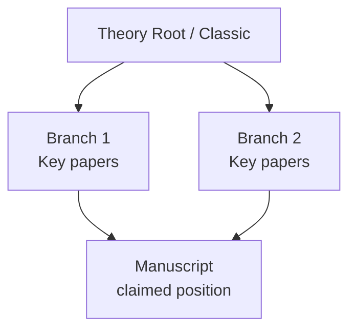

# Manuscript Literature Genealogy

## 定位

本 Skill 是 workflow-paper-writing-review 中的第 4 步：文献定位。

它不是普通文献检索 Skill。它负责把第 3 步快速通读得到的研究问题、文献缺口、理论机制、变量和贡献声明，放回高质量文献体系中，重建“知识树 / 文献树 / 知识谱系”，判断稿件声称的 gap 和贡献在谱系中的位置。

底层检索由 scholar-kit 系列 Skills 执行；本 Skill 只做编排、筛选规则、综合分析和产物组织。

## 交付物契约

本 Skill 的最终交付物不是检索日志、候选池或数据库导出，而是一份审稿人可直接阅读的中文知识谱系报告。报告应先用科普/博客式语言讲清楚“这个研究领域目前怎么理解这个问题”，再用一小段内容对照作者稿件的位置和声称。

默认最终报告为：

```text
notes/literature-positioning-and-genealogy.md
```

对英文稿，最终报告应“中文为主、保留英文关键信息”：正文分析、判断和审稿含义用中文写；概念和术语优先写中文，第一次出现时在括号中跟英文术语，例如“出口质量（export quality）”“出口产品范围（export product scope）”“出口品种（export variety）”“出口复杂度（export sophistication）”。英文论文题名、作者、期刊名、变量名、正式指标名和 query 可以保留英文。对中文稿，默认中文即可。

原始检索过程、query、候选池、BibTeX、WoS scaffold、CNKI 抓取日志等应放在 TASK 的 `logs/`、`outputs/` 或 `cache/` 中，并在最终报告中只摘要说明。不得把原始日志、长候选表或大段执行状态当作最终报告主体。

最终报告必须先讲领域共识，再对照稿件：

```text
# 文献定位与知识谱系

## 大白话导读
## 这个领域原本在讨论什么
## 关键概念定义卡
## 几条主要文献线分别讲了什么
## 知识树 / 文献谱系
## 把作者这篇放进去看
## 作者声称的位置 vs 更稳妥的位置
## 文献树 / 知识谱系
## 关键 benchmark 文献
## 后续审稿应重点查什么
## 下一步审查路由
## 附录：检索日志与产物路径
```

其中 `附录：检索日志与产物路径` 应简短，只用于可追溯；详细日志应链接到 `tasks/.../logs/search-log.md`。

## 触发条件

当用户在审稿、自审或返修项目中提出以下需求时使用：

- “第 4 步文献定位”
- “梳理这篇文章在文献体系中的位置”
- “判断贡献/gap 是否成立”
- “画知识树/文献树/知识谱系”
- “找 benchmark papers”
- “这篇文章的源流是什么”
- “用大白话讲讲这个领域”
- “先科普目前研究共识，再说作者在哪”
- “这个关键概念到底怎么定义”
- “用 FT50/顶刊/川大 B 以上文献判断新意”
- “拿到摘要后综合分析，而不是只列检索结果”

## 输入

优先读取项目内：

- `notes/quick-read-contribution-chain.md`；
- 其中的 `Step 4 Literature Branch Seeds`；
- 段落编号 Markdown 或 restored Markdown；
- 作者参考文献列表；
- 项目 README 和审稿台账；
- 已有文献候选池、BibTeX、摘要或检索日志。

如果缺少第 3 步贡献链，应先调用或建议 `manuscript-quick-reconstruction`。如果贡献链存在但缺少 `Step 4 Literature Branch Seeds`，应先回到第 3 步补齐 seed 表，而不是在第 4 步从零猜测检索领域。

## 作者参考文献优先原则

文献谱系应先从稿件自己的 References 出发，再做外部检索扩展。

第一步必须进行 author-reference baseline pass：

- 抽取作者参考文献列表；
- 按第 3 步的 literature branch seeds 对参考文献初步归类；
- 标出作者已经引用的理论源头、方法来源、变量构造来源、识别策略来源和直接 benchmark；
- 标出明显低质量来源、working paper、政策报告、中文/英文来源、可能重复或格式异常的文献；
- 标出作者引用但没有在正文贡献链中真正使用的文献；
- 标出作者没有引用但从 quick-read 看起来必须外部检索核验的缺口。

作者参考文献不是最终文献树，但它是必须先检查的起点：

```text
author references
-> branch assignment
-> benchmark candidates
-> missing-branch diagnosis
-> external search expansion
-> genealogy synthesis
```

若作者参考文献已经覆盖某条分支，外部检索应优先验证其是否足够高质量、是否遗漏更关键的高质量文献、以及作者是否准确定位该文献。若作者参考文献没有覆盖某条核心 seed，则外部检索应把该分支标为 priority。

## 可编排的 Scholar-Kit Skills

优先按用户目标和数据源约束读取并调用以下 Skills：

- `/Users/narra/Documents/alib/Writer/.pytools/scholar-kit/skills/scholar-kit-literature-search/SKILL.md`
- `/Users/narra/Documents/alib/Writer/.pytools/scholar-kit/skills/scholar-kit-wos-search/SKILL.md`
- `/Users/narra/Documents/alib/Writer/.pytools/scholar-kit/skills/scholar-kit-openalex-search/SKILL.md`
- `/Users/narra/Documents/alib/Writer/.pytools/scholar-kit/skills/scholar-kit-cnki-search/SKILL.md`
- `/Users/narra/Documents/alib/Writer/.pytools/scholar-kit/skills/scholar-kit-ebsco-search/SKILL.md`
- `/Users/narra/Documents/alib/Writer/.pytools/scholar-kit/skills/scholar-kit-cnki-cited-by/SKILL.md`
- `/Users/narra/Documents/alib/Writer/.pytools/scholar-kit/skills/scholar-kit-cnki-sentence-search/SKILL.md`
- `/Users/narra/Documents/alib/Writer/.pytools/scholar-kit/skills/reference-audit/SKILL.md`
- `/Users/narra/Documents/alib/Writer/.pytools/scholar-kit/skills/publication-grade-citation-enrichment/SKILL.md`

执行任何检索前，必须先读取本次选中的子 Skill 的 `SKILL.md`，按其原生入口、登录/验证码/真零结果/产物契约执行。

## 语种与数据源路由

默认按原稿语种决定是否启动中文数据库：

- 英文稿：默认只检索英文/国际文献，优先 OpenAlex 与 WoS；不默认检索 CNKI，也不把中文文献分支列为必须完成项。
- 中文稿：必须检索中文文献，优先 CNKI，并默认叠加川大社科 B 以上过滤；如同时需要国际定位，再补 OpenAlex/WoS。
- 例外：即使是英文稿，只有当用户明确要求中文文献、稿件声称依赖中文研究脉络、或关键变量/制度背景只能通过中文文献核验时，才启动 CNKI，并在日志中说明例外理由。

因此，第 3 步的 `Chinese literature` seed 对英文稿只作为可选背景线索，不构成第 4 步完成标准；对中文稿则是必查分支。

## 质量门槛

### 英文与国际文献主干

知识谱系的主干文献优先来自：

- FT50；
- UTD24；
- 经济学、金融、管理、国际商务、创新、组织、贸易等领域顶刊；
- 综合类顶刊和跨学科顶刊，例如 `Nature`、`Science`、`PNAS`；
- 其他被该领域反复引用、且能作为理论源头或方法基准的高影响文献。

不在上述范围内的文献可以进入线索池或背景池，但不得未经说明就成为“主干 benchmark”。

### 中文文献主干

中文文献最低门槛：

- 川大社科 B 以上期刊；
- 或用户指定的更高中文期刊白名单。

默认白名单文件：

```text
/Users/narra/Documents/alib/Writer/00 信息/川大社科-B以上.md
```

中文普通期刊、硕博论文、会议、报纸、网络首发可作为线索，但不得作为贡献判断的主干依据，除非用户明确要求或该材料有特殊事实价值。

### 摘要与元数据要求

进入谱系分析的文献，原则上至少应有：

- title；
- authors；
- year；
- venue/source；
- abstract 或足够详细的 metadata；
- DOI、WoS ID、OpenAlex ID、CNKI ID 或其他可追溯标识之一。

没有摘要时可暂列为 `metadata-only`，但不得过度解读其贡献。

## 工作流

1. 读取第 3 步贡献链和 `Step 4 Literature Branch Seeds`，抽取研究问题、核心概念、机制、变量、数据情境和作者声称的 gap。
2. 执行 author-reference baseline pass：先从作者 References 中识别已引用的源头文献、直接 benchmark、方法/变量依据和明显缺口。
3. 识别“读不懂就无法判断”的关键概念和外借指标，建立关键概念定义卡。凡稿件依赖某篇文献的变量定义、分类表、样本构造或识别假设，必须优先查该源头文献，不能只引用作者稿件的转述。
   - 例：若稿件使用 Xiang (2014) 的 new products / EPS，应先查清 Xiang 如何定义新产品，再解释该定义被当前稿件如何迁移。
   - 定义卡至少包括：中文概念、英文术语、源头文献、源头定义的大白话解释、数据/分类操作、适用边界、迁移到当前稿件时的风险。
4. 将 seed 表、作者参考文献和定义卡合并为 3-7 条知识分支，例如理论源头、概念/变量源头、方法分支、机制分支、结果变量分支、场景分支；必要时保留 seed 到 branch 的映射。
5. 为每条分支设计检索 query：概念 query、benchmark paper query、author/reference chasing query、同句/同段概念共现 query、中文对应概念 query。
6. 按 scholar-kit 路由策略调用检索能力：
   - 英文国际主线优先 `scholar-kit-literature-search`，必要时 WoS 前置 venue 约束；
   - 需要 FT50、UTD24、领域顶刊或综合顶刊证明时优先 WoS；
   - 需要综合顶刊线索时，将 `Nature`、`Science`、`PNAS` 等纳入 venue 约束或筛选标签；
   - 中文稿或明确需要中文证据时使用 CNKI，并默认叠加川大社科 B 以上过滤；
   - 需要中文概念共现时调用 CNKI sentence search；
   - 需要围绕关键中文文献追踪后续研究时调用 CNKI cited-by；
   - 需要全文命中补强时可调用 EBSCO。
7. 收集摘要和元数据，形成候选池，并标注来源、质量层级和可追溯路径。
8. 使用大模型能力做“知识优先”的综合分析：
   - 先写每条文献线的研究共识：这个分支在问什么、怎么衡量、目前大致知道什么、还争什么；
   - 用科普/博客式段落解释，而不是先审作者；
   - 归并同义主题和相邻分支；
   - 区分理论源头、主干文献、直接前沿、相邻背景和噪声；
   - 找出必须回应的 benchmark papers；
   - 判断本文声称 gap 是真实空白、局部延伸、换场景、换变量、换方法，还是可能已被覆盖；
   - 标注每条贡献声明的状态：`supported / weak-supported / questioned / unsupported / overclaimed`。
9. 输出文献定位矩阵。
10. 输出 Mermaid 知识谱系图。
11. 将下一步风险路由到方法审查、变量审查、结果叙事检查或审稿素材组装。
12. 将检索日志、候选池和矩阵材料综合改写为中文主线报告：压缩原始表格，先讲领域共识和关键概念，再对照作者稿件，保留必要英文关键信息，把“查到了什么”转化为“这个领域怎么想、作者这篇放在哪里”。

## 推荐输出

默认在项目 `notes/` 目录输出一份可读报告：

```text
notes/literature-positioning-and-genealogy.md
```

如项目需要拆分，可额外输出：

```text
notes/literature-positioning-matrix.md
notes/literature-genealogy-tree.md
```

## 语言策略

- 如果原稿是英文：文献题名、作者、期刊名、正式变量名、指标缩写和检索 query 应保留英文；正文解释、判断、分支名、gap 判断和审稿含义必须以中文为主。
- 核心概念必须采用“中文概念（English term）”格式第一次出现，后文优先使用中文或约定缩写。不要把一串英文概念裸放在中文句子中。
- 推荐：`EPS 是否真能区别于出口质量（export quality）、出口产品范围（export product scope）、出口品种（export variety）和出口复杂度（export sophistication）？`
- 避免：`EPS 是否真能区别于 export quality、export product scope、export variety、export sophistication？`
- 如果原稿是中文：默认中文输出，不需要额外生成英文版本；英文文献题名、关键词、期刊名和数据库 query 可保留英文。
- Mermaid 图中的节点可以采用中英混合：中文分支名 + 英文关键文献/术语。优先保证审稿人一眼看懂谱系关系。
- 不翻译 DOI、WoS/OpenAlex/CNKI 标识、变量名、模型名和正式引用信息。

单文件报告必须包含：

- 大白话导读；
- 这个领域原本在讨论什么；
- 关键概念定义卡；
- 几条主要文献线分别讲了什么；
- 知识树 / 文献谱系；
- 把作者这篇放进去看；
- 作者声称的位置 vs 更稳妥的位置；
- 关键 benchmark 文献；
- 后续审稿应重点查什么；
- 下一步审查路由；
- 附录：检索日志与产物路径。

以下内容不得占据报告主体：search scope、candidate retrieval log、长候选池、数据库状态、脚本输出路径。它们只应放在附录或 TASK 日志中。

## 文献定位矩阵字段

建议使用以下字段：

| Branch | Key Literature | Venue Tier | Core Question | Data / Method | Main Finding | Relation to Manuscript | Contribution Implication | Status |
|---|---|---|---|---|---|---|---|---|

## Mermaid 知识谱系

Mermaid 图应优先表达谱系关系，而不是检索列表。



图中应标出关键文献节点、分支名称和稿件所在位置。若某条边只是推断关系，应在图后说明 `inferred from abstracts/metadata`。

## 判断纪律

- 文献检索结果不是文献谱系；必须经过摘要读取和综合分析。
- 文献谱系报告不是检索日志，也不是先入为主的作者批评；必须先客观讲清楚领域知识、概念定义和研究共识，再对照作者稿件。
- 对关键外借概念或变量，不得只复述作者说法；必须追到源头文献，讲清楚源头定义、操作化方法和迁移风险。
- 不把低质量或无摘要线索放进主干文献树。
- 不把中文普通来源用于支撑“高质量文献 gap”判断。
- 不因某个数据库零结果就断言文献空白；必须区分真零结果、检索式过窄、登录/验证码、venue 约束过严和技术故障。
- 不把作者参考文献列表等同于领域文献树；需要额外检索和 benchmark 对照。
- 不生成最终审稿意见，只输出可供审稿人判断的文献定位证据和问题。
- 任何不确定的文献关系，应标为 `inferred`、`needs abstract`、`needs full text` 或 `needs manual verification`。

## 完成标准

- 已从第 3 步贡献链导出清晰的文献分支。
- 已读取并使用 `Step 4 Literature Branch Seeds`；如未使用，已说明原因。
- 已先检查作者 References，并说明哪些分支已被作者覆盖、哪些分支需要外部检索补齐。
- 已说明检索数据源、query、venue/中文白名单和产物路径。
- 主干文献满足 FT50、UTD24/领域顶刊、`Nature`、`Science`、`PNAS` 等综合顶刊要求；中文稿或明确启动 CNKI 时，中文主干还应满足川大社科 B 以上要求；例外已解释。
- 已读取或整理关键文献摘要/metadata，并用于综合判断。
- 已为关键外借概念或变量建立定义卡；如定义来自源头文献，已核查源头文献而非只信作者转述。
- 已形成文献定位矩阵。
- 已形成 Mermaid 知识谱系图。
- 已明确本文在文献树上的位置和 gap 状态。
- 已列出必须对照、必须引用或必须区分的 benchmark papers。
- 已把后续问题路由到方法识别审查、变量数据审查、结果叙事一致性或审稿素材组装。
- 最终 `notes/` 交付物是中文主线可读报告，采用“先科普领域共识和概念定义，再对照作者稿件”的结构，而不是原始检索日志或直接审稿清单；原始日志已移入或链接到 TASK 的 `logs/`、`outputs/` 或 `cache/`。
