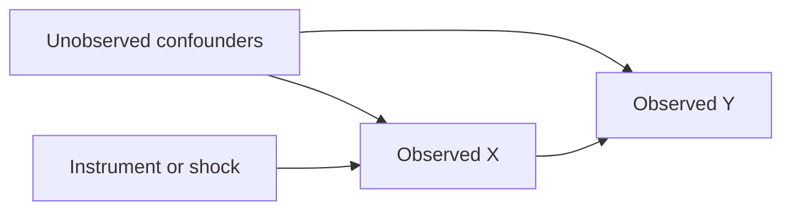

# Causal Identification Audit

## Metadata

| Field | Value |
|---|---|
| project_id |  |
| manuscript_id |  |
| title |  |
| source_text |  |
| quick_read | notes/quick-read-contribution-chain.md |
| issue_ledger | notes/review-issue-ledger.md |
| status | draft / checked / revised |

## Plain-Language Bottom Line

用三到五句话说清楚：作者实际观察到什么、作者声称什么、因果桥哪里强、哪里弱、是否需要降级表述。

## Actual Observed Finding vs Claimed Causal Finding

| Item | Plain Chinese | Evidence Location | Concern |
|---|---|---|---|
| Actual observed finding / 实际观测发现 |  |  |  |
| Claimed causal finding / 作者上升发现 |  |  |  |
| Match status / 是否匹配 | matched / partly matched / overstated / unclear |  |  |
| Bridge assumptions / 桥接假设 |  |  |  |

## Causal Object

| Item | Plain Chinese | Evidence Location |
|---|---|---|
| Intended treatment / 作者想说的 X |  |  |
| Observed X / 数据里测到的 X |  |  |
| Intended outcome / 作者想说的 Y |  |  |
| Observed Y / 数据里测到的 Y |  |  |
| Unit |  |  |
| Time order |  |  |
| Estimand | ATE / ATT / LATE / correlation / unclear |  |

## DAG

## DAG Explanation in Plain Chinese

- 作者想证明的路径：
- 主要后门路径：
- 可能的反向因果：
- 机制路径：
- 不能随便控制的变量：

## Backdoor Analysis

| Backdoor Path | Why It Matters | Author's Strategy | Does It Block? | Remaining Concern |
|---|---|---|---|---|
| X <- U -> Y |  | controls / FE / IV / PSM / DiD / robustness | yes / partly / no / unclear |  |

## Frontdoor / Mechanism Analysis

| Candidate Mediator | X -> M Evidence | M -> Y Evidence | Does It Meet Frontdoor Logic? | Plain-Language Judgment |
|---|---|---|---|---|
|  |  |  | yes / partly / no / not applicable |  |

## IV / Research Design Audit

| Assumption | Plain Chinese Test | Evidence Location | Judgment |
|---|---|---|---|
| Relevance | Z 是否真的推动 X。 |  | supported / weak / unclear |
| Exclusion restriction | Z 是否只能通过 X 影响 Y。 |  | supported / weak / violated / unclear |
| Independence | Z 是否不像是其他趋势或能力的代理。 |  | supported / weak / unclear |
| Monotonicity / LATE | IV 估计的是哪类样本的效应。 |  | clear / unclear / not discussed |
| First-stage strength | 是否弱工具。 |  | strong / weak / unclear |

## Controls and Fixed Effects

| Item | What It Helps Block | What It Cannot Block | Risk |
|---|---|---|---|
| Controls |  |  |  |
| Firm FE |  |  |  |
| Year FE |  |  |  |
| Industry-year / region-year / product-year FE |  |  |  |

## Robustness and PSM

| Check | Which Threat It Addresses | Which Threat Remains | Judgment |
|---|---|---|---|
|  |  |  |  |

## Statistical Evidence and Identification Table Audit

| Evidence Table | What It Is Supposed to Prove | Key Statistical Evidence | Does It Support the Causal Claim? | Remaining Concern | Route |
|---|---|---|---|---|---|
|  |  | coefficient / SE / F-stat / R2 / N / balance / robustness | yes / partly / no / unclear |  |  |

## Causal Claim Strength

| Claim | Strength | Suggested Downgrade or Revision |
|---|---|---|
|  | strong / moderate / weak / descriptive only |  |

## Issue Ledger Updates

| Issue ID | Update |
|---|---|
|  |  |
