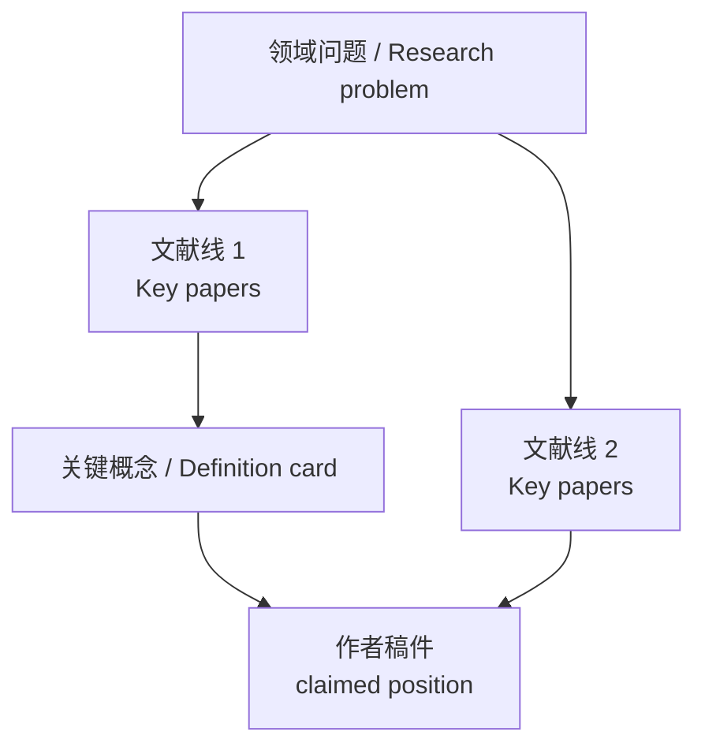

# 文献定位与知识谱系

## Metadata

| Field | Value |
|---|---|
| project_id |  |
| manuscript_id |  |
| title |  |
| source_quick_read |  |
| reading_date |  |
| status | draft / checked / revised |
| manuscript_language | English / Chinese / other |
| output_language_mode | Chinese-main-with-English-key-terms / Chinese-only / user-specified |

## 语言规则

英文稿使用中文主线写作。核心概念第一次出现时采用“中文概念（English term）”格式，后文优先使用中文或约定缩写。

推荐：

- 出口质量（export quality）
- 出口产品范围（export product scope）
- 出口品种（export variety）
- 出口复杂度（export sophistication）
- 新产品出口占比（new-product export share / EPS）

避免在中文句子里裸放一串英文概念，例如：`EPS 是否区别于 export quality、export product scope、export variety、export sophistication`。

## 大白话导读

用 3-6 句话先把这个领域在讨论什么讲清楚，不要先审作者。写法应像给研究生或合作者看的科普博客：先讲“大家原本怎么想”，再讲“这篇稿件想插到哪里”。

示例结构：

> 本文不是开辟了一个全新的“机器人与出口升级”方向，而是试图在既有机器人与出口质量（robot-export quality）、企业出口（firm export）和出口产品范围（product scope）文献之间，提出一个更窄的基于产品生命周期的新产品出口占比（PLC-based new-product export share）结果变量。这个 gap 可能成立，但必须以 EPS 构造有效性和与既有出口产品范围、出口质量、出口品种文献的区分为前提。

## 这个领域原本在讨论什么

用中文段落概述领域共识：

- 这个领域为什么关心这个问题；
- 已有研究通常怎么定义核心概念；
- 已有研究常用哪些结果变量和数据；
- 目前比较稳的结论是什么；
- 还有哪些争议或未解决问题。

## 关键概念定义卡

凡稿件依赖某篇源头文献的变量、分类、识别假设或数据构造，必须先查清楚源头定义。不要只复述作者稿件的说法。

| 概念 | 英文术语 | 源头文献 | 源头文献怎么定义/操作化 | 大白话解释 | 迁移到本文的风险 |
|---|---|---|---|---|---|
|  |  |  |  |  |  |

示例：

| 概念 | 英文术语 | 源头文献 | 源头文献怎么定义/操作化 | 大白话解释 | 迁移到本文的风险 |
|---|---|---|---|---|---|
| 新产品 | new products / new goods | Xiang (2014) | 比较美国制造业 SIC 手册中不同时点的产品条目，把后来才出现、且能匹配到美国进口商品描述的产品识别为新产品。 | 它不是“企业自己研发的新产品”，而是美国历史分类体系里后来出现的产品类别。 | 若用于中国企业出口，需要解释美国历史上的“新产品”为什么能代表中国 2000-2013 年出口升级。 |

## 几条主要文献线分别讲了什么

每条文献线先讲共识，再列关键文献，最后才说它和当前稿件可能有关。

### 文献线 1：

用 2-4 段中文解释：

- 这条线在问什么；
- 经典文献怎么讲；
- 后续文献怎么衡量；
- 这条线目前能告诉我们什么；
- 它不能告诉我们什么。

### 文献线 2：

同上。

## 知识树 / 文献谱系

图后用中文解释每条主边的含义。若某条关系只是根据摘要或 metadata 推断，标注 `inferred`。

## 把作者这篇放进去看

这一节才开始对照作者。用 2-5 段说明：

- 作者借用了哪些文献线；
- 作者把哪个概念/变量拿来做核心结果；
- 作者声称自己站在哪里；
- 按检索和定义卡看，更稳妥的位置在哪里；
- 目前看哪些地方可能成立，哪些地方需要后续审查。

## 作者声称的位置 vs 更稳妥的位置

| 作者声称 | 更稳妥的表述 | 为什么 | 后续审查含义 |
|---|---|---|---|
|  |  |  |  |

## 作者声称的 Gap 是否成立

| 作者声称 | 初步判断 | 为什么 | 审稿含义 |
|---|---|---|---|
|  | real-gap / narrow-gap / setting-extension / variable-extension / already-covered / overclaimed / uncertain |  |  |

## 关键 Benchmark 文献

| 文献 | 期刊 / 层级 | 为什么必须对照 | 对本文贡献的影响 |
|---|---|---|---|
|  | FT50 / UTD24 / field-top / comprehensive-top / SCU-B+ / lead |  |  |

## 作者参考文献基线检查

用 1-3 段中文说明作者 References 已经覆盖了什么、遗漏了什么、是否存在 working paper 替代正式发表版本、是否存在正文引用但参考文献缺失。

必要时保留短表：

| 分支 | 作者是否覆盖 | 主要问题 |
|---|---|---|
|  | yes / partial / no |  |

## 外部检索如何改变判断

用中文说明外部检索带来的增量，而不是粘贴检索日志。

| 新增或确认的文献线索 | 对判断的影响 |
|---|---|
|  |  |

## 后续审稿应重点查什么

把知识谱系转化为后续审稿检查点；仍然不要写成最终审稿意见。

| 问题 | 严重性 | 后续模块 |
|---|---|---|
|  | major / moderate / minor | method-identification-audit / variable-data-measurement-audit / result-narrative-consistency / review-material-assembly |

## 下一步审查路由

| 下一模块 | 优先级 | 为什么 |
|---|---|---|
| method-identification-audit | high / medium / low |  |
| variable-data-measurement-audit | high / medium / low |  |
| result-narrative-consistency | high / medium / low |  |
| review-material-assembly | high / medium / low |  |

## 附录：检索范围与产物路径

本节只保留可追溯摘要。详细候选池、query、BibTeX、抓取日志放在 TASK 的 `logs/`、`outputs/` 或 `cache/`。

### Search Scope and Quality Gate

| Dimension | Rule |
|---|---|
| English / international main trunk | FT50; UTD24; field top journals; comprehensive top journals such as Nature, Science, PNAS |
| Chinese main trunk | 川大社科 B 以上 or stricter user-provided whitelist |
| Supporting leads | Other sources allowed only as leads/background, not main-trunk evidence |
| Required metadata | title, authors, year, venue/source, abstract or rich metadata, traceable ID |

### Imported Manuscript Claims

| Claim Type | Claim | 中文工作版 | Evidence Location | Needs Literature Check |
|---|---|---|---|---|
| Research question |  |  |  | yes / no |
| Literature gap |  |  |  | yes / no |
| Theory / mechanism |  |  |  | yes / no |
| Data / setting |  |  |  | yes / no |
| Variable / outcome |  |  |  | yes / no |
| Contribution |  |  |  | yes / no |

### Detailed Author Reference Baseline

| Reference | Year | Venue / Source | Branch Assignment | 作者已如何使用 | Quality Tier | Role | Initial Concern |
|---|---|---|---|---|---|---|---|
|  |  |  | theory / benchmark / method / variable / data-setting / mechanism / background |  | FT50 / UTD24 / field-top / comprehensive-top / SCU-B+ / working-paper / other | source / direct-benchmark / supporting / decorative / unclear |  |

### Missing Branches After Author References

| Branch / Seed | Covered by Author References? | Missing or Weak Point | External Search Priority |
|---|---|---|---|
|  | yes / partial / no |  | high / medium / low |

### Literature Branches

| Branch ID | Branch Name | 中文分支说明 | Seed Types Used | Why It Matters | Search Queries | Primary Sources |
|---|---|---|---|---|---|---|
| B1 |  |  | research-question / theory / mechanism / treatment / outcome / data-setting / method / benchmark / Chinese-literature |  |  | OpenAlex / WoS / CNKI / EBSCO |

### Retrieval Log

| Branch | Source | Query | Quality Constraint | Status | Output Path |
|---|---|---|---|---|---|
|  |  |  |  | completed / zero / blocked / needs-manual |  |
