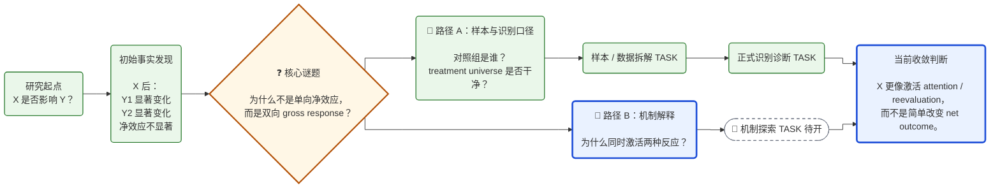
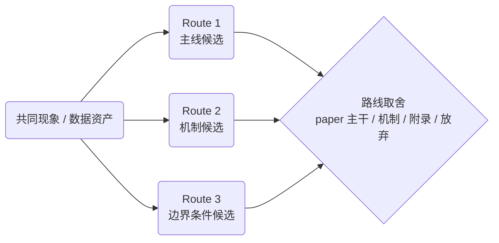
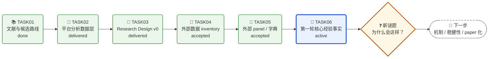
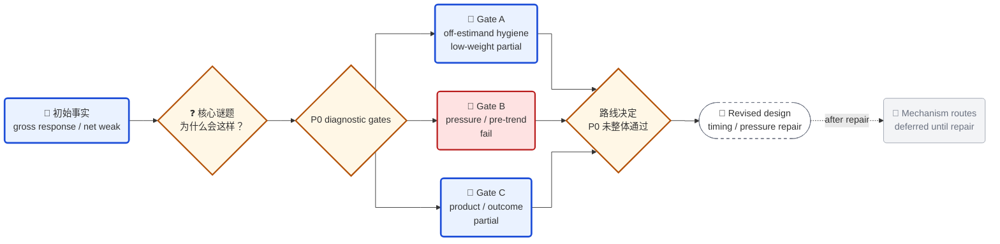
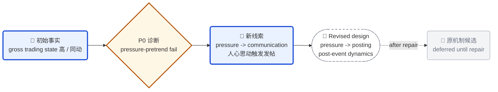
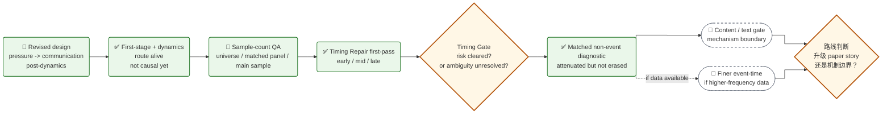
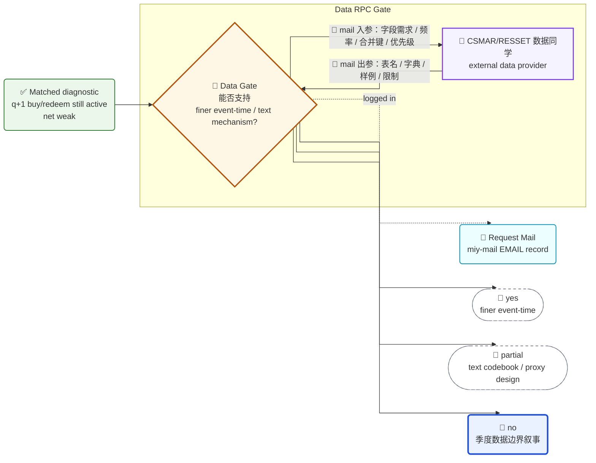

# Research Roadmap

状态：`seed / source-case structural-green / forward-test-pending`

## 前置依赖

使用本 Skill 前，先读取通用父能力：

```text
/Users/narra/Documents/alib/Writer/00 信息/miy-skills/skills/roadmap/SKILL.md
```

本 Skill 不重复定义通用 Mermaid 视觉语法。折线箭头、节点形状、Kanban 状态、emoji、`click` 链接、跨层级导航和 fallback link table 均继承 `$roadmap`。

## 定位

本 Skill 是 `workflow-research` 的研究推进可视化层。

它回答：

```text
一个探索性学术研究项目，如何从初始经验事实出发，把研究问题、机制猜测、样本口径修正、识别诊断、补充检验、证据收敛和 paper 化路线组织成一张可导航的 Research Roadmap？
```

核心原则：

```text
Research Roadmap 讲“研究为什么这样推进”；
Task Lineage Map 讲“任务和文件如何组织”；
Project Change Map 讲“研究解释或任务结构如何变更”；
Technical Route 讲“数据、代码、模型如何执行”。
```

不要用 TASK 树替代研究路线。路线图的中心应是 research question、initial fact、puzzle、candidate route、evidence role 和 claim convergence。

## 输入

优先读取：

- 项目 README / `nodes/` / route cards；
- 当前 TASK README、logs、outputs；
- 结果表格、results narrative、identification memo；
- coauthor email / 数据侧往来邮件；
- 最新 `research-zhihu-post` 同行解释稿及其证据截止日期；
- project change map / task lineage map；
- 数据字典、字段说明、样本口径说明；
- 文献矩阵、A01-A08、route-map、writing patterns。

如果用户只给出一个混乱的任务目录，先恢复研究叙事：

```text
先做了什么研究？
发现了什么经验事实？
这个事实引出了什么谜题？
后续 TASK 分别承担什么证据功能？
哪些是主线、机制、稳健性、异质性、数据修正或弃用路线？
当前是否已能收敛成 paper claim？
```

## 研究专用层级

沿用 `$roadmap` 的跨层级规则，但在研究项目中各层含义如下：

| 层级 | Roadmap 中心 | 典型用途 | 推荐落点 |
|---|---|---|---|
| Project 级 | 整个研究项目如何从 idea、文献、数据、设计推进到核心发现 | 展示 TASK01-TASKxx 如何共同推动项目主线生长 | 项目根 `README.md` |
| Route / Node 级 | 某条 candidate claim / research route 如何竞争、合并、降级或 paper 化 | 展示 RTE node 的 claim、evidence、threat、contribution 和下一步 | `nodes/<route>/node*.md` |
| Task 级 | 一个执行任务如何服务某条研究路线或产生新发现 | 展示 TASK 内部从输入、动作、结果到下一步的研究逻辑 | `tasks/TASKxx-*/README.md` |
| Subtask / Experiment 级 | 一个实验分支如何从假说到变量、模型、结果和解释边界 | 展示 P1/P2/P3 或机制检验的具体证据链 | `tasks/TASKxx-*/subtasks/*/README.md` |
| Communication 级 | 如何向 coauthor、数据同学或陌生同行解释研究推进 | 将复杂 roadmap 压缩成邮件叙事，或链接可独立理解的知乎同行稿 | `emails/THREAD-*/EMAIL-*.md` / `outputs/research-zhihu-post.md` |

上层 roadmap 只放研究主线和关键分叉。数据字段、变量构造、模型、识别细节和表格编号由下层 README / memo 承接。

当一张 roadmap 已经需要读者掌握多个 TASK 才能理解时，增加一个 `Outside-view / 知乎同行稿` 文档节点，链接到 `$research-zhihu-post` 的最新现行版本。该节点是解释入口，不是新证据节点；它不能替代 evidence owner，也不能用“稿件已更新”改变 route 状态。

## 研究路线构造流程

1. 找到路线图中心：
   - 初始 research question；
   - 已观察到的主结果；
   - 结果中最值得解释的 puzzle。

2. 将后续工作按“证据功能”分支：
   - `fact discovery`：宽口径事实发现；
   - `sample diagnosis`：样本 / 选择 / universe 拆解；
   - `identification diagnosis`：识别边界诊断；
   - `mechanism exploration`：机制探索；
   - `heterogeneity`：边界条件；
   - `robustness`：稳健性；
   - `data feasibility`：数据可得性与补数；
   - `paperization`：论文主线收敛。

3. 识别每个节点的研究角色：
   - 输入：文献、数据、coauthor insight；
   - 经验事实：初始结果或稳定 pattern；
   - 谜题：结果为何不符合朴素预期；
   - 诊断：样本、识别、口径或替代解释；
   - 机制：为什么会出现该事实；
   - 收敛：论文主张、贡献或下一篇 paper 的分流。

4. 在图中只放能帮助读者理解路线的节点。细节放进被链接的 Markdown 文档。

5. 同时维护：
   - Research Roadmap：研究推进逻辑；
   - Task Lineage Map：执行任务组织；
   - Project Change Map：解释 / 结构变更；
   - Entry Table：稳定 Markdown 入口。

### Evidence-Gated Route Lifecycle

当 roadmap 需要呈现“多路线仲裁 -> 实证 Gate -> 审计 -> 收敛”时，读取 [`evidence-gated-route-adjudication`](../../references/evidence-gated-route-adjudication.md)。上层图至少区分：

```text
L0 pattern：发现了什么形状
L1 location：形状在哪个经济/数据层级已出现
L2 mechanism compatibility：哪些 why 被削弱、仍相容或等待数据
L3 causality：是否存在外生变化和反事实
```

`L1` 节点通过不能画成“机制已解释”。若冻结协议与实现发生修复，或高风险 Gate 经过独立复核，roadmap 应显示 `protocol repair` / `independent audit` 节点，再把结果标为 accepted。若 Gate 改变了下一步数据的经济对象，应把 `result -> next data object -> Data RPC Gate` 画成主推进关系。

## 推荐研究骨架

用于“初始经验事实引出机制探索”的路线图：



用于“多个 candidate research routes 竞争”的路线图：



用于“项目级研究演进”的路线图：



## 与 workflow-research 的回挂

完成 Research Roadmap 后，应判断是否同步更新：

- 相关 `node card`：更新 claim / evidence / threat / contribution；
- 当前 TASK README：放置 Research Roadmap 与 Task Lineage Map；
- 当前 TASK log：记录路线图更新及其研究含义；
- coauthor email：把路线图压缩成可沟通叙事；
- `workflow-research/logs/`：若产生可迁移规则，记录为 field-discovery。

## 质量检查

在 `$roadmap` 通用检查之外，额外检查：

- 图的第一眼是否能看出“先发现什么，再追问什么”；
- TASK 编号是否服务研究故事，而不是支配研究故事；
- 每条分支是否有明确证据功能；
- 主结论、机制猜测、样本诊断和识别边界是否分开；
- 样本 / 识别修正是否被标成 `diagnostic`，而不是错误地写成推翻；
- 图中结论是否避免过度因果表述；
- 是否区分 pattern、location、mechanism compatibility 与 causality；
- 高风险结论是否在 accepted 前显示 protocol repair / independent audit；
- 新证据若改变下一数据对象，roadmap 是否同步展示，而不只更新显著性文字；
- 上层节点是否 click 到下层稳定入口，而不是复制全部表格细节。

## CASE-260521 模式

基金经理研究的可迁移模式：

```text
TASK06-1：先做宽口径事实发现，发现“回答 -> 申购+++ / 赎回+++ / 净 flow 不显著”。
  -> 引出 puzzle：为什么回答没有带来净流入，而是同时放大买和卖？

TASK06-2 / TASK06-3：先走样本与识别口径诊断，拆解账号、邀请、回答 adoption。
  -> 功能：解释宽口径结果是否受 platform funnel / sample universe 影响。

TASK06-4：再走机制探索。
  -> 功能：解释 gross trading 为什么上升，例如 attention、disagreement、reevaluation、crisis response、content heterogeneity。
```

该模式不应被写成线性阶段模板。它是探索性研究中的一类路线图：

```text
initial empirical fact -> puzzle -> diagnostic branch + mechanism branch -> claim convergence
```

## CASE-260521 更新：P0 诊断未通过时的路线转向

TASK07 forward-test 补充了一个重要规则：

```text
P0 diagnostic gates 不是“做完就进入机制”的仪式。
如果 P0 中出现 fail，Research Roadmap 必须把机制路线标为 deferred，并新增 revised design / repair 节点。
```

在基金经理研究中，TASK07-2 的三道 P0 门得到：

```text
Gate A / sample-platform funnel = partial / low-weight edge audit
Gate B / pressure-pretrend = fail
Gate C / product-event / outcome audit = partial
```

其中 Gate A 需要特别处理：如果主研究 estimand 是 `发帖 / 回答 vs 不发帖 / 不回答`，那么 `邀请 / 不邀请` 或 G1/G2 invitation-edge comparison 不是主 treatment。它只能作为 off-estimand sample hygiene / appendix robustness，不能和真正的 pressure / timing threat 同等加权。

路线含义不是：

```text
P0 做完 -> MR-01/MR-03 机制原型
```

而是：

```text
initial fact -> puzzle -> P0 diagnostics reveal threats
  -> revised empirical design / timing-pressure repair
  -> mechanism routes deferred until repair
```

推荐画法：



质量检查：

- `partial` 表示诊断有边界，不能被画成 `pass`；
- off-estimand 的 `partial` 要标为 `low-weight hygiene` 或 `appendix robustness`，不要让它主导研究路线；
- `fail` 表示某个前置威胁没清掉，不等于研究失败；
- 如果 `fail` 本身揭示了新的数据生成过程，应把它画成 route clue，而不是只画成 blocked；
- 机制节点应写 `deferred until repair`，避免误解为放弃；
- 下一步节点应具体写出 repair 方向，例如主样本、timing、pressure tags、residualized event-time、product-event clean sample；
- 技术细节仍放在下层报告，roadmap 只表达路线转向。

## CASE-260521 更新：Threat 变成新故事线索

TASK07 还补充了第二条规则：

```text
当一个诊断 gate fail 时，不要只问“原机制还能不能讲”；
还要问“这个 fail 是否揭示了一个更贴近 DGP 的新故事”。
```

在基金经理研究中，Gate B pressure-pretrend fail 的含义不只是：

```text
不能直接证明 发帖 / 回答 -> 交易变化
```

它也打开了一个新故事：

```text
投资者压力 / 交易活跃 / 业绩压力
  -> 投资者提问、平台主题、基金经理回应
  -> 发帖 / 回答
  -> 后续 gross trading 状态持续、缓解或重新分配
```

也就是：

```text
communication as endogenous pressure response
```

推荐画法是在 `P0 综合判断` 与 `revised design` 之间增加一个 active route clue：



此类 route clue 应要求后续 TASK 明确区分：

- first-stage / response question：什么压力触发沟通？
- post-dynamics question：沟通后压力是缓解、持续还是转移？
- causal-effect question：哪些部分还不能说成因果？
- paper-story question：新故事是否比原机制更贴近数据生成过程？

## CASE-260521 更新：Revised Design 已跑完但 Timing 仍不干净

TASK07-3 forward-test 继续补充第三条规则：

```text
revised design 跑完后，如果结果支持新故事但 timing placebo 或样本口径仍有风险，
Research Roadmap 不应直接升级 paper route；
应先新增 QA / repair 节点，并把“可说的结果”和“尚未修复的威胁”并列呈现。
```

在基金经理研究中，TASK07-3 得到：

```text
Panel Builder：accepted，统一 manager-fund-quarter 面板可用；
Pressure First-stage：accepted with caution，broad pressure 有信号，但 aggregate placebo 仍有 timing risk；
Post-Dynamics：accepted，回答后 gross buy / redeem 尤其 buy 继续放大，net flow 弱；
Parent Synthesis：route alive, but not causal yet。
```

此时路线含义不是：

```text
pressure-triggered communication 已证明 -> 立即升级 TASK08 / paper 主线
```

而是：

```text
route alive -> sample-count QA + timing repair / event-time refinement
  -> 再判断是否升级 paper story
```

TASK07-3-4 forward-test 又补充了一个更具体的分支：

```text
如果 timing repair 的结果不是“风险被清除”，而是“timing ambiguity 仍然存在”
例如 late-quarter event 的后续结果更强，
roadmap 应把 repair 节点收口为 Timing Gate，标注竞争解释，并显式画出下一步 matched non-event / non-answer 对照设计。
```

在基金经理研究中，TASK07-3-4 的诊断是：

```text
Sample QA：平台经理账号 universe = 1,434；进入主样本的可匹配平台经理 = 987；
Timing bucket：late-quarter answer 的 q+1 buy / redeem 更强；
Interpretation：兼容 recency / carryover effect 与 persistent pressure / attention episode；季度数据暂时拆不开。
```

因此路线含义进一步更新为：

```text
route alive -> sample-count QA + timing repair
  -> timing ambiguity unresolved
  -> matched non-answer quarters within similar pressure states
  -> 再判断是否升级 paper story
```

如果 matched non-event / non-answer diagnostic 的结果是：

```text
主现象被明显 attenuate，但没有消失；
net outcome 仍弱；
更长期 outcome 变弱。
```

roadmap 应把路线收口为：

```text
descriptive DGP / mechanism-boundary story
  -> text / content mechanism gate
  -> finer event-time data gate if available
```

不要把这种结果误画成：

```text
matching pass -> causal paper route
```

也不要画成：

```text
matching attenuated -> route failed
```

同时，如果对外沟通中出现样本数口径误读，例如把：

```text
进入主样本的可匹配平台经理数
```

误写成：

```text
平台经理账号 universe
```

Research Roadmap 应新增或链接一个 sample-definition / count QA 节点。原因是样本口径不是纯编辑细节，而会影响外部读者对研究覆盖面、外推范围和识别对象的理解。

推荐画法：



质量检查：

- revised design 的 `accepted` 不等于路线可以因果升级；
- `accepted with caution` 应在 roadmap 节点中保留 caution，而不是被绿色节点掩盖；
- 样本数口径应分为 `universe`、`matched panel`、`main sample`、`regression sample`；
- 对外稿件或 coauthor 邮件中的样本数必须能 click 回 sample-definition / count QA；
- timing repair 节点应明确要修的是：quarter frequency、recency / carryover、persistent pressure state、future-pressure placebo、matched non-answer quarters 或 stacked event-time；
- 如果 timing repair 显示 late / post-period 事件更强，不要写成“timing 已修好”，也不要单向写成 persistent pressure；应标成 `timing ambiguity unresolved`，并把下一步具体化为 matched non-event / non-answer design 或 finer event-time；
- 如果 matched diagnostic 让主现象缩小但未消失，应标成 `attenuated but not erased`，下一步转向 text/content mechanism 或 finer event-time data gate；
- 若 timing repair 仍不干净，路线可保留为机制边界 / descriptive DGP story，而不是失败。

## CASE-260521 更新：Data RPC Gate 与邮件化外部协作

TASK07-3-5 后补充第四条规则：

```text
当下一步机制路线取决于外部数据库、字段字典、样例或人工口径确认时，
Research Roadmap 应把它画成 Data RPC Gate：
研究侧 decision gate <-> 外部数据同学 / provider <-> mail thread。
```

在基金经理研究中，matched diagnostic 后的路线判断是：

```text
如果 CSMAR/RESSET 能提供月度/日度 flow proxy、基金事件日期或关注代理，
  -> 优先推进 finer event-time；
如果只能提供披露文本、公告文本或基金经理/产品元数据，
  -> 优先推进 text codebook / proxy design；
如果两者都不可得，
  -> 保留季度数据边界，收敛为 descriptive DGP / mechanism-boundary story。
```

这里的关键不是“数据同学就是 Data Gate”。更准确地说：

```text
Data Gate = 研究侧决策门；
数据同学 = 外部 actor / data provider；
mail = request / reply 的可追溯载体；
入参 = 字段需求、频率、合并键、优先级、用途；
出参 = 表名、字段字典、样例、覆盖范围、限制、整理成本。
```

如果邮件由 `$miy-mail` 管理，Research Roadmap 中的 `mail` 节点必须 click 到对应的 `$miy-mail` Markdown 记录：

```text
请求邮件节点 -> emails/THREAD-*/EMAIL-*.md
回复节点 -> emails/THREAD-*/REPLY-*.md
整组往来节点 -> emails/README.md 或稳定 thread index
```

推荐画法：



使用规则：

- 上例的 `#replace-with-task-local-miy-mail-record` 是 Skill 内占位符；复制到具体 TASK 后必须替换为实际存在的 `EMAIL-*.md`、`REPLY-*.md` 或 thread index；

- 如果外部数据请求会决定研究路线，Data RPC Gate 可以进入 TASK / Route 级 Research Roadmap；
- Project 级 roadmap 可压缩成一个 `CSMAR/RESSET Data Gate` 节点，不必展示所有 mail 细节；
- TASK 级 roadmap 可以画出数据同学、mail 入参/出参和 reply artifact；
- `数据同学` 节点使用 `$roadmap` 的 `external` class，不要标成 `done`；
- mail request / reply 使用 `$roadmap` 的 `mail` class，并 click 到 `$miy-mail` 生成的对应 `EMAIL-*.md` / `REPLY-*.md`；如果节点代表整组往来，则 click 到 `emails/README.md` 或稳定 thread index；
- 邮件正文、字段表、数据字典和完整回复不放在 roadmap 节点里，只放在 thread / data memo；
- 若数据同学尚未回复，Data Gate 标注 `waiting / blocked`；
- 若已回复但只部分可得，Gate 不应简单标成 pass，应明确画出 `yes / partial / no` 三类路线；
- 不要把“发出邮件”误写成“数据已可得”；mail request 是 request artifact，不是 data evidence。
