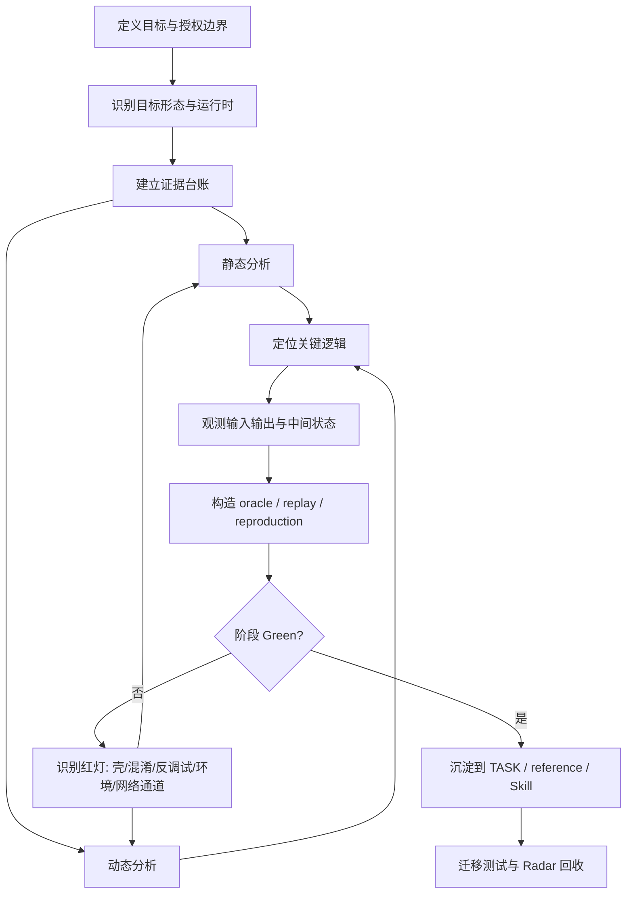

# Reverse Engineering Workflow 总流程

## 总体流程



复杂项目不要把 Green 只理解为“纯外部脚本完全复现”。先读取 `references/reproduction-ladder.md`，明确当前目标需要 R0 观察、R1 外部纯复现、R2 运行态函数代算、R3 离线 harness、R4 真实运行态代发，还是 R5 服务化封装。路线选择必须写入证据台账。

## 上位层职责

父 workflow 关注跨平台问题：

- 目标定义与完成标准；
- 以终为始和 TDD 逆向；
- 证据台账和 mermaid 任务树；
- 静态/动态分析协作；
- hook / trace / patch / replay / oracle；
- 壳、混淆、反调试、环境检测的通用分层；
- 技术 Radar 与来源采信；
- TASK、provenance、forward-test 与迁移状态。
- 服务端窗口、账号态、设备态、连接态、风控态等“环境态 Green”的边界声明；
- 从单次复现升级为数据/语料工程时的覆盖率、限速、断点、停止条件与阶段复盘。
- 接口 Green 之后的工程化调度：请求池、到期任务队列、分接口 bucket、公平调度、checkpoint、dashboard 与 human gate。

## 路线选择原则

父 workflow 应显式区分三类目标：

| 目标 | 典型 Green | 主要风险 |
|---|---|---|
| 算法解释 | R1/R3，可独立复现中间值和最终值 | 运行态依赖被低估 |
| 业务动作复现 | R2/R4，目标 App/浏览器真实运行态可低频代发 | 误写成纯外部复现 |
| 数据/语料工程 | 可追溯 source/evidence、请求池状态机、到期任务队列、覆盖率声明、限速和断点 | 把阶段性窗口误称全量，或把单接口 Green 误称长跑 Green |

当服务端接受的是“真实运行态 envelope”而不是单个签名字段时，R4 可能是当前最正确的工程 Green。不要为了追求 R1 而忽略授权边界、服务端压力或真实运行态约束。

当目标从“某个接口能请求成功”升级为“持续构建数据/语料”时，Green 的中心会从请求构造转移到调度系统。此时应把 worker、队列、bucket、窗口预算、断点恢复、状态面板和人工门视为逆向交付的一部分，而不是临时脚本脚手架。尤其要区分：

```text
single-call-green != corpus-green
business-ok != scheduler-ok
bucket-window-ok != global-window-ok
historical-error != live-blocker
```

## 项目沉淀要求

长周期逆向项目应在 TASK 之外形成项目级复盘：

```text
原始问题如何变化
→ 路线选择如何变化
→ 关键 Red -> Green
→ 证据地图
→ 仍不能宣称的边界
→ 可迁移到 workflow/skill 的规则
```

案例证据留在项目 TASK；父 workflow 只吸收抽象规则、路线判定、模板和护栏。

## 平台层职责

平台子 workflow 负责把上位流程落到具体生态：

- Android：APK / DEX / SO / ART / JNI / Frida Java / ADB / Unidbg。
- Mac App：.app bundle / Mach-O / dylib / framework / Objective-C / Swift / Electron / XPC / Frida / lldb / Keychain / TCC / sandbox / code signing。
- JS：浏览器 / Node / webpack / source map / AST / DevTools / WebCrypto / wasm。
- Windows：PE / DLL / WinAPI / NTAPI / x64dbg / WinDbg。
- Unity：Mono / IL2CPP / metadata / GameAssembly。
