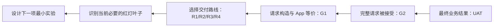
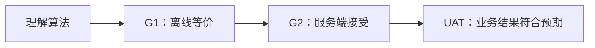
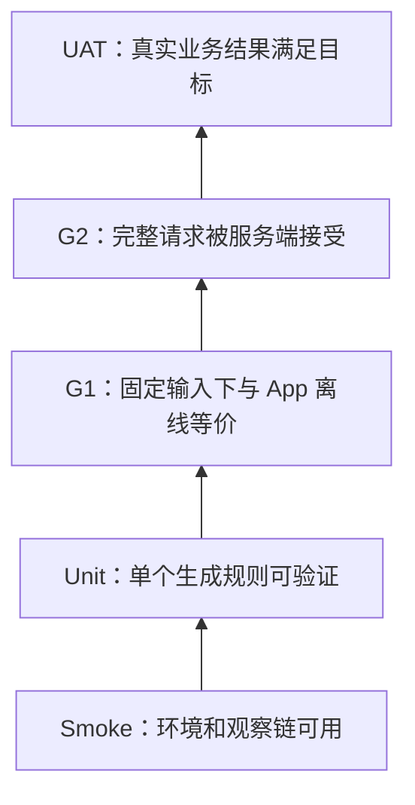
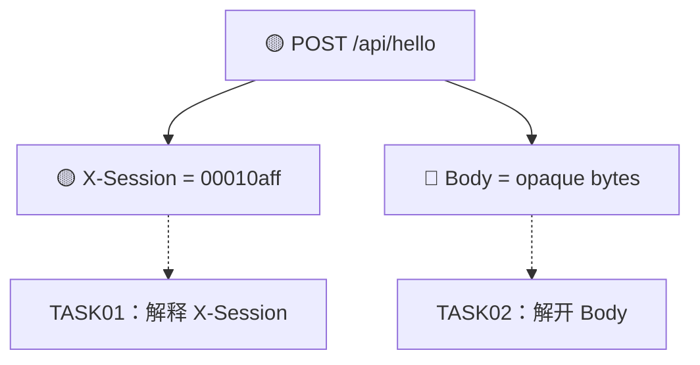
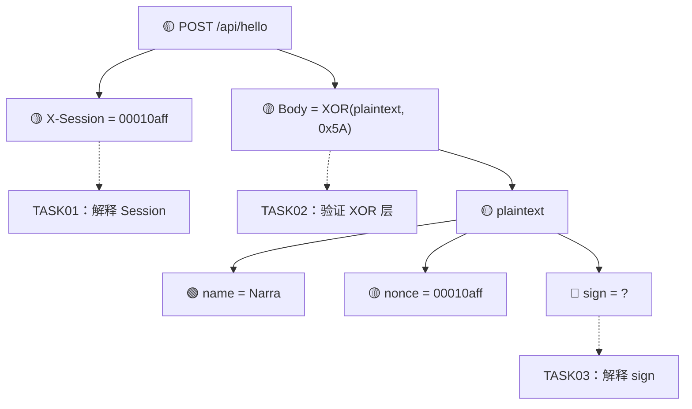
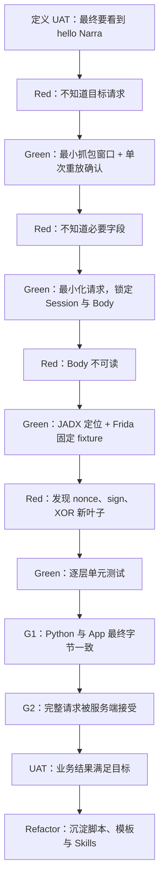

# 把接口逆向当作 TDD：一套证据驱动的红-绿-重构方法

> 本文只讨论自有应用、课堂靶场或经过明确授权的研究对象。

Android 接口逆向通常被描述成一条工具链：

> 抓包 -> JADX 搜索 -> Frida Hook -> 复现算法 -> Python 重发

这条描述没有错，但它隐藏了一个真正困难的问题：

> **做到哪一步，才算真的完成？**

我们可能已经找到了某个函数，却不知道它是不是最终生效的实现；可能 Hook 到了一个值，却不知道这个值如何生成；可能 Python 算出了相同的密文，却没有证明服务端会接受；也可能请求返回了 HTTP 200，但业务码实际上表示失败。

因此，接口逆向最容易出现的并不是“完全不会”，而是**过早宣布完成**。

一个很自然的解决办法，是把接口逆向重新理解为一种测试驱动开发：

1. 先定义最终可观察的验收结果；
2. 把未知请求拆成一组可验证的假设；
3. 让每个未知项先处于红灯状态；
4. 用抓包、静态分析、Hook 和实验逐个让它变绿；
5. 最后通过离线等价、受控端到端和业务验收形成完整证据链；
6. 在测试持续通过的前提下，把一次性脚本重构成可复用的 Skill、工具和工作流。

我把这套方法称为：

> **证据驱动的逆向 TDD（Evidence-Driven Reverse TDD）**

它并不是把普通软件开发的 TDD 生硬套到逆向工程上，而是借用“红-绿-重构”的纪律，管理逆向研究中的未知、假设、证据和完成边界。

---

## 一、为什么这个思路值得分享

传统 TDD 面对的是“我要实现什么”；逆向研究面对的则是“它究竟是怎么实现的”。

两者看起来方向相反：

| 正向开发 | 逆向研究 |
|---|---|
| 规格已知，实现未知 | 现象已知，规格和实现都可能未知 |
| 测试表达目标行为 | 测试同时表达假设和证据要求 |
| 失败表示实现不符合规格 | 失败可能表示算法错、参数错、环境错或假设本身错 |
| 重构主要改善代码结构 | 重构还包括沉淀 Hook、证据模板、任务台账和 Skills |

但它们共享一个核心思想：

> 不靠“感觉差不多”，而靠可重复的失败和可审查的通过来推进工作。

这套方法尤其适合接口逆向，因为接口请求天然具有可分解结构：

```text
Request
├── URL
├── Method
├── Headers
│   ├── session
│   ├── fingerprint
│   └── signature
└── Body
    ├── serialization
    ├── compression
    ├── encryption
    └── business fields
```

每一个未知节点都可以被转化为一个测试问题：

- 这个字段是否必要？
- 它来自业务输入、设备状态还是账号状态？
- 同一固定输入下，它是否稳定？
- Python 实现能否生成与 App 相同的中间值？
- 完整请求是否被服务端接受？
- 业务页面是否发生预期变化？

当这些问题被写成测试或证据门后，逆向流程就不再是一团“跟着感觉追代码”的探索，而会变成一张可以持续收敛的红灯地图。

### 从“以终为始”到验收契约

这套方法也与《高效能人士的七个习惯》中“以终为始”的原则高度契合。

“以终为始”不是要求我们在开始时就知道所有实现细节，而是要求我们先想清楚：

> 工作结束时，我们希望看到什么结果，又凭什么确认它真的发生了？

接口逆向很容易被眼前的技术动作牵着走：

- 看见二进制 Body，就开始猜加密算法；
- 在 JADX 中找到可疑函数，就不断执行 Find Usage；
- Hook 到一个动态字段，就继续追它的全部上游；
- 收到 HTTP 200，就认为任务已经完成。

这些动作可能都有价值，但如果没有预先声明的终点，我们很难判断：

- 当前动作是否服务于最终目标；
- 某个字段是否真的必须继续破解；
- Hook 取值已经足够，还是必须独立复现；
- 应当停在 G1，还是必须继续执行 G2；
- 页面变化是否属于最终验收的一部分。

因此，“以终为始”在这套工作流中不是一句抽象口号，而被逐级翻译成了工程对象：

| “终”的层级 | 对应的工程对象 | 回答的问题 |
|---|---|---|
| 用户或研究目标 | UAT 验收契约 | 最终希望发生什么业务结果？ |
| 协议交付目标 | G2 受控端到端 | 独立构造的请求是否被服务端接受？ |
| 构造正确性 | G1 离线等价 | 外部实现是否与 App 产生相同结果？ |
| 实现路线 | R1/R2/R3/R4 | 允许依赖 App、Hook 或 RPC 到什么程度？ |
| 当前工作 | 请求依赖树中的红灯节点 | 下一项最小实验应该解决什么？ |

它形成了一条从终点向当前行动反推的链条：



例如，目标如果只是“解释签名算法”，终点可能停在 G1，没必要冒着业务副作用运行 G2；如果目标是“使用纯 Python 构造并发送完整请求”，那么 Hook 到现成签名只能作为中间证据，不能当作最终交付；如果目标允许依赖 App 进程，稳定的 Frida RPC 又可能已经满足要求，不必为了追求形式上的“全破解”继续扩大研究范围。

由此可见，“以终为始”带来的并不是更多工作，而是**帮助我们拒绝与终点无关的工作**。

不过，它也不意味着开始时写下的终点永远不能改变。逆向研究会不断出现新证据：解开一个外层后可能发现新的字段，服务端响应可能暴露新的绑定关系，原定的纯外部路线也可能因为硬件密钥而不可行。

正确做法是：

1. 开始前先声明当前终点和完成证据；
2. 每次新证据出现时，检查原终点和路线是否仍然成立；
3. 如果需要改变终点，记录改变原因和新的验收条件；
4. 不让路线在没有记录的情况下悄悄漂移；
5. 始终用最新的终点反推下一项最小行动。

所以，更准确地说，这套方法是：

> **以终为始，以证据校正，以测试推进。**

“以终为始”决定方向，TDD 提供推进节奏，证据链负责约束我们不能仅凭合理解释或偶然成功宣布完成。

---

## 二、先澄清：逆向中的“完成”至少有三层

假设我们正在复现一个请求。下面三个结论并不等价。

### 1. 算法已经理解

我们知道：

- 输入字段是什么；
- 字段如何排序或序列化；
- 使用什么摘要、编码或加密算法；
- 密钥、IV、盐或动态参数来自哪里；
- 输出格式是什么。

这是“理解层”的完成。

### 2. 外部实现与 App 等价

在同一组固定输入下，Python 或其他外部实现能够生成：

- 相同的签名；
- 相同的中间明文；
- 相同的密文；
- 相同的最终请求字节。

这是本文所说的 **G1：离线等价关口**。

### 3. 完整请求被服务端接受

外部实现实际组装并发送完整请求，获得符合预期的：

- HTTP 状态；
- 响应正文；
- 业务码；
- 必要时还有业务页面或状态变化。

这是 **G2：受控端到端关口**。

三者的关系是：



G1 通过而 G2 没有运行时，我们最多只能说：

> 算法和请求构造已经完成离线复现。

不能说：

> 完整请求已经被服务端接受。

同样，HTTP 200 也不必然意味着业务成功。很多接口会在 HTTP 200 中返回失败业务码，因此 G2 必须同时保存状态码、响应正文和可解析的业务码。

---

## 三、逆向 TDD 不是测试金字塔，而是一架证据梯

普通项目经常使用“单元测试 -> 集成测试 -> 端到端测试”的测试金字塔。接口逆向更适合使用一架证据梯：



### Smoke：先证明实验台没有坏

Smoke 测试回答：

- ADB 能否识别设备？
- 是否具有所需权限？
- Frida Server 是否启动？
- App 进程是否存在？
- 目标类是否已经加载？
- 抓包代理是否连通？
- 本地脚本环境能否运行？

如果 Smoke 没过，Hook 无输出并不代表函数没执行，可能只是类没有加载、进程选错、版本不一致或环境链路断了。

### Unit：验证单个叶子节点

Unit 测试适合：

- Hex 是否保留前导零；
- Base64 是否使用正确变体；
- 字段排序是否正确；
- SHA-256 输入是否完全一致；
- AES 模式、填充、密钥和 IV 是否正确；
- Kotlin/Java 的字节、有符号数和字符串转换是否被正确模拟。

### G1：固定输入下做离线交叉验证

G1 是逆向研究中非常关键、却经常被忽略的一层。

它要求先从 App 获得一组固定 fixture，例如：

- Hook 到的函数参数；
- Hook 到的中间明文；
- Hook 到的签名；
- Hook 到的最终请求体；
- 抓包中保存的完整字节。

然后让外部实现使用同一输入，逐层比较首个差异：

```text
业务字段 -> 规范化文本 -> sign 输入 -> sign 输出
        -> 序列化字节 -> 加密输入 -> 密文 -> 最终 body
```

G1 的价值是把“结果不对”转化为：

> 第一个不同的层级在哪里？

### G2：只发送一次的受控端到端测试

G2 回答：

> 由外部实现构造的完整请求，服务端是否真的接受？

它应当遵守几个原则：

1. 仅用于课堂靶场、自有应用或明确授权目标；
2. 默认最多发送一次，不做自动重试；
3. 保存请求方法、URL、必要 Headers、Body 摘要和发送时间；
4. 保存 HTTP 状态、响应正文和业务码；
5. 网络错误与失败响应也要落盘；
6. 页面变化只是附加证据，不能替代协议响应。

### UAT：验证研究目标，而不只是技术结果

UAT，即用户验收测试，回答：

> 我们一开始真正想完成的事情发生了吗？

例如：

- App 页面是否显示了预期结果？
- 服务端计数是否只增加一次？
- 新账号或新设备上是否仍然有效？
- 交付脚本是否能被另一个研究者按文档运行？
- 输出文件、日志和证据是否完整？

UAT 往往包含人工步骤，因为 App 页面缓存、异步刷新和额外上报很难仅凭一个 Python 断言判断。

---

## 四、贯穿全文的 Hello World 靶场

下面设计一个完全本地的 Hello World 案例。它不追求密码学强度，只用于说明研究流程。

### 目标行为

Android App 中有一个按钮：

```text
[ Say Hello ]
```

点击后，App 请求本地测试服务器：

```http
POST http://127.0.0.1:8080/api/hello
Content-Type: application/octet-stream
X-Session: 00010aff
```

服务端成功时返回：

```json
{
  "code": 0,
  "message": "hello Narra"
}
```

App 最终在页面显示：

```text
hello Narra
```

### App 内部隐藏规则

假设我们作为靶场设计者知道真实规则，但研究者一开始并不知道：

1. `nonce` 是 4 个字节的固定宽度十六进制字符串；
2. 规范化文本为：

```text
name=Narra&nonce=00010aff
```

3. 签名为：

```text
SHA256(canonical_text + "hello-salt")
```

4. 明文为：

```text
name=Narra&nonce=00010aff&sign=<64位十六进制摘要>
```

5. Body 是明文每个 UTF-8 字节与 `0x5A` 异或后的结果；
6. `X-Session` 直接使用 `nonce`。

真实代码可能类似：

```kotlin
fun buildHelloRequest(name: String, nonceBytes: ByteArray): Request {
    val nonce = nonceBytes.joinToString("") { "%02x".format(it) }
    val canonical = "name=$name&nonce=$nonce"
    val sign = sha256(canonical + "hello-salt")
    val plaintext = "$canonical&sign=$sign"
    val body = plaintext.toByteArray().map { byte ->
        (byte.toInt() xor 0x5A).toByte()
    }.toByteArray()

    return Request.Builder()
        .url("http://127.0.0.1:8080/api/hello")
        .header("X-Session", nonce)
        .post(body.toRequestBody())
        .build()
}
```

但逆向研究者最初只看到：

- 一个 URL；
- 一个看起来像 Hex 的请求头；
- 一段不可读的二进制 Body；
- 点击按钮后页面出现 `hello Narra`。

我们的任务不是直接抄出答案，而是用测试逐步恢复这份规格。

---

## 五、第零步：先写验收契约

TDD 的第一步不是打开 JADX，而是定义终点。

可以先创建：

```markdown
# Hello 接口验收契约

## 目标

使用独立 Python 实现，从业务输入 `name=Narra` 和声明的设备输入开始，
构造完整请求，并使本地靶场返回成功业务码。

## 完成条件

- [ ] 找到目标 URL、方法和触发动作
- [ ] 解释并复现 `X-Session`
- [ ] 解释并复现 Body 的明文结构
- [ ] 解释并复现 sign
- [ ] 解释并复现 Body 字节变换
- [ ] G1：固定输入下，Python 最终 Body 与 App 完全一致
- [ ] G2：Python 完整请求返回 HTTP 200 且 `code == 0`
- [ ] UAT：页面或测试客户端显示 `hello Narra`
```

这里最重要的是写清楚“独立 Python 实现”的输入边界。

如果允许从 Frida 直接取现成的 `sign`，完成条件会完全不同。常见交付路线至少有：

| 路线 | 含义 |
|---|---|
| R1 运行时 Hook | App 运行时 Hook 出必要字段，再组装请求 |
| R2 Frida RPC | 调用 App 内部函数生成字段或 Body |
| R3 纯外部实现 | 不依赖 App 进程，独立重建生成规则 |
| R4 组合路线 | 一部分由设备生成，一部分由外部脚本生成 |

如果目标是 R3，那么“Hook 能拿到值”只是证据，不是完成。

---

## 六、把未知请求写成红灯地图

初始请求构造台账可以写成：



对应状态表：

| 节点 | 当前观察 | 状态 | 当前假设 | 下一项最小实验 |
|---|---|---|---|---|
| URL | `/api/hello` | 绿 | 点击按钮触发 | 重放确认 |
| Method | `POST` | 绿 | 固定 | 重放确认 |
| `X-Session` | `00010aff` | 黄 | 可能是随机数或设备值 | 多次采样 |
| Body | 二进制 | 红 | 可能是压缩、序列化或加密 | 查找 RequestBody 构造点 |
| 业务结果 | `hello Narra` | 黄 | 由该请求触发 | 单次受控验证 |

“红”不一定表示代码写错，也可以表示：

- `unknown`：还不知道规则；
- `not-run`：已经定义测试，但尚未运行；
- `failed`：证据与假设冲突；
- `blocked`：环境暂时阻止验证。

不要把这些状态混成一个红叉。它们对应完全不同的下一步。

---

## 七、第一个循环：先让观察链变绿

### Red

我们现在无法确定：

- 设备是否在线；
- App 是否是预期版本；
- 抓包是否覆盖按钮点击区间；
- Frida 是否能附加目标进程；
- 目标类是否加载。

### Green

写最小 Smoke 检查：

```bash
adb get-state
adb shell pm path com.example.hello
adb shell pidof com.example.hello
frida-ps -Uai
curl -s http://127.0.0.1:8080/health
```

记录结果：

```text
device: passed
package: passed
process: passed
frida: passed
local_server: passed
```

### Refactor

把这些命令封装成：

```bash
make smoke
```

或者沉淀到“准备 Android 设备”Skill。

这一步看似简单，却能消除大量伪问题。以后 Hook 没输出时，我们至少知道实验台本身是活的。

---

## 八、第二个循环：用抓包定义接口候选测试

### Red

点击按钮期间可能出现多个请求。我们不知道哪个请求真正产生 `hello Narra`。

### Green

采用最小因果窗口：

1. 保持页面静止；
2. 开始抓包；
3. 只点击一次 `Say Hello`；
4. 页面出现结果后立即停止抓包；
5. 按时间、URL、方法和响应内容筛选候选；
6. 对高怀疑候选做一次受控重放。

此时测试可以写成文档式 GIVEN-WHEN-THEN：

```markdown
## UAT-CANDIDATE-01

- GIVEN：App 停留在 Hello 页面，结果区域为空
- WHEN：只点击一次 `Say Hello`，并抓取该时间窗口内的请求
- THEN：候选请求应在窗口内出现，响应包含 `hello Narra`
```

如果重放 `/api/hello` 后再次得到相同响应，候选接口从红变绿。

### Refactor

将“最小因果窗口 + 漏斗筛选 + 单次重放”写入抓包分析 Skill，成为下一次需求自动生成的人机协作操作手册。

---

## 九、第三个循环：最小化请求，找到真正需要破解的部分

捕获完整请求后，不要立刻进入 JADX。先做请求最小化。

逐项删除或替换：

- 非必要 Headers；
- Cookie；
- Body 字段；
- 动态值；
- 设备字段；
- 时间字段。

每次只改变一个变量。

测试记录可以是：

| 实验 | 改动 | HTTP | 业务码 | 结论 |
|---|---|---:|---:|---|
| M01 | 原始请求重放 | 200 | 0 | 基线通过 |
| M02 | 删除 `User-Agent` | 200 | 0 | 非必要 |
| M03 | 删除 `X-Session` | 400 | 1002 | 必要 |
| M04 | Body 替换为空 | 400 | 1003 | 必要 |
| M05 | Body 随机字节 | 400 | 1004 | Body 存在校验 |

此时我们得到的不是最终答案，而是一份更小的红灯集合：

```text
必须解释：
├── X-Session
└── binary body
```

这比一开始盯着几十个请求头和一整段二进制高效得多。

---

## 十、第四个循环：从 Body 构造点取得黄金样本

### Red

我们不知道二进制 Body 的明文结构，也不知道它经历了什么处理。

### 静态分析

从以下位置向上追：

- `RequestBody.create(...)`
- OkHttp `Request.Builder.post(...)`
- 自定义 Converter；
- `byte[]` 返回点；
- 加密函数调用；
- URL 或路径字符串的引用。

假设 JADX 定位到：

```java
byte[] H7(String name, byte[] nonceBytes)
```

但静态分析只能说明：

- `H7` 很可能参与 Body 构造；
- 它接收 `name` 和 `nonceBytes`；
- 它返回 `byte[]`。

仍然不知道运行时：

- `name` 实际是什么；
- `nonceBytes` 的真实字节是什么；
- 返回值是否就是最终 Body；
- 这个重载是否真正执行。

### 动态验证

使用 Frida Hook：

```javascript
Java.perform(function () {
    const Builder = Java.use("com.example.hello.HelloRequestBuilder");

    Builder.H7.overload(
        "java.lang.String",
        "[B"
    ).implementation = function (name, nonceBytes) {
        const result = this.H7(name, nonceBytes);

        console.log("[H7] name =", name);
        console.log("[H7] nonce =", bytesToHex(nonceBytes));
        console.log("[H7] result =", bytesToHex(result));

        return result;
    };
});
```

触发一次按钮后保存：

```yaml
name: Narra
nonce_hex: 00010aff
body_hex: "<完整十六进制字节>"
```

这份数据是后续 G1 的黄金样本（golden fixture）。

### 一个重要纪律

Hook 到一个结果不代表已经理解规则。

此时节点能力应记录为：

```text
body: observed
```

或者在重复触发验证稳定后：

```text
body: hook-available
```

只有从声明输入独立重建真实生成规则，才可以标记：

```text
body: reproducible
```

---

## 十一、第五个循环：解开 Body 后，红灯会继续长出新分支

假设我们发现 Body 每个字节与 `0x5A` 异或后，可以得到可读文本：

```text
name=Narra&nonce=00010aff&sign=7a...
```

这时 `Body` 节点变绿了吗？

还没有。

因为解开一个外层后，我们发现了新的未知叶子 `sign`。

请求台账应当更新为：



这正是接口逆向的真实形态：

> 需要破解的参数列表不是抓包结束时一次性确定的，而是随着解码、解密、Hook 和静态分析不断展开。

因此，维护一份“请求构造依赖台账”比维护一份普通待办清单更合适。它既表达请求结构，也表达任务为什么产生。

---

## 十二、第六个循环：为每个生成规则写单元测试

现在我们已经形成三个可独立测试的函数：

```python
def encode_nonce(raw: bytes) -> str: ...
def build_sign(name: str, nonce: str) -> str: ...
def encode_body(plaintext: bytes) -> bytes: ...
```

### 1. 固定宽度 Hex

最容易被忽视的错误，是把前导零吃掉。

先写红灯：

```python
def test_encode_nonce_preserves_leading_zero():
    # GIVEN：一组包含前导零的 4 字节 nonce
    raw = bytes.fromhex("00010aff")

    # WHEN：编码为请求使用的十六进制字符串
    result = encode_nonce(raw)

    # THEN：每个字节都必须保留两位，不能丢失前导零
    assert result == "00010aff"
```

最小实现：

```python
def encode_nonce(raw: bytes) -> str:
    return raw.hex()
```

### 2. 固定 fixture 的 Sign

先保存 App 侧 Hook 的中间值：

```yaml
name: Narra
nonce: 00010aff
canonical: name=Narra&nonce=00010aff
sign: "<App 实际输出>"
```

再写测试：

```python
def test_build_sign_matches_app_fixture():
    # GIVEN：来自同一次 App 运行的固定业务字段和 nonce
    name = "Narra"
    nonce = "00010aff"

    # WHEN：使用 Python 复现 sign
    result = build_sign(name, nonce)

    # THEN：结果应与 App Hook 到的 sign 完全一致
    assert result == EXPECTED_SIGN
```

实现：

```python
import hashlib


def build_sign(name: str, nonce: str) -> str:
    canonical = f"name={name}&nonce={nonce}"
    payload = (canonical + "hello-salt").encode("utf-8")
    return hashlib.sha256(payload).hexdigest()
```

### 3. Body 字节变换

```python
def test_encode_body_matches_app_fixture():
    # GIVEN：从 App Hook 获得的固定明文
    plaintext = EXPECTED_PLAINTEXT.encode("utf-8")

    # WHEN：执行 Body 字节变换
    result = encode_body(plaintext)

    # THEN：最终字节应与 App 产生的 Body 完全一致
    assert result == bytes.fromhex(EXPECTED_BODY_HEX)
```

实现：

```python
def encode_body(plaintext: bytes) -> bytes:
    return bytes(value ^ 0x5A for value in plaintext)
```

### 4. 为什么一定要测中间层

如果只比较最终 Body，一旦不一致，我们不知道错误来自：

- nonce 编码；
- 字段顺序；
- 字符串大小写；
- UTF-8 编码；
- sign；
- Body 变换。

逐层 fixture 可以形成“首差定位”：

```python
assert actual_nonce == expected_nonce
assert actual_canonical == expected_canonical
assert actual_sign == expected_sign
assert actual_plaintext == expected_plaintext
assert actual_body == expected_body
```

第一个失败的断言，就是当前最值得调查的地方。

---

## 十三、第七个循环：执行 G1 离线等价

完整 Python 构造器：

```python
from dataclasses import dataclass


@dataclass(frozen=True)
class HelloRequest:
    url: str
    headers: dict[str, str]
    body: bytes


def build_hello_request(name: str, nonce_bytes: bytes) -> HelloRequest:
    nonce = encode_nonce(nonce_bytes)
    sign = build_sign(name, nonce)
    plaintext = f"name={name}&nonce={nonce}&sign={sign}".encode("utf-8")
    body = encode_body(plaintext)

    return HelloRequest(
        url="http://127.0.0.1:8080/api/hello",
        headers={
            "Content-Type": "application/octet-stream",
            "X-Session": nonce,
        },
        body=body,
    )
```

G1 测试：

```python
def test_full_request_matches_app_fixture():
    # GIVEN：与 App Hook 样本相同的业务输入和 nonce
    name = "Narra"
    nonce_bytes = bytes.fromhex("00010aff")

    # WHEN：使用独立 Python 实现构造完整请求
    request = build_hello_request(name, nonce_bytes)

    # THEN：请求头和最终 Body 应与 App 固定样本完全一致
    assert request.headers["X-Session"] == "00010aff"
    assert request.body == bytes.fromhex(EXPECTED_BODY_HEX)
```

当它通过时，可以记录：

```yaml
g1_offline_equivalence: passed
reproduction_level: A
capability:
  - reproducible
  - validated
fixture:
  name: Narra
  nonce_hex: 00010aff
```

注意，G1 通过后仍然不能宣称服务端接受了 Python 请求。

我们只是证明：

> 在这组固定输入下，外部实现与 App 的构造结果完全一致。

---

## 十四、第八个循环：执行 G2 受控端到端

G2 使用完整请求发送器：

```python
import requests


def send_once(request: HelloRequest) -> requests.Response:
    return requests.post(
        request.url,
        headers=request.headers,
        data=request.body,
        timeout=10,
    )
```

测试：

```python
def test_server_accepts_python_request():
    # GIVEN：由独立 Python 实现构造的完整请求
    request = build_hello_request(
        name="Narra",
        nonce_bytes=bytes.fromhex("00010aff"),
    )

    # WHEN：向本地授权靶场发送一次请求
    response = send_once(request)
    payload = response.json()

    # THEN：HTTP 和业务层都应表示成功
    assert response.status_code == 200
    assert payload["code"] == 0
    assert payload["message"] == "hello Narra"
```

同时生成 manifest：

```yaml
sent_at: 2026-06-14T18:30:00+08:00
method: POST
url: http://127.0.0.1:8080/api/hello
headers:
  Content-Type: application/octet-stream
  X-Session: 00010aff
body_sha256: "<body 摘要>"
http_status: 200
business_code: 0
response:
  code: 0
  message: hello Narra
```

G2 通过后可以说：

> Python 构造的完整请求已被本地靶场接受。

### 为什么默认只发送一次

逆向测试可能具有业务副作用：

- 增加计数；
- 创建订单；
- 修改资料；
- 触发风控；
- 消耗额度。

因此 E2E 不应像普通纯函数单元测试一样无限自动重试。对于带副作用的接口，“低频、受控、可追溯”本身就是测试设计的一部分。

---

## 十五、第九个循环：执行 UAT

如果目标只是“服务端接受”，G2 可能已经足够。

如果目标是“App 或用户实际看到了 Hello 结果”，还应执行 UAT：

```markdown
# UAT-HELLO-01

## GIVEN

- 本地靶场已启动
- App 停留在 Hello 页面
- 页面结果区域为空
- 本轮只允许触发一次请求

## WHEN

- 使用 Python 发送一次完整复现请求
- 返回 App 页面执行一次明确的刷新操作

## THEN

- 服务端日志只新增一条对应记录
- 页面显示 `hello Narra`
- 没有额外失败提示

## 人工验收

- 结果：passed
- 验收人：
- 时间：
- 截图或日志：
```

为什么要同时检查服务端记录和页面？

因为页面变化可能由：

- App 自动重试；
- 页面重进时的额外请求；
- 缓存刷新；
- 其他后台任务；
- 原请求延迟完成

共同造成。

单看页面变化，往往不能精确归因于我们刚发送的那一条请求。

---

## 十六、一次完整的红-绿-重构过程

整个 Hello World 案例可以压缩成下面这张图：



这里的“重构”不只发生在代码中。

它还包括：

- 把临时 Frida 脚本整理成参数化脚本；
- 把一次性 Python 代码拆成可测试函数；
- 把环境检查写进 Makefile；
- 把抓包方法写入 Skill；
- 把请求台账提炼成模板；
- 把失败原因写入排障手册；
- 把固定样本保存到 `fixtures/`；
- 把研究过程写入 ReAct 日志。

换句话说，逆向工程里的重构，是把“这一次做出来了”变成“下一次可以更快、更可靠地做出来”。

---

## 十七、推荐的任务目录

一个小型接口研究任务可以采用：

```text
TASK-Hello/
├── README.md
├── acceptance/
│   └── UAT-HELLO-01.md
├── request-construction-ledger.md
├── fixtures/
│   ├── app-hook-sample.yaml
│   ├── request-body.bin
│   └── response.json
├── tests/
│   ├── unit/
│   │   ├── test_nonce.py
│   │   ├── test_sign.py
│   │   └── test_body.py
│   ├── smoke/
│   │   └── smoke-check.md
│   ├── e2e/
│   │   ├── test_g1_offline_equivalence.py
│   │   └── test_g2_controlled_request.py
│   └── uat/
│       └── UAT-HELLO-01.md
├── tasks/
│   ├── TASK01-确定接口/
│   ├── TASK02-最小化请求/
│   ├── TASK03-定位Body构造/
│   ├── TASK04-Hook固定样本/
│   ├── TASK05-复现Sign/
│   └── TASK06-完整请求验证/
├── scripts/
│   ├── hook_request_builder.js
│   ├── reproduce_request.py
│   └── send_once.py
├── outputs/
│   ├── g1-report.yaml
│   ├── g2-manifest.yaml
│   └── response.json
└── log.md
```

这套目录的核心不是“文件越多越专业”，而是每类证据有稳定位置：

| 内容 | 位置 |
|---|---|
| 最终业务目标 | `acceptance/` |
| 请求结构与未知分支 | `request-construction-ledger.md` |
| App 原始证据 | `fixtures/` |
| 可自动验证规则 | `tests/` |
| 分阶段研究过程 | `tasks/` |
| 可执行实现 | `scripts/` |
| 验证结果 | `outputs/` |
| 推理与决策历史 | `log.md` |

---

## 十八、请求构造台账就是逆向项目的测试控制面

请求构造台账不应只是“已经分析出的字段说明”，而应同时承担四个角色。

### 1. 规格树

描述请求由哪些节点组成：

```text
Request
├── Header.X-Session
└── Body
    ├── plaintext
    │   ├── name
    │   ├── nonce
    │   └── sign
    └── xor-transform
```

### 2. 红灯地图

标记哪些节点：

- 未观察；
- 已观察；
- 已定位；
- 已理解；
- 可 Hook；
- 可 RPC；
- 可独立复现；
- 已交叉验证。

### 3. 任务生成器

每个 TASK 都应回答：

> 为了获得或解释哪个请求节点，才创建了这个任务？

而不是只写“今天学习 Frida”或“尝试 JADX 搜索”。

### 4. 完成判定器

根据交付路线检查：

- R1 是否所有必要字段都可稳定 Hook；
- R2 是否所有必要方法都可稳定 RPC；
- R3 是否所有必要叶子都可独立生成；
- G1 是否通过；
- 目标要求重发时，G2 是否通过；
- UAT 是否满足业务目标。

这使 Mermaid 图不只是展示图，而是当前研究状态的可视化测试面板。

---

## 十九、ReAct 日志如何与 TDD 配合

测试告诉我们“哪盏灯红了”，ReAct 日志记录“为什么选择这条修复路线”。

推荐每轮实验写：

```markdown
## Cycle 07：解释 sign

### Reason

解开 Body 后发现 `sign` 是当前 R3 路线上的必要未知叶子。
JADX 显示它可能来自 `SignatureKt.buildSign`，但调用参数尚未证实。

### Action

1. Hook `SignatureKt.buildSign(String, String)`
2. 点击一次 `Say Hello`
3. 保存输入、输出和调用栈
4. 用固定输入建立 Python 单元测试

### Observation

- 参数 1：`name=Narra&nonce=00010aff`
- 参数 2：`hello-salt`
- 输出：64 位小写 Hex
- Python SHA-256 fixture 完全一致

### Decision

- `BODY.SIGN` 从 `located` 更新为 `validated`
- 下一红灯为完整 Body 的 G1 比较
```

这种日志比流水账更有价值，因为它保存了：

- 当时的未知是什么；
- 为什么选择这个实验；
- 实际看到了什么；
- 哪个结论因此改变；
- 下一步由哪一个失败测试驱动。

---

## 二十、这套方法与经典 TDD 的关键差异

### 差异一：测试预期可能来自观察，而不是预先设计

正向开发的预期通常来自产品规格。

逆向研究的预期可能来自：

- 抓包样本；
- Hook 输出；
- App 页面；
- 服务端响应；
- 静态代码；
- 多次对照实验。

因此必须标记证据来源，避免把一个未经验证的猜测写进测试后，再用实现“证明”这个猜测。

### 差异二：黄金样本也可能是错的

固定 fixture 可能受到：

- 不同账号；
- 不同 App 版本；
- 不同设备；
- 不同会话；
- 时间窗口；
- Hook 点选错；
- 请求重试

的影响。

所以 fixture 应记录环境和来源，而不是只保存一串 Hex。

### 差异三：Red 不一定是代码失败

逆向中的红灯可能表示：

- 规格未知；
- 环境不可观察；
- 路线选择不成立；
- App 版本变化；
- 字段与设备绑定；
- 服务端拒绝；
- 实现错误。

必须先分类，再决定是改代码、换 Hook 点、补证据还是修改假设。

### 差异四：有些测试不能频繁自动运行

带业务副作用的 G2 与 UAT 应当低频运行，甚至保留人工确认。

单元测试可以跑一千次；创建订单的 E2E 不应该。

---

## 二十一、建议使用的状态模型

对于每个请求节点，可以使用：

| 状态 | 含义 |
|---|---|
| `unknown` | 尚不知道形态或来源 |
| `observed` | 已观察到一次取值 |
| `located` | 已定位相关代码或函数 |
| `understood` | 已理解规则，但尚未独立实现 |
| `hook-available` | 可从稳定 Hook 点获取 |
| `rpc-available` | 可通过 RPC 稳定调用 |
| `substitute-candidate` | 存在替代构造假设 |
| `substitute-valid` | 替代构造在声明范围内有效 |
| `reproducible` | 可从声明输入独立重建 |
| `validated` | 已与 App、fixture 或服务端交叉验证 |

对于测试关口，可以使用：

| 状态 | 含义 |
|---|---|
| `not-defined` | 尚未定义通过条件 |
| `not-run` | 已定义但未执行 |
| `failed` | 已执行且失败 |
| `blocked` | 受明确外部条件阻塞 |
| `passed` | 已通过并保存证据 |
| `not-required` | 当前交付目标不要求 |

这种区分能避免一句模糊的“还没做完”掩盖真实状态。

---

## 二十二、常见反模式

### 反模式一：Hook 到值就宣布破解

Hook 只证明运行时可以观察。

如果目标是纯 Python 独立生成，还需要继续追上游或恢复算法。

### 反模式二：Python 输出像 App 就宣布成功

“看起来像”不等于逐字节一致。

至少应使用固定输入完成 G1。

### 反模式三：G1 通过就宣布接口可用

离线等价不能替代服务端验证。

如果目标明确包含重发，G2 必须单独通过。

### 反模式四：HTTP 200 就宣布业务成功

必须检查业务码和正文。

### 反模式五：页面变化就认为是当前请求造成

页面重进、后台重试和缓存刷新都可能产生额外影响。需要结合请求日志和单次控制。

### 反模式六：一开始就追完所有参数

先做请求最小化，只研究当前路线的必要叶子。

### 反模式七：先写“大而全”的复现脚本

先让最小函数和固定 fixture 变绿，再组合完整请求。否则差异很难定位。

### 反模式八：测试只保存在脑子里

如果“我记得上次这个值一样”是唯一证据，那么项目换人、换版本或隔一周后就很难复核。

---

## 二十三、什么时候不需要把所有关口都跑完

证据驱动不意味着每个研究任务都必须机械地跑完整套流程。

### 只研究算法

如果目标只是解释某个签名算法：

- Unit 必须；
- G1 建议必须；
- G2 可以是 `not-required`；
- UAT 可以是 `not-required`。

### 只定位接口

如果目标是找出按钮对应的 URL：

- 抓包候选验证必须；
- 请求重放或业务 UAT 很重要；
- 算法单元测试未必需要。

### 完整外部请求复现

如果目标是“Python 独立构造并被服务端接受”：

- Unit 必须；
- G1 必须；
- G2 必须；
- 业务效果属于目标时，UAT 也必须。

### 环境阻止最终请求

如果授权环境、服务端状态或版本问题阻止 G2，可以记录为阶段复现：

```yaml
reproduction_level: C
g1_offline_equivalence: passed
g2_controlled_e2e: blocked
blocking_reason: 本地靶场服务不可用
```

重点不是强行打绿，而是准确报告完成边界。

---

## 二十四、如何把一次实践变成 Skills + MCP 工作流

当若干轮 TDD 完成后，可以按职责把能力沉淀为多个 Skill：

```text
android-request-reproduction
├── prepare-android-device
├── capture-android-traffic
├── analyze-android-traffic
├── minimize-android-request
├── locate-android-request-builder
├── trace-android-java
├── reproduce-android-crypto
└── validate-controlled-request
```

总编排 Skill 负责：

- 读取目标和授权边界；
- 建立验收契约；
- 选择 R1/R2/R3/R4 路线；
- 创建请求构造台账；
- 找出当前 required 且未满足的叶子；
- 调用合适的子 Skill；
- 更新 G1/G2/UAT 状态；
- 阻止在证据不足时提前宣布完成。

MCP 或工具负责执行动作：

- Reqable MCP：读取、筛选和重放抓包；
- ADB：设备与进程操作；
- JADX：静态分析；
- Frida MCP：注入、Hook 和调用；
- IDA MCP：Native 层分析；
- 本地测试工具：执行 fixture、单元测试和报告生成。

二者的关系是：

> Skill 决定“为什么做、下一步做什么、什么算完成”；MCP 负责“实际执行工具动作并返回证据”。

TDD 恰好提供了它们之间的控制协议：每次工具调用都应该对应某个红灯，并产出足以更新状态的证据。

---

## 二十五、一个可复制的最小模板

开始新接口时，可以先填写：

```markdown
# 接口逆向测试契约

## 目标与授权

- 授权范围：
- 目标行为：
- 目标请求：
- 业务副作用：
- 允许的发送次数：

## 交付路线

- 当前路线：R1 / R2 / R3 / R4
- 输入边界：
- 真实性要求：functional-equivalent / app-authentic

## 验收条件

- [ ] 目标接口已确认
- [ ] 必要字段已最小化
- [ ] 所有 required 叶子达到路线能力门槛
- [ ] Unit 通过
- [ ] Smoke 通过
- [ ] G1 离线等价通过
- [ ] G2 受控端到端：passed / not-required
- [ ] UAT：passed / not-required

## 证据

- 抓包：
- JADX：
- Frida：
- fixture：
- 测试报告：
- G2 manifest：
- UAT 记录：

## 未验证边界

- 账号绑定：
- 设备绑定：
- 时间有效期：
- App 版本：
- 服务端版本：
```

再为每一轮实验填写：

```markdown
## Cycle N

### Red

当前失败测试或未知叶子：

### Hypothesis

当前最小假设：

### Action

只改变一个变量的实验：

### Observation

直接观察到的事实：

### Green Condition

什么证据出现才算通过：

### Decision

更新了哪个节点、测试或路线：
```

---

## 二十六、最终的 Definition of Done

对于“独立复现并发送完整请求”这一类任务，我建议使用下面的完成定义：

### 请求结构

- URL、Method、必要 Headers 和 Body 已登记；
- 解开外层后发现的新字段已追加到依赖树；
- 每个 TASK 都能追溯到具体请求节点。

### 生成能力

- 所有当前路线的必要叶子达到约定能力等级；
- 替代构造与真实生成规则被明确区分；
- 动态字段的账号、设备、会话和时间绑定边界已声明。

### 自动验证

- 关键纯函数有单元测试；
- 环境链路有 Smoke 检查；
- 固定输入下 G1 通过；
- 目标包含重发时，G2 通过；
- 目标包含业务效果时，UAT 通过。

### 证据与复现

- fixture 带有来源、时间、版本和环境；
- G2 请求与响应有 manifest；
- ReAct 日志保存关键假设和决策；
- 另一个研究者可以按文档运行；
- 未验证范围被明确列出。

满足这些条件后，我们得到的不只是一段“今天能跑”的脚本，而是一份：

- 可复核；
- 可解释；
- 可迁移；
- 可重构；
- 可自动化；
- 不容易提前误判完成

的研究成果。

---

## 结语：让逆向从“手艺活”变成可演进的研究工程

接口逆向当然仍然需要经验。

你需要判断从哪个 URL 入手、在哪个函数 Hook、何时打印调用栈、何时继续追上游、何时接受运行时取值、何时必须恢复真实算法。TDD 不会替代这些判断。

但它可以让经验不再只存在于研究者脑中。

通过红-绿-重构，我们可以把一次接口逆向改写成一组清晰的问题：

1. 最终业务目标是什么？
2. 当前哪一个必要节点仍然是红的？
3. 什么最小实验能区分现有假设？
4. 需要什么证据才能把它变绿？
5. G1、G2 和 UAT 分别完成了吗？
6. 哪部分经验值得重构成下一次可复用的 Skill？

这套方法最有创造性的地方，不是给逆向流程增加了几个测试文件，而是改变了我们对“破解完成”的定义：

> 完成不是“我大概知道它怎么做”，也不是“偶然得到了一次正确结果”，而是从目标、假设、观察、实现到验收之间，已经形成一条可重复、可审查的证据链。

当请求依赖树成为红灯地图，TASK 成为测试分解，Frida 和 JADX 成为证据采集器，G1/G2 成为质量门，Skills 成为重构后的知识模块时，接口逆向就从一次性的手工探索，逐渐变成了一套可以持续学习、持续复用、持续自动化的研究工程。
