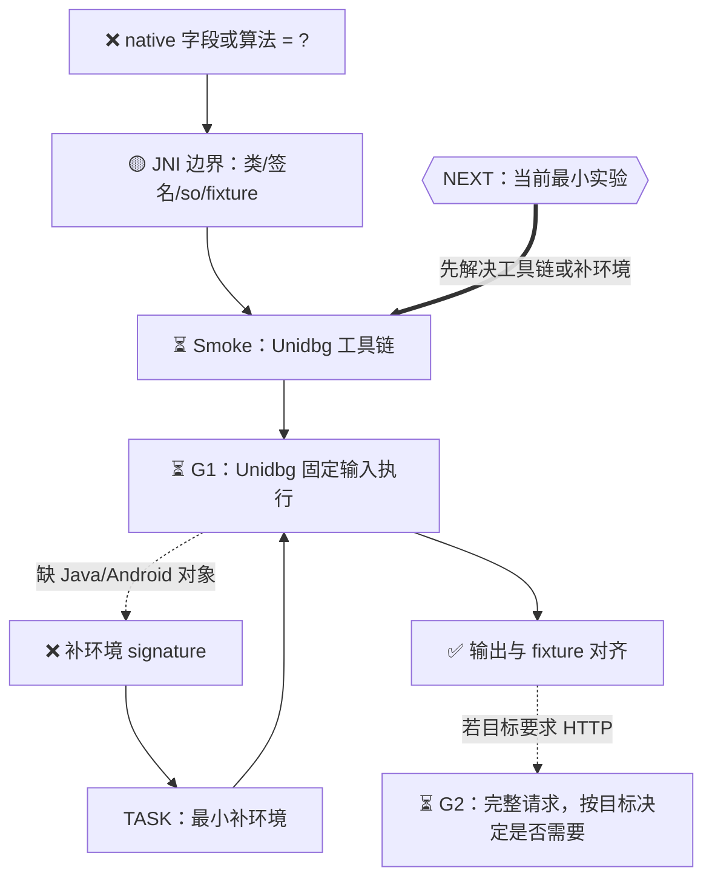

# Native / Unidbg TASK 模板

适用场景：

- Java 调用链进入 `native`，目标算法或字段生成位于 `.so`；
- 希望脱离真机，在桌面环境反复执行 so 函数、JNI wrapper 或固定 fixture；
- 需要把课堂 Unidbg 案例沉淀成可回归、可验证、可迁移的 TASK；
- 当前真机正被其他采集任务占用，希望优先走 `desktop-only` 路线。

不适用场景：

- 尚未确认目标字段与 `.so` 有关；
- 目标必须依赖真实 App 运行态、登录态、TEE、设备态或服务端上下文，且没有可离线 fixture；
- 目标是抓包、页面接口地图、RPC 语料库或批量采集，应回到对应网络/RPC 子 Skill。

## 推荐目录

```text
TASK-<Day或案例>-Unidbg复现/
├── README.md
├── Makefile
├── TASK-总-Unidbg.md
├── acceptance-contract.md
├── request-construction-ledger.md
├── 00-工作流状态.yaml
├── inputs/
│   ├── resource-manifest.yaml
│   ├── course-provided/
│   │   └── .gitkeep
│   └── extracted/
├── common/
│   ├── README.md
│   └── paths.md
├── tests/
│   ├── smoke/
│   ├── unit/
│   ├── e2e/
│   └── uat/
├── tasks/
│   ├── TASK01-Unidbg工具链准备/
│   │   ├── TASK01-说明.md
│   │   ├── inputs/
│   │   ├── outputs/
│   │   └── logs/
│   ├── TASK02-JNI边界与fixture/
│   │   ├── TASK02-说明.md
│   │   ├── inputs/
│   │   ├── outputs/
│   │   └── logs/
│   ├── TASK03-基础so执行或JNI-wrapper主动调用/
│   │   ├── TASK03-说明.md
│   │   ├── src/
│   │   ├── outputs/
│   │   └── logs/
│   ├── TASK04-最小补环境/
│   │   ├── TASK04-说明.md
│   │   ├── src/
│   │   ├── outputs/
│   │   └── logs/
│   ├── TASK05-结果验证与交付形态/
│   │   ├── TASK05-说明.md
│   │   ├── outputs/
│   │   └── logs/
│   └── TASK06-Skill回填与评测/
│       ├── TASK06-说明.md
│       ├── evaluations/
│       └── logs/
├── logs/
│   └── LOG.md
└── final_outputs/
    └── UAT-<案例>-Unidbg复现.md
```

真实课程案例可按需要增加平行任务，例如 `TASK07-IDA交叉验证`、`TASK08-module-callFunction裸地址主动调用`、`TASK09-PDD复杂补环境`。未实跑的平行路径必须标为 `not-run` 或 `deferred`，不能因为主路径通过就自动标绿。

若离线补环境已经输出 token、签名或密文，但使用了设备态、账号态、StackTrace、`/proc`、TEE、时间/随机数或 App 自定义设备值 fixture，应追加一个平行任务：

```text
TASKxx-真实设备态对齐/
├── TASKxx-说明.md
├── inputs/
├── hooks/
├── outputs/
└── logs/
```

该任务默认从 `desktop-only` 切到受控 `device-assisted`，必须重新声明是否触碰真机、是否 Hook、是否发送网络请求和人工关口。

## 资源清单

在 `inputs/resource-manifest.yaml` 中记录所有换环境后需要恢复的资源。资源本体不放进 Skill；公开第三方资源写官方获取方式，课程授权资源写本地授权来源和人工补齐方式。

推荐模板：

```yaml
project:
  name: "<案例名>"
  mode: native-unidbg
  resource_policy:
    skill_contains_large_binaries: false
    task_tracks_manifest: true
    course_materials_committed: false
    public_sources_preferred_when_available: true

resources:
  - id: unidbg
    kind: third-party-open-source
    purpose: "Unidbg 离线执行框架"
    preferred_source: "https://github.com/zhkl0228/unidbg"
    recommended_version: "0.9.7"
    fallback_source: "授权课程资料包中的 unidbg-0.9.7.zip"
    expected_path: "inputs/course-provided/unidbg-0.9.7.zip"
    extracted_path: "inputs/extracted/unidbg-0.9.7"
    sha256: "<fill-after-first-verified-copy>"
    restore_strategy: "优先官方来源；若课程指定版本与官方来源不一致，使用授权课程包并记录原因"
    commit_policy: "do-not-commit-large-binary"
    status: "missing / present-unverified / verified"

  - id: target-apk
    kind: course-fixture
    purpose: "目标 APK fixture"
    preferred_source: "授权课程资料包或人工提供路径"
    expected_path: "inputs/course-provided/<target>.apk"
    sha256: "<fill-after-first-verified-copy>"
    restore_strategy: "从本地课程资料包复制；缺失时请求人工补齐"
    commit_policy: "do-not-commit"
    status: "missing / present-unverified / verified"

  - id: target-so
    kind: course-fixture
    purpose: "目标 native library fixture"
    preferred_source: "目标 APK 解包或授权课程资料包"
    expected_path: "inputs/course-provided/lib<name>.so"
    sha256: "<fill-after-first-verified-copy>"
    restore_strategy: "优先从 APK 解包；若课程单独提供 so，则校验后使用"
    commit_policy: "do-not-commit"
    status: "missing / present-unverified / verified"

  - id: teacher-sample-code
    kind: course-reference
    purpose: "教师示例代码，仅用于对照或平行路线"
    preferred_source: "授权课程资料包"
    expected_path: "inputs/course-provided/teacher-code/"
    sha256: "<directory-hash-or-manifest>"
    restore_strategy: "从课程资料包复制；若独立复现阶段冻结，则只登记不读取"
    commit_policy: "do-not-commit-unless-explicitly-allowed"
    status: "missing / present-unverified / verified"

artifacts:
  ascii_workdir:
    path: "/tmp/<task>-unidbg-work"
    reason: "避免中文、空格或非 ASCII 路径触发 Unidbg 0.9.x resource URL 编码问题"
  logs:
    restore_log: "logs/LOG.md"
```

资源恢复流程：

```text
读取 manifest
→ 检查 expected_path
→ 公开第三方资源按 preferred_source 获取
→ 课程资源只从授权本地资料包或人工提供路径复制
→ 计算 sha256 并更新 status
→ 解压到 inputs/extracted/
→ 复制运行副本到 ASCII workdir
→ 记录到 logs/LOG.md
```

规则：

- Skill 中只放获取契约、脚手架和小模板，不放 APK、so、课程 zip 或完整第三方源码包。
- TASK 中可以保存资源 manifest、hash、解压脚本和本次输出；资源本体是否纳入 git 由 `commit_policy` 决定，默认不提交。
- 公开资源与课程资源要分开标注。公开资源缺失时可以自动下载；课程资源缺失时不要从未知来源替代，应请求授权本地资料或人工补齐。
- 教师示例代码若会泄漏答案，在 blind 阶段只能登记存在，不读取内容；comparison 或 parallel 阶段再解冻。

## 契约模板

在 `acceptance-contract.md` 中至少声明：

```text
授权范围：
最终目标：
当前主路线：R3 / R4
运行边界：desktop-only / device-assisted / mixed
是否触碰真机：yes / no
是否发送网络请求：yes / no
G1 固定 fixture：
G2 是否要求：
UAT 是否要求：
禁止动作：
```

若真机正在执行其他任务，写入：

```text
desktop-only guard：本 TASK 不运行 adb、frida、Reqable、mitmproxy、SocksDroid 或任何会改变手机网络/进程状态的命令。
```

## 任务拆分

### TASK01：Unidbg 工具链准备

目标：证明桌面环境能稳定运行课程或项目中的 Unidbg 样例。

输入：

- 课程包中的 Unidbg 源码或压缩包；
- `inputs/resource-manifest.yaml` 中声明的公开或课程资源；
- JDK 路径；
- Maven wrapper 或本地 Maven；
- 一个最小 smoke 类。

Green 条件：

- manifest 中本轮必需资源均为 `verified`，或缺失资源已有明确人工补齐动作；
- JDK 是完整 JDK，不是 JRE；
- `mvnw` 或 Maven 构建通过；
- smoke 类能输出稳定结果；
- 若路径包含中文或空格，已验证 ASCII 工作副本或等价方案。

建议使用子 Skill：`prepare-unidbg-toolchain`。

### TASK02：JNI 边界与 fixture

目标：明确要调用哪个类、方法、JNI 签名、so 模块和固定输入。

记录：

- APK 路径；
- so 路径；
- ABI；
- Java 类名；
- native 方法签名；
- `JNI_OnLoad` 是否需要调用；
- 输入 fixture；
- 预期输出或可观察摘要；
- fixture 是否来自课堂、抓包、Hook、IDA/JADX 或自己构造。

若映射未知，回到 `map-android-jni` 或 `analyze-android-native-static`；不要在 Unidbg 里盲猜入口。

### TASK03：基础 so 执行或 JNI wrapper 主动调用

目标：在 Unidbg 中让目标函数跑出第一次结果。

常见动作：

- 选择 `for32Bit()` 或 `for64Bit()`；
- 设置 `AndroidResolver(apiLevel)`；
- 加载 APK 与 so；
- 调用 `callJNI_OnLoad`；
- 使用 `resolveClass`、`callStaticJniMethodObject`、`callJniMethodObject` 或等价 API；
- 用 `StringObject`、`ByteArray`、`DvmInteger`、`DvmLong`、`ProxyDvmObject` 包装参数；
- 将输出保存到 `outputs/`。

Green 条件：

- 固定输入下输出稳定；
- 输出与已知 fixture、课堂结果、Hook 结果或静态预期能够对照；
- 命令写入 Makefile。

建议使用子 Skill：`run-so-with-unidbg`。

### TASK04：最小补环境

目标：按 Unidbg 报错 signature 逐个补齐目标函数真正需要的 Java、Android 或 App 对象。

补环境不是维护 Android API 清单，而是做 signature-driven 的最小实验。每次先判断该 signature 对目标输出的影响，再决定是真实 Java 调用、占位对象、fixture 固定值、最小 App 类，还是应该切换 Frida RPC / 自建 Android 宿主 App / R4 组合路线。

记录每个补环境点：

```text
signature：
first-difference-layer：
impact：no-impact / affects-branch / affects-output / unknown-impact
strategy：real-java-call / placeholder-object / fixture-value / minimal-app-class / route-switch
value-source：
why-minimal：
unit-or-g1-evidence：
route-risk：
next：
```

已验证包装模式：

- 真实 Java 对象：从 `DvmObject.getValue()` 取宿主对象，调用真实方法后包装返回；
- 占位系统对象：只在不影响目标输出或后续语义明确时使用；
- App 最小等价对象：复制被 native 调用的最小字段、构造函数和方法；
- fixture 固定值：必须说明来源、适用范围和绑定风险。

Green 条件：

- 不再出现当前目标函数所需的缺失 signature；
- 输出稳定；
- Unit/G1 对照通过，或明确标为 `partial-validated` 并说明缺少的真机/服务端对齐；
- 补环境只覆盖当前函数必要路径，没有为了消除日志而泛化过度；
- 若补环境过重，已记录路线切换理由，而不是继续硬补。

建议使用子 Skill：`patch-unidbg-environment`。

### TASK05：结果验证与交付形态

目标：把“跑出来了”升级成可说明边界的交付。

至少区分：

- Unit：单个函数固定输入输出一致；
- G1：目标字段、密文、签名或正文在固定 fixture 下离线等价；
- G2：若目标要求外部请求，受控发送一次并记录首差；
- UAT：若目标要求业务效果，记录最终现象与归因边界；
- CLI/Jar：若目标是工具交付，提供可重复命令和参数引用规则。

Green 条件：

- 能说明当前是 `partial-validated`、`validated` 还是 `blocked-by-runtime-boundary`；
- 未执行的 PDD、裸地址调用、真机请求或 Jar forward-test 已显式列为边界；
- 不把 Unidbg G1 误写成完整 HTTP G2。

对复杂安全 SDK，推荐额外输出：

```text
已验证：
  - JNI/native 入口；
  - fixed fixture；
  - 输出摘要；
  - 补环境链路；
未验证：
  - 真机设备态；
  - 账号态或 App 自定义值；
  - /proc、时间、随机数或 TEE；
  - 真实请求 G2/UAT。
下一步：
  - 是否需要 device-assisted 对齐 TASK。
```

建议使用子 Skill：`validate-android-reproduction`。

### TASK06：Skill 回填与课程评测

目标：把本案例中可迁移的知识回填到 workflow，而不是只留在 TASK 里。

回填判断：

- 工具链环境、路径、JDK、Maven 等属于 `prepare-unidbg-toolchain`；
- APK/so/JNI wrapper 主动调用属于 `run-so-with-unidbg`；
- 报错 signature 与对象替身属于 `patch-unidbg-environment`；
- G1/G2/UAT、Jar/CLI 和边界声明属于 `validate-android-reproduction`；
- 何时选择 Unidbg、Frida RPC、自建宿主 App、IDA 或 Python，属于总编排 Skill 的 `routing.md` / `execution-route-policy.md`。

Green 条件：

- 能力注册表状态已更新；
- 课程评测或 UAT 已落盘；
- 已声明迁移状态：`not-tested / partial / validated`；
- 个案固定值没有写入通用 Skill。

## Makefile 建议目标

```makefile
.PHONY: status guard-no-device build-unidbg smoke run-g1 test

status:
	@echo "TASK: Native / Unidbg reproduction"

guard-no-device:
	@echo "Desktop-only guard: do not run adb/frida/proxy tools in this phase."

build-unidbg:
	@echo "Build Unidbg with JDK/Maven wrapper"

smoke: guard-no-device build-unidbg
	@echo "Run minimal Unidbg smoke"

run-g1: guard-no-device
	@echo "Run fixed fixture G1"

test: smoke run-g1
```

具体命令必须由当前 TASK 根据课程包路径、JDK 路径和源码路径填写。模板不应包含个案绝对路径。

## Mermaid 控制面节点

在 `request-construction-ledger.md` 中把 Unidbg 表达为路线，而不是神秘工具：



节点状态应使用总编排台账中的能力词：

- `located`：已定位 native/JNI 边界；
- `observed`：只看到一次输出；
- `rpc-available`：目标进程内可主动调用；
- `reproducible`：Unidbg 或外部环境可从声明输入生成；
- `validated`：与 fixture、App 或服务端结果对照通过；
- `blocked-by-runtime-boundary`：算法能跑，但完整请求受设备态、登录态、TEE、TLS 或服务端策略限制。

## 交付边界句式

可直接复制到 UAT：

```text
本 TASK 已完成 <函数/字段> 在固定 fixture 下的 Unidbg G1 复现，状态为 <validated/partial-validated>。
本结论证明 <声明输入> 可以在桌面环境生成 <声明输出>。
本结论不自动证明完整外部 HTTP 请求已被服务端接受；若目标需要 G2，仍需执行原始成功请求预检、受控请求和首差分层。
本轮未执行的平行路线包括：<IDA/MCP/module.callFunction/PDD/真机请求/Jar forward-test>，状态为 <not-run/deferred>。
```
