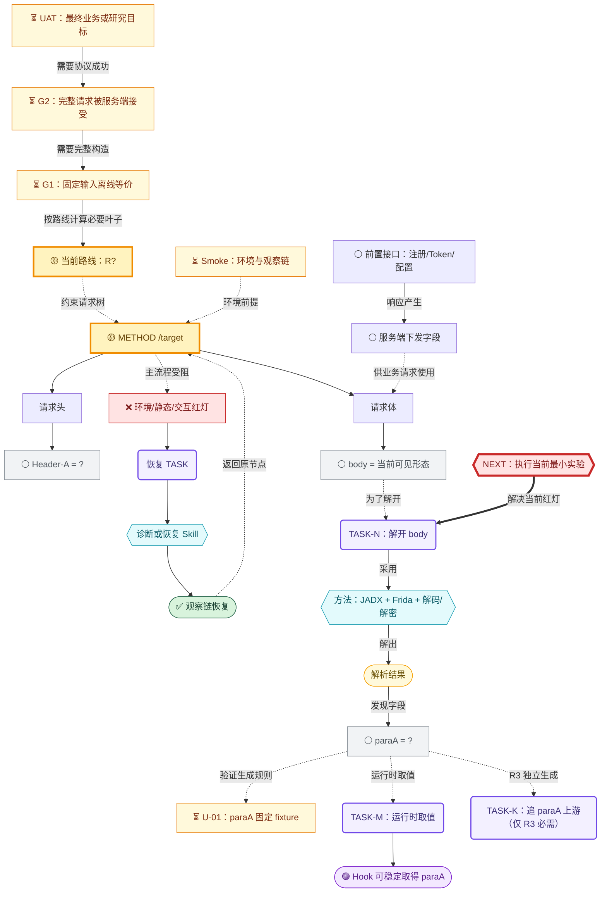

# `<METHOD> <URL>` 请求构造依赖台账

> 核心原则：以终为始，以证据校正，以测试推进。

## 目标、授权与输入边界

- 授权范围：
- 最终业务或研究目标：
- 目标请求：
- 业务输入：
- 业务副作用：
- 允许发送次数：
- 当前主路线：`R1 / R2 / R3 / R4`
- 当前分析路线：
- 当前 TASK 角色：`blocking / confirmatory / enhancement`
- 真实性要求：`functional-equivalent / app-authentic`
- 验收契约：[[acceptance-contract]]

## 终点与测试状态

| 层级 | 通过条件 | 状态 | 证据 |
|---|---|---|---|
| Smoke | 设备、代理、进程、插桩和脚本环境满足本轮实验 | `not-run / failed / blocked / passed` | |
| Unit | 当前字段或算法固定 fixture 通过 | `not-required / not-run / failed / blocked / passed` | |
| G1 离线等价 | 固定输入下关键中间值和最终字节与 App 一致 | `not-run / failed / blocked / passed` | |
| G2 受控端到端 | 一次完整请求获得预期 HTTP 与业务响应 | `not-required / not-run / failed / blocked / passed` | |
| UAT 最终验收 | 最终现象满足验收契约并记录归因边界 | `not-required / not-run / failed / blocked / passed` | |

## 当前红灯与 NEXT

- 当前红灯节点或测试 ID：
- 为什么阻塞终点：
- 下一项最小实验：
- Green 条件：
- 预期证据：
- 对应 TASK：

## 交付路线矩阵

| 路线 | 运行环境与输入边界 | 状态 | 完成门槛 | 当前缺口 |
|---|---|---|---|---|
| R1 运行时 Hook | App + Frida；从稳定 Hook 点取值 | `not-started` | 必要字段均 `hook-available`，组合结果验证通过 | |
| R2 Frida RPC | App + Frida；调用目标方法生成 | `not-started` | 必要输出均 `rpc-available`，结果验证通过 | |
| R3 纯外部独立生成 | 不依赖目标进程；从声明业务输入开始 | `not-started` | 必要叶子均 `reproducible`，组合结果 `validated` | |
| R4 组合路线 | 明确设备端与外部端的责任边界 | `not-started` | 每个环节达到约定能力门槛 | |

## 分析路线与证据角色

| 分析路线或工具 | TASK 角色 | 证据角色 | 目标问题 | 落盘产物 | 状态 |
|---|---|---|---|---|---|
| | `blocking/confirmatory/enhancement` | `primary/confirmatory/exploratory/superseded` | | | |

## Mermaid 核心控制面

## 测试矩阵

| ID | 层级 | 对象 | Red 或未完成状态 | Green 条件 | 当前状态 | 证据 |
|---|---|---|---|---|---|---|
| `S-01` | Smoke | 设备与观察链 | 环境尚未确认 | 本轮需要的 ADB、代理、进程和插桩链可用 | `not-run` | |
| `U-01` | Unit | `BODY.PARA_A` | 生成规则未知或 fixture 不一致 | 固定输入与 App 中间值一致 | `not-run` | |
| `G1` | G1 | 完整请求构造链 | 尚未完成离线对照 | 必要中间值和最终字节与 App 一致 | `not-run` | |
| `G2` | G2 | 完整 HTTP 请求 | 尚未获得服务端证据 | HTTP 与业务响应满足契约 | `not-required` | |
| `UAT-01` | UAT | 最终目标 | 最终现象尚未验收 | 结果满足契约并可说明归因边界 | `not-required` | |

## 字段能力与路线必要性

| 节点 ID | 父节点 | 名称与位置 | 当前形态 | 取值能力 | 真实性要求 | 绑定风险 | 验证范围 | R1 | R2 | R3 | R4 | 生成逻辑与依赖 | 原始证据 | 下一动作 |
|---|---|---|---|---|---|---|---|---|---|---|---|---|---|---|
| `BODY.PARA_A` | `BODY` | `paraA` | `?` | `unknown` | `app-authentic` | `unknown` | - | `required` | `required` | `required` | `required` | | | |

## 前置接口 DAG

| 接口节点 | 方法与 URL | 输入依赖 | 响应字段 | 时效/生命周期 | 持久化 | 下游节点 | 状态 |
|---|---|---|---|---|---|---|---|
| | | | | | | | |

## G2 原始请求预检

- 原始成功请求：
- 外部重算字段：
- 预期：
- 实际：
- 若预检一致但 G2 失败，新增的运行态/设备态/传输上下文节点：

## 替代构造候选

| 字段 | 替代公式 | 适用前提 | 已验证范围 | 未验证绑定 | 失败后路线 | 状态 |
|---|---|---|---|---|---|---|
| | | | | | | `substitute-candidate` |

## 当前未解决叶子

### R1 运行时 Hook

-

### R2 Frida RPC

-

### R3 纯外部独立生成

-

### R4 组合路线

-

## ReAct 当前循环

### Reason

- 当前红灯：
- 为什么优先：

### Action

- 最小实验：
- 只改变的变量：

### Observation

- 直接观察：
- 证据链接：

### Decision

- Green 条件是否达到：
- 更新的节点和测试：
- 新 `NEXT`：

## 终点与路线决策记录

| 日期 | 原终点或路线 | 新终点或路线 | 新证据与原因 | 必要性变化 | 保留证据 |
|---|---|---|---|---|---|

## 完成结论

- Smoke：
- Unit：
- G1：
- G2：
- UAT：
- R1：
- R2：
- R3：
- R4：
- 当前允许声明的完成范围：
- 未验证边界：
