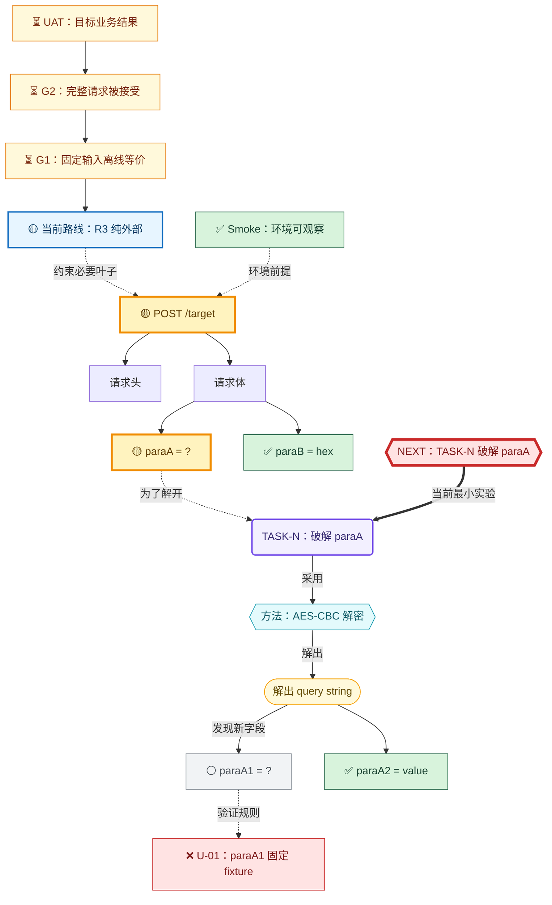

# Obsidian Mermaid 终点驱动请求控制面

## 核心模型

在 `request-construction-ledger.md` 顶部维护一张 `flowchart TB`。它是总编排的核心控制面，必须同时包含：

1. 从 UAT 反推到 G2、G1 和交付路线的终点链；
2. 与真实 HTTP 请求嵌套结构同构的请求树；
3. 从未知字段到 TASK、方法、结果和新叶子的取证侧枝；
4. Smoke、Unit、G1、G2、UAT 的测试状态；
5. 指向当前最小实验的唯一 `NEXT` 节点。

总编排必须从图中选择下一步。图中状态没有证据链接时，按未通过处理。

主干只表达请求本身：

```text
METHOD + URL
├── 请求头
│   └── header = 当前可见形态
└── 请求体
    └── body = 当前可见形态
```

某个参数不透明时，从该参数侧接破解过程：

```text
参数 = ?
├── TASK-N：破解该参数
│   └── 方法：JADX / Frida / 解码 / 解密
│       └── 解析结果
└── 解开后发现的内部字段
    ├── paraA1 = ?
    └── paraA2 = 已解决
```

内部字段仍不透明时，重复同一结构。由此形成：

> 请求结构是树干，未知参数是递归入口，TASK 是侧枝，破解方法是转换过程，解析结果产生下一层请求字段；运行时证据和交付路线也是侧枝，不改变真实请求的父子结构。

## 终点链

终点链从最终验收向请求构造反推：

```mermaid
UAT["UAT：最终业务结果"]
G2["G2：完整请求被接受"]
G1["G1：固定输入离线等价"]
ROUTE["路线门槛：R1/R2/R3/R4"]
REQ["METHOD /target"]

UAT -->|"需要协议成功"| G2
G2 -->|"需要构造正确"| G1
G1 -->|"按路线计算必要叶子"| ROUTE
ROUTE -.->|"约束请求树"| REQ
```

不需要的关口保留在图中并标记 `➖ not-required`，不要删除。这样可以区分“有意识地不需要”和“尚未考虑”。

若终点改变，先更新终点链和路线门槛，再重新计算请求树中的 required 叶子。

## 当前路由

图中必须有一个 `NEXT` 节点：

```mermaid
NEXT{{"NEXT：执行最小实验"}}
NEXT ==>|"解决当前红灯"| TASK_A
```

规则：

1. `NEXT` 只能指向当前主路线 required 且未达门槛的节点、失败测试或必要关口。
2. Smoke 失败时，`NEXT` 必须先指向环境修复，不得继续算法分析。
3. 某个不透明层阻止观察内部字段时，优先指向该外层。
4. 所有必要叶子满足后，`NEXT` 依次指向 G1、G2 和 UAT。
5. 只有任务确实互不依赖时才允许 `NEXT-A`、`NEXT-B`。
6. 子 TASK 完成后必须移除旧 `NEXT`，重新计算，不得长期保留多个历史指针。

## 运行时证据与路线

Hook 取得值时，必须在字段或其共同构造方法旁增加证据侧枝：

```mermaid
P_AID["aid = Hook 可得 / 独立生成?"]
TASK_HOOK("TASK-N：Hook H7")
HOOK_RESULT(["✅ 运行时取得 aid/cid/did/..."])
TASK_UPSTREAM("TASK-M：追 aid 上游（仅 R3 必需）")

P_AID -.->|"运行时取值"| TASK_HOOK
TASK_HOOK --> HOOK_RESULT
P_AID -.->|"R3 独立生成"| TASK_UPSTREAM
```

图中必须区分：

- “本次观察到”：`observed`；
- “以后可稳定 Hook”：`hook-available`；
- “可由 RPC 重算”：`rpc-available`；
- “可脱离目标进程生成”：`reproducible`。

路线节点从根请求侧接，用于说明完成口径，不得替代请求结构：

```mermaid
REQ -.->|"交付路线"| ROUTES
ROUTES --> R1["R1 Hook：上游追踪非必要"]
ROUTES --> R2["R2 RPC：App 内生成"]
ROUTES --> R3["R3 纯外部：上游追踪必要"]
```

## 节点类型

| 类型 | 形状建议 | 内容 |
|---|---|---|
| 请求结构 | 矩形 `["..."]` | URL、请求头、请求体、真实参数及当前值形态 |
| 破解 TASK | 圆角矩形 `("...")` | 为某个参数创建的 TASK，链接任务文档 |
| 破解方法 | 六边形 `{{"..."}}` | JADX 定位、Frida Hook、AES 解密、Protobuf 解析等 |
| 解析结果 | 体育场形 `(["..."])` | 解出了什么结构或生成规则 |

不得把 `aid`、`did` 等真实字段放到“设备字段”“业务字段”等平行分类中。它们必须位于实际承载它们的数据层下面。

## 边的语义

使用边标签说明关系：

```mermaid
BODY -->|"当前观察"| BODY_HEX
BODY_HEX -.->|"为了解开"| TASK07
TASK07 -->|"定位与验证"| AES_METHOD
AES_METHOD -->|"解出"| PLAINTEXT
PLAINTEXT --> AID
```

- 实线：真实请求的包含或转换关系；
- 虚线：为解决该节点而创建的任务关系；
- 标签：`包含`、`当前观察`、`为了解开`、`方法`、`解出`、`发现新字段`、`生成`。

## 状态标记

| 状态 | 标签 | Mermaid class |
|---|---|---|
| 已验证 | `✅` | `validated` |
| Hook 可稳定取得 | `🟣` | `hookAvailable` |
| RPC 可稳定生成 | `🔵` | `rpcAvailable` |
| 可独立生成 | `🟢` | `reproducible` |
| 正在破解 | `🟡` | `inProgress` |
| 已定位但未独立复现 | `🔎` | `located` |
| 尚未分析 | `⚪` | `pending` |
| 受阻 | `🔴` | `blocked` |
| 当前范围不需要 | `➖` | `notRequired` |
| 测试失败/当前红灯 | `❌` | `failed` |
| 测试尚未运行 | `⏳` | `notRun` |

TASK 节点还应使用独立样式：

```mermaid
classDef task fill:#f3f0ff,stroke:#7048e8,color:#3b2f75,stroke-width:2px;
classDef method fill:#e3fafc,stroke:#1098ad,color:#0b5965;
classDef result fill:#fff9db,stroke:#f59f00,color:#664d03;
classDef next fill:#ffe3e3,stroke:#c92a2a,color:#7f1d1d,stroke-width:4px;
classDef gate fill:#e7f5ff,stroke:#1971c2,color:#0b3d66,stroke-width:2px;
```

## 节点与链接

1. 使用稳定 ID，例如 `BODY_RAW`、`TASK_BODY_DECRYPT`、`METHOD_AES`、`P_DID`。
2. 请求结构标签应显示真实形态，例如：
   - `body = application/octet-stream (hex?)`
   - `sign = 64-char hex`
   - `aid = ?`
3. TASK 标签应包含任务编号和目的，例如 `TASK07-09：解二进制正文`。
4. `click` TASK 节点到任务文档；结果或方法节点可链接证据文档。
5. 链接相对于台账文件，不使用机器绝对路径或 `file://`。

## 更新规则

1. 初次抓包只画当时真实可见的结构和未知形态，不提前填入尚未发现的内部字段。
2. 为未知参数创建 TASK 时，在该参数旁增加虚线 TASK 侧枝。
3. TASK 得到破解方法时，在 TASK 下增加方法节点。
4. 解开数据层后：
   - 保留原始不透明节点；
   - 增加方法与解析结果；
   - 把新发现字段挂在解析结果下面；
   - 为仍未知的新字段继续创建 TASK 侧枝。
5. 字段状态变化时同步更新标签、class 和节点台账。
6. 同一个 TASK 处理多个字段时，可以分别从字段虚线连接同一个 TASK；后续规模变大再拆分子 TASK。
7. 不删除失败路径，标记为 `blocked` 或在任务文档中保留失败证据。
8. 已 Hook 到值时增加证据侧枝；是否保留上游 TASK 由路线必要性决定。
9. 每次开始和结束实验时更新 `NEXT`、对应红灯、测试状态和证据链接。
10. G1/G2/UAT 状态变化时同步更新终点链，不得只修改表格。
11. 图中 `✅` 必须能够通过 `click` 或同名证据 ID 追溯到 fixture、测试报告、manifest 或验收记录。

## 核心控制面模板


