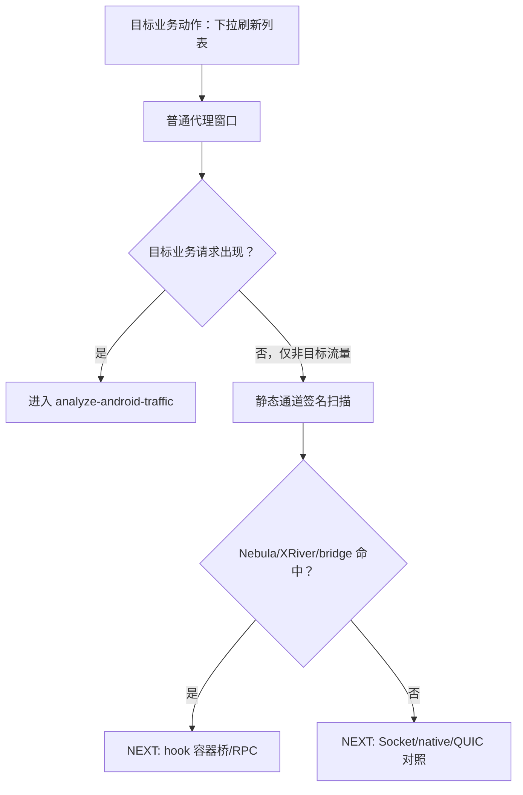

# UAT 与写回契约

## Green 类型

- `channel-confirmed`：已确认目标动作走某个通道，并有动态证据。
- `channel-high-confidence`：静态和窗口证据强，但缺动态 hook 验证。
- `next-experiment-ready`：尚未确认通道，但下一条最小实验明确可执行。
- `blocked-by-human-window`：需要人类重新触发动作窗口或提供 UI 观察。

## 写回 TASK

必须写入：

- 当前 Red 分层；
- 目标动作窗口；
- 静态签名表；
- 候选通道树；
- 已排除分支；
- 下一条最小实验；
- 证据文件链接；
- `NEXT`。

## Mermaid 推荐形态

