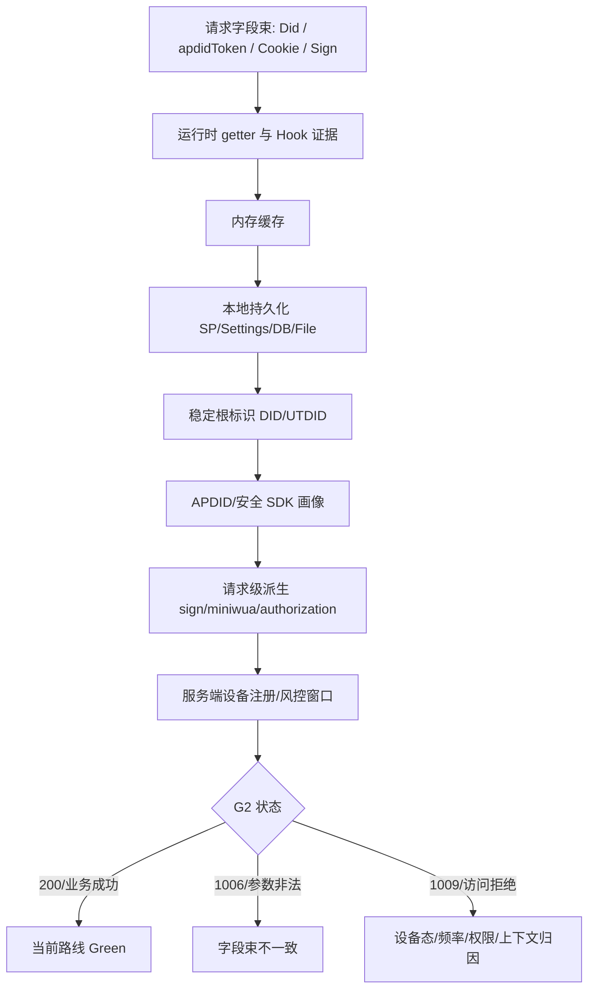

# 设备态字段束闭环

用于 DID、UTDID、APDID、apdidToken、umidToken、devKeySet、miniwua、authorization、Sign、Cookie、安装态或风控态疑似绑定的场景。它不是“单个字段怎么生成”的问题，而是“多个字段是否共同构成一个设备态字段束”的问题。

## 触发条件

出现任一现象时读取本文件：

- 单独改请求头 DID、apdidToken、authorization、miniwua、Cookie 或签名相关字段后，服务端从 `1009` 变成 `1006`、参数非法、登录态异常或上下文不一致。
- 同账号换设备表现不同，或同设备换账号仍被限制，设备态比账号态更可疑。
- App 内请求能发出，但外部 R3 重放被 `Did`、APDID、miniwua、Sign、authorization、设备指纹或风控上下文阻塞。
- 字段读取入口已经定位，但上游包含 Security SDK、UTDID、APDID、设备注册、TokenStorage、SettingsStorage、SharedPreferences 包装层或服务端注册链。
- 只读 Hook 能看到多个相关字段，但随机替换、只换一个字段或只换 Header 不能稳定通过。

## 认知模型

设备态字段束通常包含几层：

```text
稳定根标识 DID/UTDID
→ 安全 SDK 设备画像 APDID/apdidToken/umidToken
→ 本地存储与备份 SP/Settings/DB/File
→ Cookie/devKeySet/session 绑定
→ sign/miniwua/authorization 等请求级派生字段
→ 服务端设备注册、风险与窗口状态
```

其中某个字段能读出来，不代表它能单独替换。字段束里的值可能互相绑定，也可能被服务端按历史设备注册状态校验。

## 典型证据链

DID/UTDID 一类稳定根标识可按以下链路追踪：

```text
请求 Header Did
← DeviceInfo.getmDid()
← DeviceInfo 内存字段
← UTDevice.getUtdid(ctx)
← AppUtdid.getUtdid(ctx)
← UTUtdid.getValue()
← PersistentConfiguration.getUtdidFromSp()
← 本地 SP/备份存储
```

`refresh`、`refreashUtDid`、`forceRefreashInstance` 一类方法优先按“刷新内存缓存或重建对象”理解，不能直接当作“生成新设备”。必须通过清内存、读持久化、重启 App、清应用数据或重装后的对照证明它是否真正改变稳定根标识。

APDID 一类安全 SDK 设备画像可按以下链路追踪：

```text
请求或 Cookie 中的 token/devKeySet
← ApdidManager / OneApdidBridge
← TokenStorage
← ApdidStorageV4 / SettingsStorage / SP 包装层
← ApdidStorageModelV4
← DID/UTDID 或设备环境输入
← 服务端注册或刷新响应
```

如果本地 APDID 存储模型里出现 DID/UTDID 长度相近的字段，或 APDID 模型同时保存 token、设备摘要、时间、环境摘要，优先判断为字段束绑定证据。`apdid_v2`、`apdidToken_v2`、`umidToken_v2` 这类持久化值可能是包装层，不一定等同于运行时请求里直接使用的 token。

## 最小工作流

1. 先固定基线：同一设备、同一账号、同一业务动作、同一冷却窗口下的成功或拒绝样本。
2. 建立字段束台账：字段名、请求位置、运行时 getter、内存缓存、持久化位置、服务端来源、下游消费者、绑定证据。
3. 先追稳定根标识，再追 APDID/token 模型，最后追 sign、miniwua、authorization 等请求级消费者。
4. Hook 默认只读：输出长度、hash、调用栈、来源分支和状态码，不在通用 Skill 文档里保存原始设备 ID、token、Cookie 或真实账号信息。
5. 对每个 `refresh` 方法做语义判别：缓存刷新、对象重建、本地重读、服务端注册、服务端刷新分别标注，不按方法名猜测。
6. 如需验证替换，先确认是否授权；只做单变量或字段束整体的最小低频实验，并记录 `before/after` 状态码。
7. 若替换单个字段导致 `1006` 或参数非法，把它视作字段束一致性证据，不把它当作失败噪声。
8. 若 App 内 R2/R4 能稳定取得数据，采集任务优先使用 App 运行态派发和窗口限速；R3 纯外部重放另开研究任务，不阻塞已可用路线。

## 授权靶场中的设备态根换代

当已满足以下条件时，可以把“设备态根换代”作为完整重装 App 的替代实验路线：

- 明确处在授权靶场或自有测试环境；
- 已证明同账号换设备可用、同设备换账号仍受限，设备态比账号态更可疑；
- 后置随机改 `Did`、`apdidToken` 等单字段会导致 `1006` 或不稳定结果；
- 完整重装 App 已被验证能让 DID/UTDID/APDID/token 字段束换代，并让业务从 `1009` 回到成功；
- 已有 before/after 字段束对照工具，只记录长度、hash、字段是否变化和证据路径，不保存原始敏感值。

这种路线不是“改请求参数”，而是让 App/安全 SDK 自己重建一组自洽设备态：

```text
删除或重置设备态根
-> App 首启 / 登录 / 业务动作
-> 安全 SDK 重建 DID/UTDID/APDID/token bundle
-> 同一业务 smoke 从 1009 回到 success
```

验收必须以业务 smoke 为准，字段变化只是中间证据：

```text
字段束 before/after 成组变化
+ 同一 answerId / 同一业务动作从 1009 恢复 success
+ 未使用后置字段 override
= 设备态根换代 Green
```

不要把该路线默认写成通用绕过能力。它只适用于授权环境下的设备态归因、恢复和采集窗口验证；真实项目中应优先选择降频、停止、人工验证或合规的数据获取方式。

## Mermaid 模板



## 状态词

- `bundle-observed`：已观察到多个设备态字段同时参与请求。
- `root-located`：稳定根标识读取链已定位。
- `storage-bound`：字段与本地存储模型或备份存储存在绑定证据。
- `server-bound`：字段来自服务端注册、刷新或服务端风控状态。
- `bundle-bound`：字段属于多字段设备态字段束，单独替换结论不可信。
- `do-not-substitute`：可读取但不应在当前路线里替换；替换会破坏字段束一致性或授权边界。
- `runtime-boundary`：R2/R4 可由 App 运行态提供，R3 外部重放暂不适合继续。

## 红灯解释

- `1006`：常见于字段束被改坏、请求结构不一致、签名链和设备态不匹配。优先回到字段束台账，不要继续随机替换。
- `1009`：常见于设备态、账号态、频率窗口、权限或上下文拒绝。不要重复探测；先冷却、保留最近成功/拒绝样本，再做最小实验。
- `2000` 或登录态异常：可能说明字段替换绕过了某一层校验，但破坏了登录或会话绑定；不能直接视为成功。

## 写回要求

字段束任务至少写回：

- 哪些字段属于同一束；
- 哪些字段已定位读取链；
- 哪些字段只证明了当前值读取，尚未证明首次生成；
- 哪些方法只是缓存刷新，哪些可能触发服务端注册；
- 单变量实验的状态码变化；
- 当前路线采用 R2/R4 App 运行态、R3 外部重放，还是二者并行；
- 原始敏感值的落盘边界：通用 Skill 文档只保存长度、hash 和证据路径。
